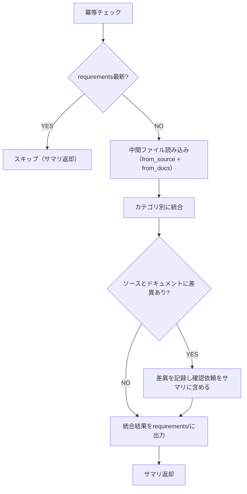

# 解析結果統合手順

`ai_generated/intermediate_files/` の解析結果を統合し、`ai_generated/requirements/` に出力します。

## 参照制約

参照可能なディレクトリは `ai_generated/intermediate_files/` のみ。原本（ソースコード、ドキュメント）は**参照禁止**。

## 冪等チェック（再開対応）

`ai_generated/requirements/` が存在し、`ai_generated/intermediate_files/` より新しい場合はスキップする。

```bash
# requirements/の最新更新日とintermediate_files/の最新更新日を比較
if [ -d "ai_generated/requirements" ] && [ -f "ai_generated/requirements/architecture.md" ]; then
  req_time=$(stat -c %Y ai_generated/requirements/architecture.md 2>/dev/null || echo 0)
  int_time=$(find ai_generated/intermediate_files/ -type f -name "*.md" -printf '%T@\n' 2>/dev/null | sort -rn | head -1)
  if [ "${req_time%.*}" -ge "${int_time%.*}" ] 2>/dev/null; then
    echo "SKIP: requirements is up to date"
  fi
fi
```

## フェーズ内フロー



## Step 1: 中間ファイルの読み込み

両ソースの中間ファイルを読み込む:

```bash
ls ai_generated/intermediate_files/from_source/ 2>/dev/null
ls ai_generated/intermediate_files/from_docs/ 2>/dev/null
```

- `from_source/` のみ存在する場合: ソース解析結果のみで統合
- 両方存在する場合: カテゴリごとに内容を突合・統合

## Step 2: カテゴリ別統合

同じカテゴリの中間ファイル（`from_source/architecture.md` と `from_docs/architecture.md` 等）を統合する。

- 情報が一致する場合: そのまま統合
- 情報に差異がある場合: 差異を明記し、サマリの「ユーザー確認依頼」セクションに含める

### devops.mdの統合ルール

- `from_source/devops.md` の内容をベースに、`from_docs/devops.md`（存在する場合）の情報を統合する
- ソース由来の実行実績に基づく情報（ビルド手順・アクセスURL・環境変数等）を優先する
- ドキュメント由来の情報はソース由来と矛盾しない限りマージする

## Step 3: requirements/への出力

```bash
mkdir -p ai_generated/requirements
```

### 出力ファイル一覧

| ファイル | 内容 |
|---------|------|
| `README.md` | ガイド・確定要件・設定（改修内容は後続ステップで追記） |
| `architecture.md` | システム構成図 |
| `file_structure.md` | ディレクトリ構成 |
| `db.md` | ER図 |
| `screens.md` | 画面一覧・遷移図 |
| `api.md` | WebAPI一覧 |
| `devops.md` | ビルド・起動手順 / デプロイ構成 / CI/CD設定 / 環境変数 / テスト実行方法 |
| `others.md` | その他（カテゴリ外情報） |

## コミット＆プッシュ

統合結果をコミット＆プッシュする（`.claude/rules/git-rules.md` に従う）。

```bash
git add ai_generated/requirements/
git commit -m "docs(requirements): Add integrated analysis results

Co-Authored-By: Claude <noreply@anthropic.com>"
git push
```

## 完了条件

- 統合結果が `ai_generated/requirements/` に出力されていること
- 原本（ソースコード、ドキュメント）を直接参照していないこと
- 生成ファイルがコミット＆プッシュされていること

## 完了時の返却サマリ

```
## 解析結果統合 完了サマリ
- 統合元: from_source（N件）、from_docs（N件）
- 生成ファイル: [ファイル名一覧]
- 出力先: ai_generated/requirements/
```

### 差異がある場合のサマリ

```
## 解析結果統合 完了サマリ
- 統合元: from_source（N件）、from_docs（N件）
- 生成ファイル: [ファイル名一覧]
- 出力先: ai_generated/requirements/

### ユーザー確認依頼
ソースコードとドキュメントの間に以下の差異が検出されました。確認をお願いします:
- [差異1]: ソース=[内容] / ドキュメント=[内容]
- [差異2]: ソース=[内容] / ドキュメント=[内容]
```

## 注意事項

- 原本参照禁止を厳守すること。中間ファイルの情報のみで統合する
- 差異のユーザー確認はサマリ経由で親オーケストレーターに依頼する（Subagent内ではAskUserQuestionは使用不可）
