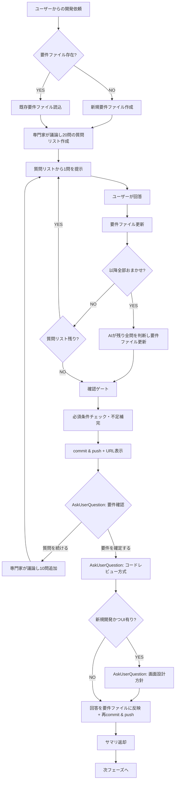

# Multi-Expert Analysis（壁打ちフェーズ）

## 最初に必ず読み込むファイル

以下のファイルをReadツールで読み込んでから作業を開始すること:

1. `docs_with_ai/multi-expert-analysis/00_core/framework.md` - フレームワーク定義
2. `docs_with_ai/multi-expert-analysis/00_core/story_format.md` - ストーリー形式

## 概要

複数のエキスパート視点から要件・設計を分析し、バイアスを排除した意思決定を支援します。
**このフェーズは会話継続型**です。ユーザーとの対話を通じて要件を深掘りし、要件ファイルに永続化します。

## 冪等チェック（再開対応）

1. `ai_generated/requirements/` ディレクトリが存在するか確認（`README.md` をアンカーファイルとして判定）
2. 存在する場合: `README.md` を読み込み、続けて各要件ファイルをロードして会話を継続
3. 存在しない場合: 新規作成

## コアエキスパート

すべての分析に参加する必須エキスパート：

| エキスパート | 役割 | 参照 |
|-------------|------|------|
| **PO** | プロダクト価値最大化、バックログ管理 | [po.md](docs_with_ai/multi-expert-analysis/05_experts/core/po.md) |
| **Architect** | 技術設計、構造決定、拡張性検証 | [architect.md](docs_with_ai/multi-expert-analysis/05_experts/core/architect.md) |
| **QA** | 品質保証、テスト戦略、DoD主導 | [qa.md](docs_with_ai/multi-expert-analysis/05_experts/core/qa.md) |
| **Security** | セキュリティ確保、リスク評価 | [security.md](docs_with_ai/multi-expert-analysis/05_experts/core/security.md) |

## パターン選択

親オーケストレーターからプロンプトで渡されたパターン（`new_development` / `maintenance`）に従う。
壁打ち中の質問でデータ処理が主目的と判明した場合のみ `data_pipeline` パターンに切り替える。

| パターン | 参照 |
|----------|------|
| 新規開発 | [new_development.md](docs_with_ai/multi-expert-analysis/20_patterns/new_development.md) |
| 保守 | [maintenance.md](docs_with_ai/multi-expert-analysis/20_patterns/maintenance.md) |
| データパイプライン | [data_pipeline.md](docs_with_ai/multi-expert-analysis/20_patterns/data_pipeline.md) |

---

## 会話継続型フロー

### 全体フロー



### フェーズ0: Box資料読み込み（オプション）

`.box/credentials.json` が存在する場合のみ実行する。存在しない場合はフェーズ1へスキップする。

1. AskUserQuestionで「Boxから資料を読み込みますか？」と確認する
   - 選択肢: 「はい（BoxフォルダIDを入力）」「いいえ（テキスト入力で進める）」
2. 「はい」の場合:
   - AskUserQuestionでBoxフォルダIDの入力を求める
   - 以下のコマンドでフォルダ内のファイルを再帰的にダウンロードする
     ```bash
     python3 tools/box_client.py download-folder {フォルダID}
     ```
   - ダウンロードされたファイルは `ai_generated/input/` に保存される
   - Readツールでダウンロードしたファイルの内容を読み込み、以降のコンテキストとして活用する
3. 「いいえ」の場合: フェーズ1へ進む

**エラー時の対処**: ダウンロードコマンドがエラーになった場合、エラーメッセージの内容に応じて以下のように対応する:
- 「接続認証の有効期限が切れています」→ ユーザーに「Boxとの接続認証が期限切れです。GAiDoアプリのStep 4でBox連携を再設定してください」と伝え、Box読み込みをスキップしてフェーズ1へ進む
- 「IDが存在しません」(404) → ユーザーに「入力したBoxフォルダIDが見つかりません。Box画面でフォルダを開いたときのURLに含まれるIDを確認してください」と伝え、再入力を求める
- 「アクセス権限がありません」(403) → ユーザーに「指定したBoxフォルダへのアクセス権限がありません。Box上でそのフォルダの共有設定を確認してください」と伝える
- 「接続できません」→ ユーザーに「Boxのサーバーに接続できません。インターネット接続を確認してください」と伝え、Box読み込みをスキップしてフェーズ1へ進む
- その他のエラー → エラーメッセージをそのままユーザーに伝え、Box読み込みをスキップしてフェーズ1へ進む

### フェーズ1: 初期分析

1. **要件ファイルの確認**
   - `ai_generated/requirements/` ディレクトリを確認（なければ作成）
   - `ai_generated/requirements/README.md` が存在するか確認
   - あれば `README.md` を読み込み、続けて各要件ファイルをロードして会話継続。なければ新規作成
   - **要件ファイルのパス**: `ai_generated/requirements/`（ディレクトリ構成、履歴はGitで追跡）
   - **新規作成時の `README.md` テンプレート**:
     ```markdown
     # 要件ファイル

     ## ドキュメント一覧

     | ドキュメント | 内容 |
     |---|---|
     | [architecture.md](architecture.md) | システム構成図 |
     | [file_structure.md](file_structure.md) | ディレクトリ構成 |
     | [db.md](db.md) | ER図 |
     | [screens.md](screens.md) | 画面一覧・遷移図 |
     | [api.md](api.md) | WebAPI一覧 |
     | [devops.md](devops.md) | デプロイ構造・コマンド |
     | [others.md](others.md) | その他 |

     ※ プロジェクト特性に応じて一部のファイルは存在しない場合があります。

     ## 確定要件

     （機能要件・非機能要件）

     ## 開発プロセス設定

     （壁打ちフェーズ完了時に記録）

     ## 専門家分析

     （PO/Architect/QA/Security の分析結果）
     ```
   - **「ドキュメント一覧」は存在するファイルのみリスト**する。未作成のファイルは行ごと削除すること

2. **専門家による質問（壁打ち形式）**
   - 最初に専門家（PO/Architect/QA/Security）が議論し、**20問分の質問リスト**を作成
   - 質問リストから、関連する質問はまとめて（最大4問）、それ以外は一問一答でユーザーに質問
   - 選択肢がある質問はAskUserQuestionツールで選択UIを提示（複数選択が適切な場合はmultiSelect使用）
   - **重要**: `questions` パラメータは必ず配列として渡すこと。JSON文字列は禁止（`.claude/rules/tool-usage.md` 参照）

   **聞き取るべき項目**（20問の中で網羅すること）:
   - 構築するシステムの概要や具体的な達成目標
   - 実装形態（Webシステム/バッチ処理/スマートフォン用アプリ/その他）
   - テスト環境（ブラウザやOSの種類など）をAIからの提案ベースで聞き取る
   - 想定ユーザのITリテラシー
     - ITリテラシーが高い人向け → 専門用語を使い概念を正確に表現するシステムにする
     - ITリテラシーが低い人向け → マニュアルなしで利用できるように説明的なUIにする
   - ユーザ数の規模感、使用する言語、フレームワーク、アーキテクチャなど
   - プロジェクトの配布形態（OSSとして公開 / SaaS提供 / 社内利用のみ / パッケージ配布）とそれに伴うOSSライセンス互換性の確認
     - Architectは技術・ライブラリ提案時にコピーレフトライセンス（GPL/AGPL等）のリスクを考慮すること
     - 配布形態が確定していれば、Backlog後のOSSライセンスチェックの精度が向上する

   **聞き取りの原則**:
   - システム詳細について不明な点や、実装フェーズで作業するに不足する点がないようにAI自ら判断し、不足している場合は人間に提案ベースで確認すること
   - 人間からのフィードバックを受けるたびに、AI自らさらなる不明点や不足する点がないか確認し、不明点や不足する点全てが解決するまで確認を繰り返すこと
   - **注意**: コードレビュー方式は20問の質問リストに含めない（確認ゲートで独立して聞く）

### フェーズ2: 会話継続（ユーザー回答後）

**毎回の回答後に必ず実行すること**:
1. 最新の要件ファイルを読み込む
2. ユーザーの回答を要件ファイルに反映
3. **回答内容から必須成果物を作成・更新**（以下のいずれかが該当する場合、適切なファイルに振り分けて更新）:
   - 技術選定が決まった → `architecture.md`（システム構成図）・`file_structure.md`（ディレクトリ構成）を作成/更新
   - 画面/UIの情報が出た → `screens.md`（画面一覧・画面遷移図・ワイヤーフレーム）を作成/更新
   - API/データの情報が出た → `api.md`（API一覧）・`db.md`（ER図）を作成/更新
   - デプロイ情報が出た → `devops.md`（デプロイ構造・コマンド）を作成/更新
   - 確定要件・設定・専門家分析 → `README.md` を更新
   - カテゴリ外の情報 → `others.md` を作成/更新
   - 毎回更新後に `README.md` の「ドキュメント一覧」テーブルも更新（存在するファイルのみリスト、相対リンク付き）
4. 質問リストに従い次の質問を提示

**「以降全部おまかせ」の扱い**:
ユーザーが**明示的に**「以降おまかせ」「残り全部おまかせ」「AI判断に委任」等と**直接**回答した場合**のみ**、**残りの質問すべて**をAIが自己判断で埋め、要件ファイルに反映した上で確認ゲートへ進む。
1問だけ「おまかせ」の場合は通常の回答として処理し、次の質問へ続行する。
ユーザーの行動（オフトピック、無回答等）からおまかせの意思を推測してはならない。

### フェーズ3: 確認ゲート

質問リスト消化完了 or 以降全部おまかせ のいずれの場合も、**必ず以下のゲートを通すこと**。
「おまかせ」はあくまで質問リストの残りをAI判断に委任するものであり、確認ゲートのAskUserQuestionはスキップしてはならない。

#### Step 1: 必須条件チェック

**分析完了の必須条件**（AIに全任せで実装できるレベルであること）:

1. **専門家の観点から確認**
   - 各専門家ファイル（[05_experts/core/](docs_with_ai/multi-expert-analysis/05_experts/core/)）の「重視する観点」を参照
   - その観点から要件が十分に定義されているか確認

2. **必須成果物の確認**
   以下がすべて作成されていること:
   | 成果物 | 形式 | ファイル | 条件 |
   |--------|------|---------|------|
   | システム構成図 | mermaid flowchart | `architecture.md` | 常に必須 |
   | ディレクトリ構成 | tree形式コードブロック | `file_structure.md` | 常に必須 |
   | 画面一覧 | Markdown表 | `screens.md` | UI有の場合必須 |
   | 画面遷移図 | mermaid stateDiagram | `screens.md` | UI有の場合必須 |
   | 画面ワイヤーフレーム | mermaid flowchart（画面ごとに別ブロック） | `screens.md` | UI有の場合必須 |
   | API一覧 | Markdown表 | `api.md` | API有の場合必須 |
   | OpenAPI定義 | yamlコードブロック | `api.md` 内のyamlコードブロック | API有の場合必須 |
   | ER図 | mermaid erDiagram | `db.md` | DB有の場合必須 |

   **mermaid記法ルール**: テキストは`"`で囲むこと（パースエラー防止）
   - 例: `A["ノード"]`, `A -->|"ラベル"| B`
   - 詳細な記法はContext7で確認

3. **追加条件**
   - 未解決事項がゼロ（すべて解決済み or 「AI判断に委任」と明記）
   - 機能要件が網羅的（初期依頼のすべての要素をカバー）

**「未定」は許容しない**: 決められない項目は「AIが〇〇の観点で最適なものを選定」と明示的に委任すること。

**条件を満たさない場合**: 不足項目をAIが自己判断で補完し、要件ファイルに反映する。

#### Step 1.5: mermaid構文検証

要件ファイルにmermaid図が含まれるため、コミット前に構文検証する。`rules/mermaid-validation.md` に従うこと。

```bash
npx md-mermaid-lint "ai_generated/requirements/**/*.md"
```

エラーが出た場合は修正して再検証し、エラーが解消されるまで繰り返す。

#### Step 2: コミット＆プッシュ + URL表示

要件ファイルをコミット＆プッシュし、GitHub URLを表示する（`.claude/rules/git-rules.md` に従う）。

```bash
# URL生成
gh repo view --json url -q .url
git branch --show-current
```

表示形式: `[クリックしてGitHub上で要件ファイルを確認]({repo_url}/tree/{branch}/ai_generated/requirements)`

#### Step 3: フェーズ遷移の確認

**必ずAskUserQuestionで確認すること。AIが勝手に判断してはならない。このステップのスキップは厳禁。**

**質問**: 「要件ファイルを確認してください。どうしますか？」

**選択肢**:
- 「要件を確定する」（コードレビュー設定を確認後、バックログ作成へ進む）→ Step 4へ
- 「質問を続ける」→ 専門家が10問追加し、質問ループへ戻る

#### Step 4: コードレビュー設定の確認

**必ずAskUserQuestionで確認すること。AIが勝手に判断してはならない。**

**質問**: 「実装後のPRに対して、どのようにレビューしますか？」

**選択肢**:
- 「ユーザーがレビュー」→ `ai_generated/requirements/README.md` の「開発プロセス設定」に `コードレビュー: ユーザーレビュー` を記録
- 「AIがレビュー」→ `ai_generated/requirements/README.md` の「開発プロセス設定」に `コードレビュー: AIレビュー` を記録
- 「レビューなし」→ `ai_generated/requirements/README.md` の「開発プロセス設定」に `コードレビュー: なし` を記録

**回答の記録形式**: `ai_generated/requirements/README.md` の「開発プロセス設定」セクションに以下の形式で記録すること：
```markdown
## 開発プロセス設定
- コードレビュー: ユーザーレビュー / AIレビュー / なし
```

回答を要件ファイルに反映する。

#### Step 5: 画面設計方針の確認（新規開発かつUI有りの場合のみ）

**maintenanceパターンもしくはUI無しの場合はスキップ。**

**必ずAskUserQuestionで確認すること。AIが勝手に判断してはならない。**

**質問**: 「画面の詳細設計をどのように行いますか？」

**選択肢**:
- 「Pencilで詳細な画面設計を行う」→ `ai_generated/requirements/README.md` の「開発プロセス設定」に `画面設計: Pencilで設計` を記録
- 「AIにお任せで良い」→ `ai_generated/requirements/README.md` の「開発プロセス設定」に `画面設計: AIにお任せ` を記録

**回答の記録形式**: `ai_generated/requirements/README.md` の「開発プロセス設定」セクションに追記すること：
```markdown
## 開発プロセス設定
- コードレビュー: ユーザーレビュー / AIレビュー / なし
- 画面設計: Pencilで設計 / AIにお任せ
```

回答を要件ファイルに反映した後、`git add ai_generated/requirements/` で**再度コミット＆プッシュ**してからサマリを返却しフェーズ完了。

---

## 分析プロセス・品質チェック（参照）

分析プロセスの詳細と品質チェック基準は以下を参照：

- **分析プロセス**: [framework.md](docs_with_ai/multi-expert-analysis/00_core/framework.md)
  - コンテキスト理解 → 専門家招集 → 多視点議論 → 収束 → 成果物生成
- **INVESTチェック**: framework.md「5.1 Epic/PBI 共通：INVESTチェック」
- **YAGNIチェック**: framework.md「5.2 Epic/PBI 共通：YAGNIチェック」
- **専門家の観点**: [05_experts/](docs_with_ai/multi-expert-analysis/05_experts/) 配下の各ファイル

---

## 実行手順チェックリスト

### 初回実行時

1. [ ] `ai_generated/requirements/` ディレクトリ確認（なければ作成）
2. [ ] `ai_generated/requirements/README.md` の有無を確認
3. [ ] なければ新規作成、あれば `README.md` + 各要件ファイルを読込（会話継続）
4. [ ] 親から渡されたパターンに基づきパターンファイルを読込（data_pipelineへの切替は壁打ち中に判断）
5. [ ] 専門家が議論し**20問分の質問リスト**を作成
6. [ ] 質問リストから、関連する質問はまとめて（最大4問）、それ以外は一問一答でユーザーに質問
7. [ ] 選択肢がある質問はAskUserQuestionツールで選択UIを提示

### ユーザー回答後（継続）

1. [ ] 最新の要件ファイルを読込
2. [ ] ユーザーの回答を要件ファイルに反映
3. [ ] 「以降全部おまかせ」かどうか判定 → YESならAIが残り全問を判断して要件ファイル更新 → 確認ゲートへ
4. [ ] 質問リスト消化完了 → 確認ゲートへ

### 確認ゲート

1. [ ] 必須条件チェック（不足があればAIが補完）
2. [ ] 要件ファイルをコミット＆プッシュしてGitHub URLを表示
3. [ ] AskUserQuestionで「要件を確定する」or「質問を続ける」を確認
4. [ ] 「質問を続ける」→ 専門家が10問追加して質問ループへ
5. [ ] 「要件を確定する」→ AskUserQuestionでコードレビュー方式を確認 → 要件ファイルに反映
6. [ ] 新規開発かつUI有りの場合: AskUserQuestionで画面設計方針（Pencil or AIにお任せ）を確認 → 要件ファイルに反映
7. [ ] 再コミット＆プッシュ → サマリを返却し次フェーズへ進む

---

## 完了時の返却サマリ

このフェーズが完了したら、以下を出力すること:

```
## 壁打ちフェーズ完了サマリ
- 要件ファイル: ai_generated/requirements/
- 要件ファイルURL: {repo_url}/tree/{branch}/ai_generated/requirements
- 質問数: N問
- 確定要件数: N件
- コードレビュー設定: ユーザーレビュー/AIレビュー/なし
- 画面設計: Pencilで設計/AIにお任せ/（UI無しのためスキップ）
- 必須成果物: すべて作成済み
```
