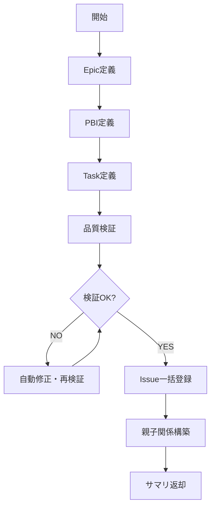

# バックログ作成手順

壁打ちフェーズで確定した要件をもとに、Epic/PBI/TaskをJSON定義し、品質検証後にGitHub Issueへ一括登録します。

## 冪等チェック（再開対応）

```bash
# GitHub Issue状態を確認
gh issue list --label "epic" --json number,title,state --limit 100
gh issue list --label "pbi" --json number,title,state --limit 100
gh issue list --label "task" --json number,title,state --limit 100
# ローカルファイル状態を確認
ls -la ai_generated/issues.json ai_generated/issue_numbers.json 2>/dev/null
```

- 既存のIssueがある場合は、未作成のものから再開する
- `ai_generated/issues.json` が存在する場合は、定義済みのステップをスキップ
- `ai_generated/issue_numbers.json` が存在する場合は、Issue登録済みとして親子関係構築から再開

## 実行開始時（必須）

1. `ai_generated/requirements/README.md` を読み込み、続けて各要件ファイルを読み込む
2. 既存のEpic/PBI/Task Issueを確認（上記コマンド）

## フェーズ内フロー



## Step 1: Epic定義

**Readツールで `references/Epic.md` を読み込み**、手順に従ってEpic定義をJSONファイルに追記する。

JSON操作が必要な場合は `references/JsonOperations.md` を参照。

## Step 2: PBI定義

**Readツールで `references/PBI.md` を読み込み**、手順に従ってPBI定義をJSONファイルに追記する。

## Step 3: Task定義

**Readツールで `references/Task.md` を読み込み**、手順に従ってTask定義をJSONファイルに追記する。

## Step 4: 品質検証

**Readツールで `references/Validate.md` を読み込み**、手順に従ってINVEST/YAGNIチェックを実行する。

- 検証対象は `ai_generated/issues.json` の内容
- 検証失敗時は自動修正し、再検証（最大5回）
- 5回で合格しない場合は、修正内容をユーザーに報告して続行

## Step 5: Issue一括登録

**Readツールで `references/Register.md` を読み込み**、手順に従って `create_issues.py` でIssueを一括登録する。

## Step 6: 親子関係構築

**Readツールで `references/Tasklist.md` を読み込み**、手順に従ってGitHub Tasklistを構築する。

スクリプトによる一括処理:
```bash
python3 .claude/skills/backlog-operations/scripts/build_tasklist.py
```

## 完了条件

- 全Epic/PBI/Task Issueが作成されていること
- 品質検証（INVEST/YAGNIチェック）に合格していること
- 親子関係（Tasklist）が構築されていること

## 完了時の返却サマリ

このフェーズが完了したら、以下のサマリを親オーケストレーターに返却すること。
**注意**: ユーザー承認は親オーケストレーターが担当する（Subagent内ではAskUserQuestionは使用不可）。

```
## バックログ作成フェーズ完了サマリ
- Epic数: N件（Issue番号: #X, #Y, ...）
- PBI数: N件（Issue番号: #X, #Y, ...）
- Task数: N件（Issue番号: #X, #Y, ...）
- 品質検証: 合格
- 親子関係: 構築済み

### ユーザー確認依頼
以下の内容を確認し、実装開始の承認をお願いします:
- [作成したEpic/PBI/Taskの一覧とIssue URL]
- 実装予定のTask数: N件
```

## 参照ファイル一覧

| ファイル | 用途 | 読込タイミング |
|---------|------|-------------|
| `references/Epic.md` | Epic定義手順 | Step 1 |
| `references/PBI.md` | PBI定義手順 | Step 2 |
| `references/Task.md` | Task定義手順 | Step 3 |
| `references/Validate.md` | 品質検証手順 | Step 4 |
| `references/Register.md` | Issue一括登録手順 | Step 5 |
| `references/Tasklist.md` | 親子関係構築手順 | Step 6 |
| `references/JsonOperations.md` | JSON操作共通パターン | 必要時 |

## 注意事項

- Issue定義は `ai_generated/issues.json` に出力すること
- Issue登録後の番号は `ai_generated/issue_numbers.json` に記録される
