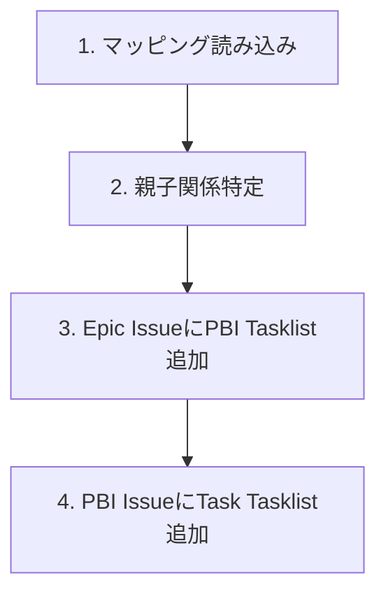

# GitHub Tasklist構築手順

## 概要

登録済みのEpic/PBI/Task Issueに対して、親子関係（Tasklist）を構築します。
`ai_generated/issue_numbers.json` のマッピングを使用します。

## 前提条件

- Issue一括登録が完了していること
- `ai_generated/issues.json` にEpic/PBI/Taskが定義されていること
- `ai_generated/issue_numbers.json` にID→Issue番号マッピングが保存されていること

確認項目:
- 全Epic/PBI/Task Issueが登録済み
- `gh` CLI がインストール・認証済み
- GitHubリポジトリへのwrite権限

## 階層表現

| 階層 | GitHub表現 |
|------|-----------|
| Epic → PBI | Tasklistでリンク |
| PBI → Task | Tasklistでリンク |

## 実行手順

### スクリプトによる一括処理

```bash
# ドライランで確認
python3 .claude/skills/backlog-operations/scripts/build_tasklist.py --dry-run

# 実行
python3 .claude/skills/backlog-operations/scripts/build_tasklist.py
```

### 実行順序



## トラブルシューティング

### ラベル作成

```bash
gh label create epic --color "0052CC" --description "Epic"
gh label create pbi --color "00CC52" --description "Product Backlog Item"
gh label create task --color "CC5200" --description "Task"
gh label create test-case --color "8B5CF6" --description "Test Case"
```

### マッピングファイルがない場合

Issue一括登録（Register.md）を再実行して、`ai_generated/issue_numbers.json` を生成する。

## 完了後

親子関係構築完了後、メインのフローに戻る。
次のステップでユーザーに実装前確認を提示する。
