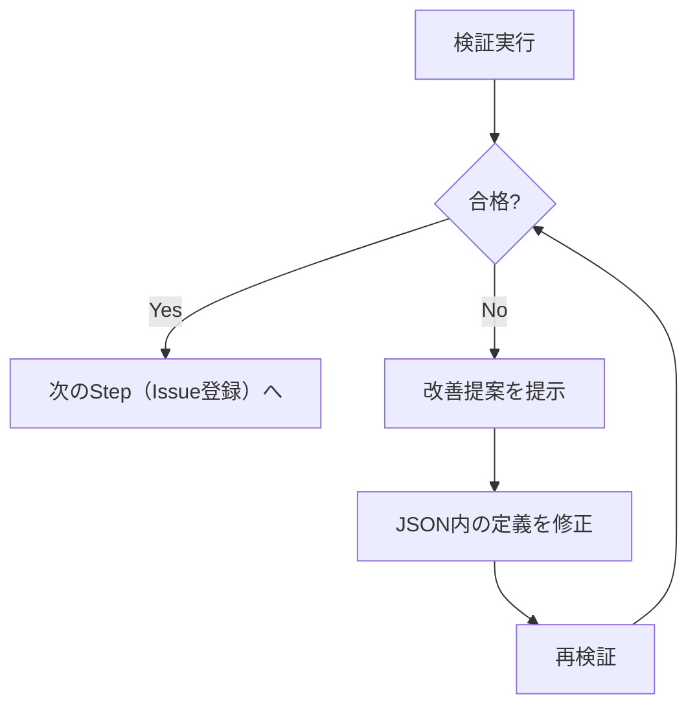

# バックログ品質検証手順

## 概要

`ai_generated/issues.json` のEpic/PBI/Task定義をINVEST/YAGNIチェックで検証し、改善点を提示します。

## 前提条件

- Task定義が全て完了していること
- `ai_generated/issues.json` にEpic/PBI/Taskが定義されていること

## 検証対象の取得

```python
import json

with open('ai_generated/issues.json', 'r') as f:
    issues = json.load(f)

epics = [i for i in issues if i['type'] == 'epic']
pbis = [i for i in issues if i['type'] == 'pbi']
tasks = [i for i in issues if i['type'] == 'task']
```

## 検証プロセス

### 1. INVESTチェック（Epic/PBI用）

| 項目 | 確認内容 | 合格基準 |
|------|----------|----------|
| **I**ndependent | 他と独立しているか | 依存関係が最小限 |
| **N**egotiable | 交渉の余地があるか | 実装方法が固定されていない |
| **V**aluable | 価値があるか | ユーザー/ビジネス価値が明確 |
| **E**stimable | 見積もれるか | 範囲が明確で見積もり可能 |
| **S**mall | 適切なサイズか | Epic: 1-2スプリント、PBI: 1スプリント以内 |
| **T**estable | テスト可能か | 完了を客観的に確認可能 |

**評価基準**:
- 6/6: 優秀
- 4-5/6: 合格（軽微な改善推奨）
- 3/6以下: 要改善

### 2. YAGNIフィルター（Epic/PBI用）

| 質問 | Yes | No |
|------|-----|-----|
| 今この瞬間、これがないと先に進めないか？ | 必要 | 延期検討 |
| 作らないことで10倍以上の手戻りが発生するか？ | 必要 | 延期検討 |
| 推測ではなく実際の要求に基づいているか？ | 必要 | 延期検討 |

**評価基準**:
- 3/3 Yes: 必須
- 2/3 Yes: 優先度検討
- 1/3以下 Yes: 延期・削除候補

### 3. DoD（完成の定義）チェック（PBI用）

body内に以下が含まれているか確認：
- [ ] 受入条件がすべて満たされている
- [ ] コードレビュー完了
- [ ] ユニットテストカバレッジ達成
- [ ] E2Eテスト合格
- [ ] セキュリティレビュー完了

### 4. 受入条件チェック（PBI用）

各受入条件の品質を確認：

| チェック項目 | 内容 |
|-------------|------|
| 具体性 | 曖昧な表現がないか |
| 計測可能性 | 数値や明確な基準があるか |
| 品質分類 | 必須/推奨/任意が設定されているか |
| 回帰テスト | ○/△/×が設定されているか |

### 5. Task完了条件チェック

- [ ] 完了条件が客観的に確認可能か
- [ ] 技術的注意点が記載されているか
- [ ] 依存関係が明記されているか

## 出力形式

```markdown
# バックログ検証レポート

## 検証サマリー

| ID | タイプ | INVEST | YAGNI | 総合 |
|----|--------|--------|-------|------|
| epic-1 | Epic | 5/6 | 3/3 | 合格 |
| pbi-1-1 | PBI | 4/6 | 2/3 | 要確認 |
| task-1-1-1 | Task | - | - | 合格 |

## 要改善項目

### pbi-1-1 [PBI] ユーザーストーリータイトル
- **INVEST**: Smallが未達（スコープが広い）
- **YAGNI**: 2/3（優先度検討）
- **改善提案**:
  1. スコープを分割して2つのPBIに
  2. 受入条件を具体化

## 総合評価
- 合格: 3件
- 要確認: 1件
- 要改善: 0件
```

## 検証失敗時のフロー



**検証失敗時の対応**:
1. 改善提案をログに出力
2. `ai_generated/issues.json` 内の該当定義を修正
3. 再度検証を実行
4. 全定義が合格するまで繰り返し（最大5回）
5. 5回で合格しない場合、修正内容をユーザーに報告して続行

## JSON修正方法

```python
import json

# 読み込み
with open('ai_generated/issues.json', 'r') as f:
    issues = json.load(f)

# 該当Issueを検索して修正
for issue in issues:
    if issue['id'] == 'pbi-1-1':
        issue['body'] = "修正後の本文..."
        break

# 保存
with open('ai_generated/issues.json', 'w') as f:
    json.dump(issues, f, ensure_ascii=False, indent=2)
```

## 完了後

検証通過後、メインのフローに戻り、次のStep（Issue一括登録）に進む。
