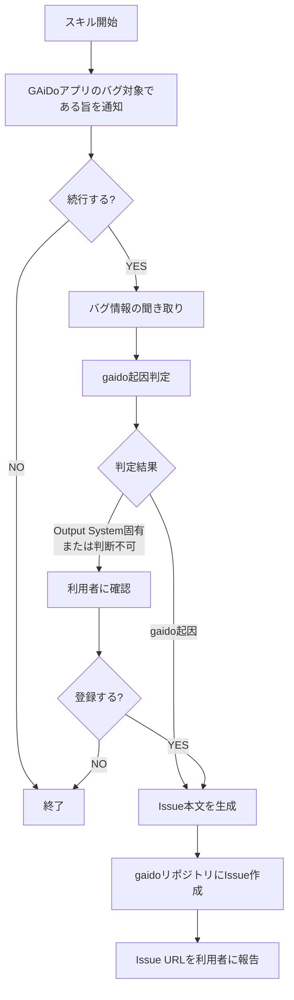

# バグ報告（利用者向け）

利用者との対話でバグ情報を聞き取り、gaidoリポジトリにIssue登録します。

## 重要: スキル開始時の通知

スキル実行開始時に、以下の内容を利用者に **必ず通知** すること:

> このバグ報告機能は **GAiDoアプリ自体** のバグを対象としています。
> AIに作ってもらったシステム（Output System）のバグではありません。
> Output Systemのバグは、Output System内で別途対応してください。

この通知を表示した上で、利用者がバグ報告を続行する意思を確認してから次に進むこと。

## フロー



## Step 1: バグ情報の聞き取り

AskUserQuestionで以下を聞き取る。一度にすべてを聞くのではなく、段階的に聞き取ること。

### 必須項目

1. **バグの概要**: 何が起きたか（1文で）
2. **再現手順**: どの画面で何をしたら発生するか
3. **期待される動作**: 本来どうなるべきだったか
4. **実際の動作**: 実際にはどうなったか

### 任意項目

5. **発生日時**: いつ発生したか
6. **スクリーンショット**: ある場合（Electron上のpockodeではURLは見えないため、URLは聞かない）

## Step 2: gaido起因判定

聞き取った内容から、このバグがGAiDoアプリ自体に起因するかを判定する。

### 判定基準

| 分類 | 条件 | 例 |
|------|------|-----|
| gaido起因 | GAiDoアプリ本体（Electron、pockode、docker、テンプレート、スキル）に起因 | 起動エラー、UI不具合、スキルの動作不良 |
| Output System固有 | AIが構築したOutput Systemの実装に固有。特定ライブラリの使い方、CSS仕様、外部API仕様など | React stale closure、ESLint設定、CSS制約 |
| 判断不可 | どちらか判断できない | |

### 判定後のフロー

- **gaido起因**: そのままIssue作成に進む
- **Output System固有** または **判断不可**: 利用者に以下を通知し、それでも登録するか確認する

> この問題はOutput System固有の問題と思われます。
> GAiDoアプリ自体のバグではない可能性がありますが、それでもgaidoリポジトリにIssue登録しますか？
>
> **判定理由**: [判定理由を説明]

利用者が「登録しない」と回答した場合は終了する。

## Step 3: ラベルの存在確認

```bash
# bugラベルが存在するか確認、なければ作成
gh label list --repo TS3-SE4/gaido --search "bug" --json name | grep -q '"bug"' || \
  gh label create "bug" --repo TS3-SE4/gaido --color "d73a4a" --description "バグ報告"
```

## Step 4: Issue作成

聞き取った内容からIssue本文を生成し、gaidoリポジトリにIssue作成する。

**gaidoリポジトリ操作時のトークン:**
環境変数 `TOKEN_FOR_ISSUE_REPORT_SYSTEM` が設定されている場合は、それを `GH_TOKEN` に指定して実行する。未設定の場合は通常の認証で実行する。

```bash
# TOKEN_FOR_ISSUE_REPORT_SYSTEM が設定されている場合
GH_TOKEN="$TOKEN_FOR_ISSUE_REPORT_SYSTEM" gh issue create --repo TS3-SE4/gaido \
  --title "[利用者報告] {バグの概要}" \
  --label "bug" \
  --body "Issue本文"

# 未設定の場合
gh issue create --repo TS3-SE4/gaido \
  --title "[利用者報告] {バグの概要}" \
  --label "bug" \
  --body "Issue本文"
```

### Issue本文テンプレート

```markdown
## バグ概要

[聞き取った概要]

## 再現手順

[聞き取った再現手順]

## 期待される動作

[聞き取った期待動作]

## 実際の動作

[聞き取った実際の動作]

## gaido起因判定

- **判定結果**: [gaido起因 / Output System固有（利用者確認済み） / 判断不可（利用者確認済み）]
- **判定理由**: [なぜそう判断したかの説明]

## 発生環境

- 発生日時: [聞き取った日時 or 不明]
- スクリーンショット: [あれば添付 or なし]
- 報告元: pockode経由（利用者報告）
```

## Step 5: 完了報告

利用者に以下を報告する:

- 作成したIssue URL
- Issue番号
- 「根本原因分析は別途 `/bug-tickets-root-cause-analysis` で実行されます」

## 注意事項

- 登録先は **gaidoリポジトリ**（`--repo TS3-SE4/gaido`）であり、ターゲットリポジトリではない
- `一時対応済み` ラベルは付けない（根本原因分析がまだのため）
- Issueタイトルには `[利用者報告]` プレフィックスを付けて識別可能にする
