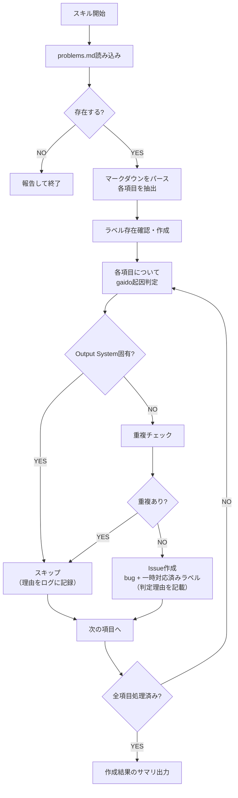

# problems.md → Issue登録

finalizeフェーズで生成された `problems.md` の各項目を、gaidoリポジトリのIssueとして1件ずつ登録します。

## 前提条件

- `problems.md` がターゲットリポジトリのルートに存在すること
- `gh` CLIでgaidoリポジトリにIssue作成可能であること

## フロー



## Step 1: problems.md読み込み

`problems.md` をReadツールで読み込む。存在しない場合は「problems.mdが見つかりません」と報告して終了する。

## Step 2: マークダウンパース

problems.mdの構造を解析し、各項目を抽出する。

**パース対象の構造:**
- `## 各項目の詳細` セクション配下の `### N. 項目名` を各項目として認識
- 概要テーブルから `記録日` を抽出（全項目共通のバグ発生日として使用）
- 各項目から以下を抽出:
  - 項目名（タイトル）
  - 苦労度・深刻度・原因カテゴリ・影響範囲（存在する場合）
  - 「何が起きたか」セクション
  - 「原因」セクション
  - 「どう解決したか」セクション
  - 「改善提案」セクション（対象ファイル・変更種別・具体的な変更内容）

## Step 3: gaido起因判定によるフィルタ

各項目について、gaido側で対応すべき問題かどうかを判定する。

### 判定ロジック

以下の情報を組み合わせて判定する:

1. `影響範囲` フィールド（存在する場合は最優先で使用）
2. `原因カテゴリ` フィールド
3. `改善提案` の対象ファイルパス

| 判定 | 条件 | 処理 |
|------|------|------|
| gaido起因 | 改善提案の対象ファイルがgaido管理領域（`.claude/`, `docker/`, `tools/`, `CLAUDE.md`等） | Issue登録する |
| ルール改善で予防可能 | 原因カテゴリが「ルール不足」「ルール曖昧」「テンプレート不足」で、gaido側のルール/テンプレート追加で再発防止できる | Issue登録する（判定理由付き） |
| Output System固有 | 影響範囲が「Output System固有」、または原因カテゴリが「外部依存」で特定ライブラリ/API/CSS仕様に固有、かつ改善提案の対象ファイルがOutput System内のみ | **スキップ** |

**注意**: `影響範囲` フィールドがない既存のproblems.mdの場合は、`原因カテゴリ` と `改善提案の対象ファイル` から判定する。

## Step 4: ラベルの存在確認（Step 3でスキップされなかった項目のみ以降を実行）

```bash
# bugラベルが存在するか確認、なければ作成
gh label list --repo TS3-SE4/gaido --search "bug" --json name | grep -q '"bug"' || \
  gh label create "bug" --repo TS3-SE4/gaido --color "d73a4a" --description "バグ報告"

# 一時対応済みラベルが存在するか確認、なければ作成
gh label list --repo TS3-SE4/gaido --search "一時対応済み" --json name | grep -q '"一時対応済み"' || \
  gh label create "一時対応済み" --repo TS3-SE4/gaido --color "0075ca" --description "根本原因分析が完了"
```

## Step 5: 重複チェック＆Issue作成

各項目について、以下の手順で処理する。

**gaidoリポジトリ操作時のトークン:**
シェル環境変数 `TOKEN_FOR_ISSUE_REPORT_SYSTEM` が設定されている場合は、それを `GH_TOKEN` に指定して `gh` コマンドを実行する。未設定の場合は通常の認証で実行する。

確認方法（ファイルではなくシェルの環境変数を確認すること）:
```bash
echo "${TOKEN_FOR_ISSUE_REPORT_SYSTEM:-(未設定)}"
```

### 重複チェック

```bash
# 同一タイトルのIssueが既に存在するか確認
# シェル環境変数 TOKEN_FOR_ISSUE_REPORT_SYSTEM が設定されている場合はGH_TOKENに指定して実行
gh issue list --repo TS3-SE4/gaido --label "bug" --search "[problems.md] {項目名}" --json number,title
```

既に同一タイトルのIssueが存在する場合はスキップし、ログに記録する。

### Issue作成

```bash
# シェル環境変数 TOKEN_FOR_ISSUE_REPORT_SYSTEM が設定されている場合はGH_TOKENに指定して実行
gh issue create --repo TS3-SE4/gaido \
  --title "[problems.md] {項目名}" \
  --label "bug" --label "一時対応済み" \
  --body "Issue本文"
```

### Issue本文テンプレート

```markdown
## 概要

- **バグ発生日**: [problems.mdの概要テーブルから抽出した記録日（YYYY-MM-DD）]
- **苦労度**: [抽出した苦労度]
- **深刻度**: [抽出した深刻度]
- **原因カテゴリ**: [抽出したカテゴリ]
- **発生元プロジェクト**: [ターゲットリポジトリ名]

## 何が起きたか

[problems.mdの「何が起きたか」セクションをそのまま転記]

## 原因

[problems.mdの「原因」セクションをそのまま転記]

## 解決方法の提案

[problems.mdの「改善提案」セクションをそのまま転記。対象ファイル・変更種別・具体的な変更内容を含む]

## gaido起因判定

- **判定結果**: [gaido起因 / ルール改善で予防可能]
- **判定理由**: [なぜgaidoリポジトリにIssue登録すると判断したかの説明]

## 元のproblems.md

- リポジトリ: [ターゲットリポジトリURL]
- ファイル: `problems.md` 項目 #N
```

## Step 6: 完了サマリ

すべての項目の処理が完了したら、以下のサマリを出力する:

```
## problems.md Issue登録サマリ

- problems.md項目数: N件
- Issue作成: M件（Issue番号: #X, #Y, #Z, ...）
- スキップ（Output System固有）: J件（項目名: xxx, yyy, ...）
- スキップ（重複）: K件（Issue番号: #A, #B, ...）
```

## 注意事項

- 登録先は **gaidoリポジトリ**（`--repo TS3-SE4/gaido`）であり、ターゲットリポジトリではない
- problems.mdの「改善提案」には対象ファイルと具体的な変更内容が含まれているため、根本原因分析済みと見なして `一時対応済み` ラベルも付与する
- Issueタイトルには `[problems.md]` プレフィックスを付けて、problems.md由来であることを識別可能にする
- ターゲットリポジトリのURLは `git remote get-url origin` で取得する
