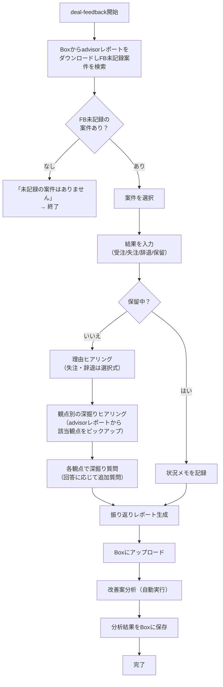

# Deal Feedback - 案件振り返りレポート作成

## 概要

提案後に案件の結果（受注/失注/辞退/保留）を記録し、振り返りレポートを作成する。
welcome-messageの「営業支援」→「案件の振り返りを記録する」で呼び出す独立スキル。

## 行動指針

- **ポジティブに**: 失注・辞退でも責めない。「次に活かせることを一緒に整理しましょう」というスタンス
- **選択式中心**: 自由記述は最小限にし、選択式で素早く回答できるようにする

## 実行フロー



## 事前準備

1. `ai_generated/advisor/feedback/` ディレクトリの存在を確認し、なければ作成
2. Box接続の確認（`.box/credentials.json` の存在確認）

## Step 1: FB未記録案件の検索（Boxマスター）

Boxから案件一覧を取得し、FB未記録の案件を検索する。

```bash
# 1. Boxから案件フォルダ一覧を取得（GAiDo/ 配下）
python3 tools/box_client.py download-folder-by-path "GAiDo" \
  --output-dir ai_generated/advisor/box_sync/
```

ダウンロード後、`ai_generated/advisor/box_sync/` 配下のadvisorレポートを検索する。

- 対象ファイル: `report_*.md`（確定レポート）、`hearing_*.md`（営業ヒアリングまとめ）
- 各ファイルから案件名・顧客名・評価日を抽出する
- Boxの `GAiDo/feedback/` 配下に対応するFBファイル（`fb_*_{案件名}.md`）が存在するかチェック
- FB未記録の案件をリストアップする

**Boxダウンロード失敗時のフォールバック**: ローカルの `ai_generated/advisor/` 配下のadvisorレポートから検索する。

**FB未記録案件がない場合**: 「前回の案件で未記録のものはありません」と伝えて終了。

## Step 2: 案件選択

AskUserQuestionでFB未記録案件を選択肢として提示する。

```
メェナビ「案件の振り返りですね！結果が出た案件はどれですか？」
  ○ {顧客名} {案件名}（{評価日} 評価）
  ○ {顧客名} {案件名}（{評価日} 評価）
  ...
  ○ Other（一覧にない案件）
```

- 案件を選択した場合: Step 3へ
- 「Other」の場合: 案件名を自由入力してもらい、Step 3へ

## Step 3: 結果入力

AskUserQuestionで案件の結果を聞く。

```
メェナビ「{案件名}の結果はどうでしたか？」
  ○ 受注
  ○ 失注
  ○ 辞退
  ○ 保留中
```

## Step 4: 理由ヒアリング

結果に応じて理由を選択式で聞く。

### 失注の場合

```
メェナビ「失注の主な理由を教えてください」
  ○ 競合負け（価格）
  ○ 競合負け（技術力・提案内容）
  ○ 顧客側の予算・体制の問題
  ○ 案件自体が消滅
  ○ Other
```

### 辞退の場合

```
メェナビ「辞退の理由を教えてください」
  ○ 技術的懸念・個人情報取扱いリスク
  ○ 機能要件の曖昧さ
  ○ 顧客・発注元の不明確さ
  ○ Other
```

### 受注の場合

理由の選択はスキップし、Step 5へ進む。

### 保留中の場合

```
メェナビ「現在の状況を教えてください（次のアクションや見込みなど）」
→ 自由記述
```

保留中の場合はStep 5の深掘りは行わず、状況メモのみ記録してStep 6へ進む。

## Step 5: 観点別の深掘りヒアリング

advisor機能と同じ考え方で、観点リストに沿ってメェナビが対話で深掘りする。
質問数の上限は設けない。該当しない観点はスキップする。

### 深掘りの進め方

1. Step 1でBoxからダウンロードしたadvisorレポートから案件の情報（商流、案件種類、規模等）を把握する
2. 観点リストから該当する項目をピックアップする
3. 各観点について選択式または自由記述で質問する
4. **各観点で最低2回は質問する**（1回目: 状況確認、2回目: 具体化・深掘り）
5. ユーザーの回答が曖昧・抽象的な場合は**必ず具体化を求める追加質問を行う**（深掘りルール参照）
6. 該当しない観点はスキップする（例: 商流が「SBのみ」なら対ベンダー/対設置業者はスキップ）
7. advisorレポートから判断できない場合は「この案件でベンダーとのやり取りはありましたか？」等と確認してからスキップ/深掘りを判断する

### 深掘りルール

回答の裏付け・具体化を確認し、次に活かせるレベルの情報を引き出す。

**深掘りが必要なケース（追加質問する）:**
- 回答が曖昧・定性的:「僅差だった」→「具体的にどのくらいの差でしたか？（金額、割合等）」
- 回答が短い:「交渉の余地がなかった」→「なぜ交渉の余地がなかったですか？（価格が固定だった、相見積もりだった等）」
- 改善アクションが抽象的:「もっと早くやるべきだった」→「具体的にいつ頃から始めていれば間に合いましたか？」
- 数値化できそうな回答:「コスト差が大きかった」→「どの費目にいくらくらいの差がありましたか？」

**深掘りが不要なケース（次の観点に進む）:**
- 具体的な数値が含まれている（「200M高かった」「Disc83%で交渉した」等）
- 具体的なアクションが示されている（「次回はRFP受領時点で特価申請を開始する」等）
- 十分な詳細が含まれている

**深掘り質問の生成ルール:**
- 選択式で答えられる質問を優先（営業の負担軽減）
- 「なぜ？」ではなく「具体的には？」「どのくらい？」「いつ頃？」で聞く

### 観点リスト

各観点で「**できなかったこと**」と「**次はどうするか**」を引き出すことを意識する。

#### コスト面

提案スピード向上への効果: 次の見積もりが速くなる

- 「提示額と競合のコスト差は具体的にいくらでしたか？（概算で構いません）」
- 「コスト差が大きかったのはどの費目ですか？（機器/作業/開発/保守等）」
- 「値引き交渉はいつ頃から始めましたか？もっと早く始めていれば結果は変わりましたか？」

#### 対SB

提案スピード向上への効果: SBとの関係構築が進み、情報収集が速くなる

- 「SB様の中で、CTCのポジションはどうでしたか？（本命/有力候補/比較対象/当て馬）」
- 「SB様から競合情報や予算の詳細は引き出せましたか？具体的にどんな情報が得られましたか？」
- 「最終局面でCTCのポジションを確認できましたか？確認できていたら何か手を打てましたか？」

#### 対ベンダー

提案スピード向上への効果: ベンダー交渉の知見で次が速くなる

※ advisorレポートの商流情報等から、ベンダーとのやり取りがある案件のみ聞く

- 「メーカーとの特価交渉はいつ頃始めましたか？（RFP受領時/提案書作成中/最終見積時等）」
- 「最終的にどのくらいのディスカウントを得られましたか？（率や金額で）」
- 「既存商流（エンドユーザーの現行機器の購入元）は把握できていましたか？把握していたら交渉に活かせましたか？」

#### 対設置業者/協力会社

提案スピード向上への効果: 協力会社の選定・交渉が速くなる

※ 設置作業が発生する案件のみ聞く

- 「設置業者は何社に見積もりを取りましたか？比較検討しましたか？」
- 「設置費用は全体コストの何割くらいを占めていましたか？コスト圧縮の余地はありましたか？」

#### 競合

提案スピード向上への効果: 競合対策の知見が次の案件判断を速くする

- 「競合はどこですか？競合の構成・価格感は把握できていましたか？」
- 「競合に対してCTCが差別化できたポイントは何ですか？逆に負けたポイントは？」

#### ヒアリング効率

提案スピード向上への効果: **最も直接的に提案時間を短縮する**

- 「ヒアリングで一番時間がかかったのは何の情報収集ですか？（要件定義/既存構成把握/予算確認等）」
- 「最初から聞いておくべきだった情報は何ですか？それがあればどのくらい時間短縮できましたか？」
- 「エンドユーザーの情報でSB経由では分からなかったことは何ですか？どうすれば入手できましたか？」

#### 提案内容

提案スピード向上への効果: 次の提案書作成が速くなる

- 「RFPで問われている内容で、提案に盛り込めなかった項目はありましたか？具体的に何ですか？」
- 「顧客またはSB様から提案に対するフィードバックはありましたか？どんな評価でしたか？」
- 「提案で一番刺さったポイントと、一番弱かったポイントは何ですか？」

#### 社内プロセス

提案スピード向上への効果: 社内調整の効率化

- 「社内レビュー（部長/本部長/役員）は提案期限のどのくらい前に実施しましたか？十分な時間がありましたか？」
- 「ターゲットコストの算出は正確でしたか？実際の競合価格と比べてどうでしたか？」
- 「社内の情報連携で詰まったところはありましたか？具体的にどこですか？」

## Step 6: 振り返りレポート生成・保存

収集した情報をもとに振り返りレポートを生成する。

### ファイル名

`ai_generated/advisor/feedback/fb_{YYYYMMDD}_{案件名}.md`

例: `fb_20260324_ABC社_クラウド移行.md`

### レポートフォーマット

```markdown
---
deal_name: "{案件名}"
customer: "{顧客名}"
evaluation_date: "{advisorでの評価日}"
feedback_date: "{本日の日付}"
result: "{受注 | 失注 | 辞退 | 保留中}"
loss_reason: "{失注理由（失注の場合のみ）}"
withdrawal_reason: "{辞退理由（辞退の場合のみ）}"
advisor_report: "{対応するadvisorレポートのファイルパス}"
---

# 案件振り返りレポート: {案件名}

## 基本情報

| 項目 | 内容 |
|------|------|
| 案件名 | {案件名} |
| 顧客名 | {顧客名} |
| advisor評価日 | {評価日} |
| 振り返り記録日 | {本日の日付} |
| 結果 | {受注 / 失注 / 辞退 / 保留中} |

## 結果詳細

{結果に応じた理由・状況の記載}

## 観点別の振り返り

### {該当した観点名}（例: コスト面）

**できなかったこと:**
{ヒアリングで引き出した内容}

**次はどうするか:**
{ヒアリングで引き出した改善アクション}

### {該当した観点名}（例: ヒアリング効率）

**できなかったこと:**
{ヒアリングで引き出した内容}

**次はどうするか:**
{ヒアリングで引き出した改善アクション}

（※ 該当した観点の数だけ繰り返す。スキップした観点は含めない）

## advisor判定との振り返り

| advisor評価項目 | スコア | 実績からの所感 |
|----------------|--------|---------------|
| {項目名} | {スコア}/5 | {実績との比較コメント} |

```

## Step 7: 保存（Boxマスター）

**Boxにアップロードする。** アップロード後、出力されたBox URLをユーザーに表示すること。

```bash
python3 tools/box_client.py upload {対象ファイルパス} \
  --folder-path "GAiDo/feedback/{案件名}"
```

**Boxアップロードが失敗した場合**: エラー内容をユーザーに伝え、Boxへの再アップロードを促すこと。

## Step 8: 改善案分析（自動実行）

振り返りレポート保存後、自動で改善案分析を実行する。

### 手順

1. **Boxから全FBレポートをダウンロード**

```bash
# Boxのフィードバックフォルダからダウンロード
python3 tools/box_client.py download-folder-by-path "GAiDo/feedback" \
  --output-dir ai_generated/advisor/feedback/box_sync/
```

**Boxダウンロード失敗時のフォールバック**: ローカルの `ai_generated/advisor/feedback/` にあるFBレポートのみで分析を続行する。

2. **全FBレポートを読み込み**

以下のファイルをReadツールで読み込む:
- `ai_generated/advisor/feedback/box_sync/**/fb_*.md`（Boxからダウンロードした全担当者分）
- Boxダウンロード失敗時: `ai_generated/advisor/feedback/fb_*.md`（ローカルのFBレポート）

3. **対応するadvisorレポートも読み込み**

各FBレポートのfrontmatter `advisor_report` フィールドからadvisorレポートのパスを取得し、存在するものを読み込む。advisorのスコアリング結果と実際の結果を突合するために必要。

4. **分析実行**

全FBレポートとadvisorレポートを総合して、以下の観点で分析する:

- **受注パターン**: どんな案件が受注しやすいか（共通する特徴、スコアの傾向）
- **失注パターン**: どんな案件で負けやすいか（失注理由の分布、スコアとの相関）
- **辞退パターン**: どんな案件を見送るべきか（辞退理由の傾向）
- **advisorスコアと実績のギャップ**: advisor判定がGoだったのに失注した案件、No Bidだったのに受注できた案件など
- **ScoringCriteria改善示唆**: ウェイトの妥当性、閾値の精度に対する改善提案

5. **分析結果レポートを生成・保存**

### ファイル名

`ai_generated/advisor/feedback/analysis_{YYYYMMDD}.md`

例: `analysis_20260324.md`

**上書きせず時系列で残す**。同日に複数回実行した場合は `analysis_{YYYYMMDD}_{HHMMSS}.md` とする。

### レポートフォーマット

```markdown
---
analysis_date: "{本日の日付}"
total_feedback_count: {分析対象の総FB数}
own_feedback_count: {自分のFB数}
shared_feedback_count: {他担当者のFB数}
---

# 改善案分析レポート

## 分析概要

| 項目 | 件数 |
|------|------|
| 分析対象FB総数 | {件数} |
| 受注 | {件数} |
| 失注 | {件数} |
| 辞退 | {件数} |
| 保留中 | {件数} |

## 受注パターン

{受注案件に共通する特徴、advisorスコアの傾向}

## 失注パターン

{失注理由の分布、多い失注理由、スコアとの相関}

## 辞退パターン

{辞退理由の傾向、事前検知できそうなパターン}

## advisorスコアと実績のギャップ

{advisor判定と実際の結果が乖離したケースの分析}

## ScoringCriteria改善示唆

{ウェイトの妥当性、閾値の精度、追加すべき評価軸などの提案}

## 次の案件相談への推奨事項

{次回advisor利用時に特に注意すべきポイント}
```

7. **保存（Boxマスター）** アップロード後、出力されたBox URLをユーザーに表示すること。

```bash
python3 tools/box_client.py upload {分析結果ファイルパス} \
  --folder-path "GAiDo/feedback/analysis"
```

8. **ユーザーに完了を伝える**

「過去の振り返りデータをもとに改善案の分析を行いました。次の案件相談時に改善案が反映されます。」と伝えて完了。

## 注意事項

- AskUserQuestionの `questions` パラメータは必ず配列型で渡すこと（JSON文字列は不可）
- 1つのAskUserQuestion呼び出しでは、関連する質問のみをまとめること
- 保留中の案件は次回も未記録として表示される（結果が確定するまで）
- このスキルはwelcome-messageのOtherから独立して呼び出される
- Step 8の改善案分析はFBレポートが1件以上ある場合のみ実行する（0件の場合はスキップ）
- 分析結果は上書きせず時系列で残す。過去の分析結果との比較で改善傾向が見えるようにする
- **既存のFBファイル（`fb_*.md`）を削除・上書きしてはならない**。一度記録した振り返りレポートは改善案分析の元データであり、削除すると分析の正確性が損なわれる
- **既存の分析結果ファイル（`analysis_*.md`）も削除・上書きしてはならない**。時系列の変遷を追跡するために全件保持する
