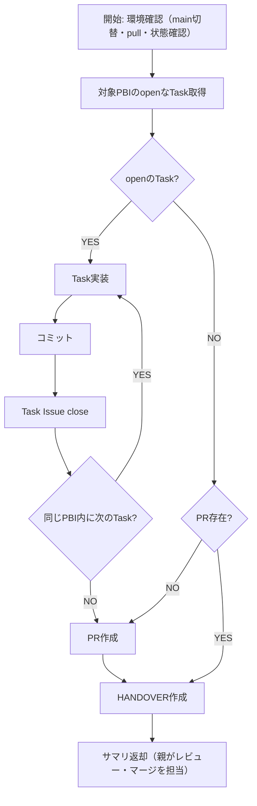

# 実装フェーズ手順

親オーケストレーターから指定された1つのPBIのTask Issueを順に実装し、PBI単位でPRを作成します。

## 対象PBIの特定

親オーケストレーターのプロンプトに含まれる「対象PBI Issue: #N」からPBI番号を取得する。

対象PBI Issue本文の `## タスク` セクション（backlogフェーズで構築済み）からTask Issue番号リストを取得:
```bash
# 対象PBI本文を取得
gh issue view <pbi_number> --json body -q '.body'
# → "## タスク" セクションの "- [ ] #5\n- [ ] #6\n- [ ] #7" からTask番号を抽出
```

## 開始時の環境確認

各SubAgentは開始時に自分の前提条件を確保する。前のSubAgentの状態に依存しない。

```bash
# 1. mainブランチに切り替え・最新化
git checkout main && git pull

# 2. ワーキングディレクトリがクリーンであることを確認
git status

# 3. 対象PBIのTask Issue番号リストを取得（PBI本文の「## タスク」セクションから）
gh issue view <pbi_number> --json body -q '.body'

# 4. 各Task Issueの状態を確認（closedはスキップ、openから実装再開）
gh issue view <task_number> --json state -q '.state'

# 5. PRの状態を確認
gh pr list --state all --json number,title,state --limit 100
```

### プロジェクトコンテキストの引継ぎ

1. `ai_generated/HANDOVER.md` が存在する場合はReadし、プロジェクト固有知識（技術スタック・設計判断・はまりポイント等）を把握する
2. 対象PBI Issue本文の `## 依存関係 > 前提` からIssue番号（#N形式）を取得する:
   ```bash
   gh issue view <pbi_number> --json body -q '.body'
   # → 「前提」行から #番号 を抽出
   ```
   前提PBIがある場合、各前提PBI Issueのコメントから引き継ぎノートを取得する:
   ```bash
   gh issue view <前提PBI番号> --json comments -q '.comments[].body'
   # → 「<!-- HANDOVER-NOTE -->」マーカーを含むコメントが引き継ぎノート
   ```
   前提PBIが複数ある場合は、全ての前提PBIの引き継ぎコメントを読む。
3. 前提PBIがない場合、または引き継ぎコメントが見つからない場合は通常通りプロジェクト探索を行う

## フェーズ内フロー



## Step 1: Task実装ループ

各Taskに対して:

1. **Readツールで `references/Coding.md` を読み込み**、手順に従って実装
2. コミット（`.claude/rules/git-rules.md` 参照）
3. Task Issueをclose: `gh issue close <task_issue_number>`

## Step 2: PR作成

PBI配下の全Task完了後:

**Readツールで `references/PR.md` を読み込み**、手順に従ってPR作成。

## Step 3: HANDOVER作成

**Readツールで `references/Handover.md` を読み込み**、手順に従ってHANDOVER.mdの更新とPBI Issueへの引き継ぎコメント投稿を行う。

- PBI Issueに構造化された引き継ぎコメントを投稿する（`<!-- HANDOVER-NOTE -->` マーカー付き）
- サマリに「レビュー待ちPR」として含めて親に返却
  - マージは親オーケストレーターが担当（コードレビュー設定に応じてユーザーレビュー、AIレビュー、または即マージ）

## コミット後の自動判定ロジック

コミット完了後、以下を**自動的に判定・実行**すること：

1. 対象PBI本文の `## タスク` セクションからTask Issue番号リストを取得（対象PBI番号はプロンプトで指定済み）
2. Task Issue番号リストのうち、openのものがあるか確認
3. **同じPBI配下にopenのTask Issueがある場合**: 次のTaskを実装（番号順で次のopenのTask）
4. **同じPBI配下の全Task Issueがclosedの場合**: PR作成（Step 2へ）

## 修正モード

親オーケストレーターから「修正が必要: [指示内容]」を含むプロンプトで呼ばれた場合:

1. 既存PRのブランチを特定:
   ```bash
   gh pr list --state open --json number,headRefName --limit 100
   ```
2. 既存PRのブランチをチェックアウト: `git checkout <既存ブランチ名>`
3. 指示に基づいて修正を実施
4. コミット・プッシュ（既存PRに自動反映）
5. HANDOVER更新（`references/Handover.md` の手順に従い、HANDOVER.mdとPBI Issue引き継ぎコメントを更新）
6. サマリ返却（「修正完了」として）

## 完了条件

- 対象PBIの全TaskがcloseされていることをGitHub Issueで確認
- PRが作成（レビュー待ち）であること

## 完了時の返却サマリ

このPBIの実装が完了したら、以下のサマリを親オーケストレーターに返却すること。
**注意**: ユーザーへのレビュー依頼・動作確認依頼は親オーケストレーターが担当する（Subagent内ではAskUserQuestionは使用不可）。

```
## PBI実装完了サマリ
- 対象PBI: #N [タイトル]
- 実装済みTask数: N件
- PR: #N（レビュー待ち）
- PR URL: [URL]
```

## 注意事項

- Task番号順 = 実装順。依存先Taskより先に実装しないこと
- コミットは `.claude/rules/git-rules.md` の規約に従うこと
- こまめにコミットすること（エラーリカバリ時のコード喪失防止）

## 参照ファイル一覧

| ファイル | 用途 | 読込タイミング |
|---------|------|-------------|
| `references/Coding.md` | コーディング手順 | Step 1（各Task実装時） |
| `references/PR.md` | PR作成手順 | Step 2 |
| `references/Handover.md` | HANDOVER作成手順 | Step 3 |
