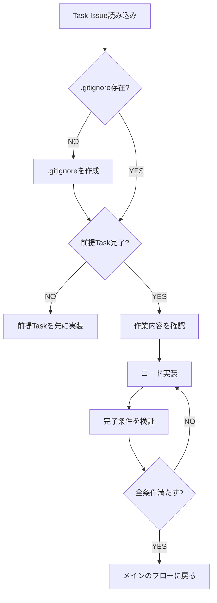

# コーディング手順

## 概要

GitHub Issue上のTask Issueを読み込み、完了条件を満たすコードを実装します。

**スコープ**: この手順は**単一Taskの実装**を担当。

## 前提条件

- バックログ検証が完了していること
- 対象Task Issueがopenであること

## 実装前の確認

1. **対象Task Issueを読み込む**
   ```bash
   # 未完了のTask Issue一覧を取得
   gh issue list --label "task" --state open --json number,title,body --limit 100

   # 対象Taskの詳細を取得
   gh issue view <task_issue_number>
   ```

2. **親PBI Issueを確認**（受入条件確認用）
   ```bash
   gh issue list --label "pbi" --json number,title,body --limit 100
   ```

3. **要件ファイルを確認**
   ```
   ai_generated/requirements/ 配下のファイルを読み込み（README.md でガイド確認後、必要なファイルを読む）
   ```

4. `rules/context7.md` に従いドキュメントを確認

## プロジェクト初期化（最初のTask実装時のみ）

**リポジトリにコードがまだない場合**、最初のTask実装前に以下を行う:

### 0. `output_system/` ディレクトリを作成（必須）

実装コードはすべて `output_system/` 配下に配置する（CLAUDE.mdの「コード配置規約」参照）。

```bash
mkdir -p output_system
```

### 1. `.gitignore`を作成（必須）

`output_system/.gitignore` に技術スタックに応じた適切な.gitignoreを作成する。

**.gitignoreに含めることでコミット対象にしないもの**（最低限、以下は必ず除外すること）:
- `.pockode/`（Pockode内部ファイル）
- `.env`、`.env.*`、`*.local`（機密情報）
- `node_modules/`、`vendor/`、`venv/`、`.venv/`、`__pycache__/`（依存パッケージ）
- `dist/`、`build/`、`out/`、`.next/`（ビルド成果物）
- `.turbo/`（Turborepoキャッシュ）
- `.idea/`、`.vscode/`、`*.swp`、`*.swo`（IDE設定）
- `.DS_Store`、`Thumbs.db`（OS固有ファイル）
- `*.log`、`logs/`（ログファイル）
- `coverage/`、`test-results/`、`playwright-report/`、`playwright/.cache/`（テスト結果）
- `*.tsbuildinfo`（TypeScriptキャッシュ）
- `*.tmp`、`*.temp`（一時ファイル）
- `.mcp.json`（利用可能なMCP情報）

**.gitignoreに含めてはいけない。つまりコミット対象にするもの**（継続開発に必要）:
- `ai_generated/`（要件ファイル、スクリーンショット等）
- `cost_metrics.jsonl`（コスト記録）
- `session_*/`（チャットのセッションファイル）
- `.claude/`（Claude Code設定）
- `docs_with_ai/`（AIも利用するドキュメント）
- `CLAUDE.md`（指示内容）
- `ssl-certificates/`（Output Container用証明書）

参考: https://github.com/github/gitignore

### 2. その他の初期ファイル
- 言語・フレームワークの設定ファイル（`output_system/package.json`、`output_system/tsconfig.json`等）
- ディレクトリ構成（`output_system/` 配下に作成）

## 実装フロー



## 実装ルール

### 1. Task Issueに従う

- 「作業内容」に記載された項目をすべて実施
- 「完了条件」をすべて満たすまで完了としない
- 「技術的な注意点」を守る

### 2. コード品質

- テストを書く（test-standards スキルに従うこと）
- セキュリティ脆弱性を作らない（OWASP Top 10）
- 要件ファイルの「技術選定」に従う
- **コメントを多めに入れること**
  - 各種ソースコード、Dockerfile、docker-compose.yml、各設定ファイルなどに多めにコメントを入れる
  - なぜその設定やコードが必要なのかといった、その理由をコメントとして記載する
  - 特にソースコードの場合は、人間が後でレビューしやすいように、TSDocやそれに類するフォーマットで、全関数やclassに用途・引数・返り値付きのコメントを付ける

### 3. ブランチ運用

- ブランチは**mainとfeatureブランチのみ**とする
- featureブランチは `feature/<チケット名を英語にしたもの>` とする（例: `feature/user-authentication`）
- 新たなPBIに着手するときは、mainブランチからfeatureブランチを作って、そのPBIの全Taskをその上で実装する

## 技術選定（実装開始時）

要件ファイルの「技術選定」が未定の場合、**AIが要件に基づいて最適な技術スタックを決定**する。

**判定フロー**:
1. 要件ファイルの「技術選定」を確認
2. 決まっている → それに従う
3. 決まっていない → AIが要件を分析し、最適な技術を選定

**AIは以下を考慮して選定**:
- 要件の特性（Web/API/CLI/データ処理等）
- 既存コードとの整合性
- スケーラビリティ・保守性
- チームのスキル（不明なら汎用性の高いものを選択）

**選定結果は要件ファイルに記録して永続化する。**

## 検証ステップ（必須）

コード実装後、以下の検証を通過させること。

### 1. コード品質検証

| 検証項目 | コマンド例 | 条件 |
|---------|-----------|------|
| Linter | `npm run lint` | エラー0 |
| 型チェック | `npm run typecheck` | エラー0 |
| ビルド | `npm run build` | 成功 |
| ユニットテスト | `npm test` | 全pass |

- テスト環境がなければAIが構築してから実行
- エラーを修正して再検証
- 全ステップが通過するまで完了としない

### 2. ブラウザ動作確認（Webシステムの場合・必須）

**playwright-cliを使用してブラウザで動作確認すること**。curlでの確認は最小限に。

**注: URLは `rules/instance-config.md` の「コンテナ内からアクセスする時のフロントエンドURL」を参照すること。以下はデフォルト値での例。**

```bash
# コンテナを起動
docker compose up -d

# playwright-cliでブラウザ操作（対話的な操作が可能）
# AI Agent containerからOutput System containerへはコンテナ名でアクセスする
playwright-cli open http://output-system-container:3001
playwright-cli snapshot
playwright-cli click e5  # snapshotのrefを使用
playwright-cli screenshot --filename=ai_generated/screenshots/task-{issue番号}_{画面名}.png

# 簡易なスクリーンショットだけなら従来コマンドも利用可
npx playwright screenshot http://output-system-container:3001 ai_generated/screenshots/task-{issue番号}_{画面名}.png
```

**完了条件**:
- playwright-cliでページが正常に開けること
- 主要な画面のスクリーンショットが `ai_generated/screenshots/` に保存されていること
- スクリーンショットがReadツールで正常に読み込めること
- チケット仕様通りに動くまで修正を繰り返すこと

詳細は `.claude/skills/playwright-cli/SKILL.md` を参照。

## Task完了条件の検証

Task Issueの完了条件を1つずつ確認：

```markdown
## 完了条件
- [x] APIエンドポイントが動作する
- [x] ユニットテストが通る
- [x] エラーハンドリングが実装されている
```

すべてチェックが入るまで次のTaskに進まない。

## エラー時の対応

| 状況 | 対応 |
|------|------|
| テスト失敗 | 修正して再実行 |
| 依存Taskが未完了 | 依存Taskを先に実装 |
| 要件不明確 | 要件ファイルを確認、不足なら `/analyze` に戻る |
| 技術的ブロッカー | Task Issueにコメントし、ユーザーに報告 |

## 完了後

実装完了後、メインのフローに戻り、コミットを実行する。
