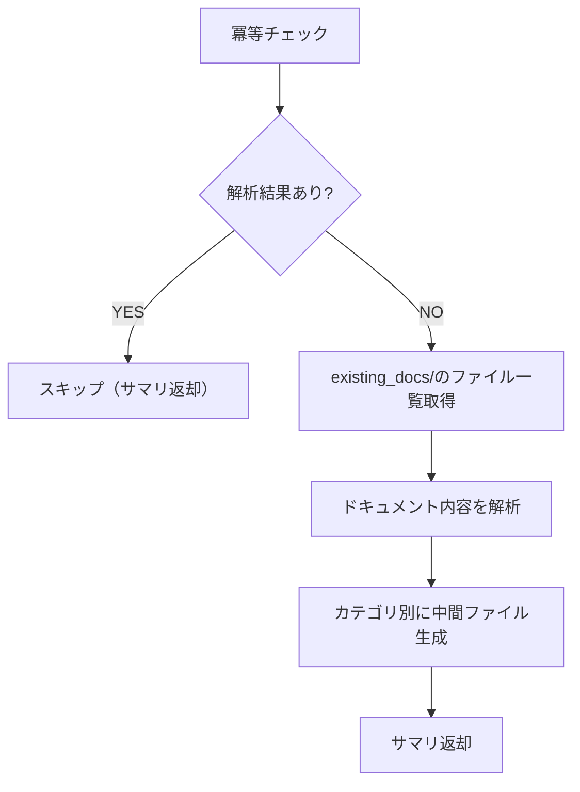

# 既存ドキュメント解析手順

`existing_docs/` 配下のドキュメントのみを解析し、requirements形式の中間ファイルを `ai_generated/intermediate_files/from_docs/` に生成します。

## 参照制約

参照可能なディレクトリは `existing_docs/` のみ。それ以外のファイル（ソースコード含む）は**参照禁止**。

## 冪等チェック（再開対応）

`ai_generated/intermediate_files/from_docs/` に解析結果ファイルが存在する場合はスキップする。

```bash
ls ai_generated/intermediate_files/from_docs/architecture.md 2>/dev/null && echo "SKIP: already completed"
```

## フェーズ内フロー



## Step 1: ドキュメント一覧の把握

```bash
find existing_docs/ -type f | head -200
```

## Step 2: 解析・中間ファイル生成

各ドキュメントを読み込み、カテゴリ別にrequirements形式で中間ファイルを生成する。

```bash
mkdir -p ai_generated/intermediate_files/from_docs
```

### 出力ファイル一覧

| ファイル | 内容 |
|---------|------|
| `architecture.md` | システム構成・技術スタック・主要コンポーネント |
| `db.md` | DB構造・テーブル定義・リレーション |
| `screens.md` | 画面一覧・画面遷移 |
| `api.md` | API一覧・エンドポイント定義 |
| `file_structure.md` | ディレクトリ構成・各ディレクトリの役割 |
| `devops.md` | ビルド・デプロイ構成 |
| `others.md` | 上記カテゴリに含まれない情報 |

各ファイルの内容は、ドキュメントから読み取れた事実のみを記載すること。

該当する情報がないカテゴリのファイルは作成不要。

## コミット＆プッシュ

生成した中間ファイルをコミット＆プッシュする（`.claude/rules/git-rules.md` に従う）。

```bash
git add ai_generated/intermediate_files/from_docs/
git commit -m "docs(analysis): Add document analysis intermediate files

Co-Authored-By: Claude <noreply@anthropic.com>"
git push
```

## 完了条件

- 該当するカテゴリの中間ファイルが `ai_generated/intermediate_files/from_docs/` に出力されていること
- `existing_docs/` 以外のファイルを参照していないこと
- 生成ファイルがコミット＆プッシュされていること

## 完了時の返却サマリ

```
## 既存ドキュメント解析 完了サマリ
- 解析したドキュメント数: N件
- 生成ファイル数: N件
- 生成ファイル: [ファイル名一覧]
- 出力先: ai_generated/intermediate_files/from_docs/
```

## 注意事項

- ソースコードは参照禁止。ドキュメントのみから情報を抽出すること
- ドキュメントの形式（Word, PDF, Markdown, Excel等）に応じて適切に読み込むこと
- Office文書（Excel/Word/PowerPoint）が含まれる場合は、constraints.mdのOffice文書セクションに従いPDFに変換してから読み込むこと
