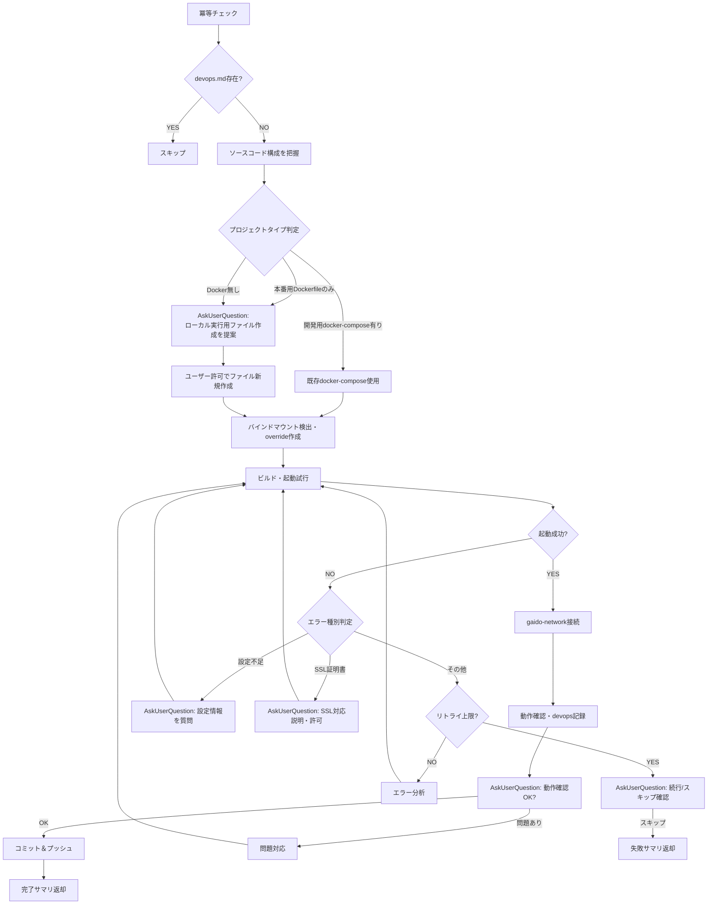

# 既存ソースローカル実行手順

既存システムをローカルでビルド・起動し、動作確認を行います。devops情報を中間ファイルに記録します。

**このSkillは親コンテキスト（メインエージェント）で実行され、AskUserQuestionでユーザーと直接対話できます。**

## 絶対ルール

- **既存ファイルの改変はユーザーの明示的許可が必要**: `output_system/` 配下の既存ファイル（ソースコード、Dockerfile、docker-compose.yml、設定ファイル等）を変更する場合は、必ずAskUserQuestionで理由を説明し許可を得ること。許可なく改変してはならない
- **新規ファイル作成もユーザー許可制**: Dockerfile/docker-compose.yml等の新規作成はAskUserQuestionでユーザーの許可を得てから行う
- **必ずOutput Systemコンテナ（DooD）として起動**: AI Agentコンテナ内での直接起動は禁止（ユーザーのブラウザからアクセスできないため）
- **コードを改造して無理やり起動させない**: 設定情報が不足している場合はユーザーに質問する。外部サービス（DB、Redis、AWS等）の設定をモックやスタブに置き換えてはならない
- **外部サービスの構成方針はユーザーに確認する**: DB、Redis、メッセージキュー等の外部サービスが必要な場合、構成方針の選択肢をユーザーに提示すること。AIが勝手にローカルコンテナを立てたり接続先を決めたりしてはならない

## 冪等チェック（再開対応）

`ai_generated/intermediate_files/from_source/devops.md` が存在する場合はスキップする。

```bash
ls ai_generated/intermediate_files/from_source/devops.md 2>/dev/null && echo "SKIP: already completed"
```

## フェーズ内フロー



## Step 1: ソースコード構成の把握

`output_system/` 配下のファイル構成を確認し、以下を特定する:

- 使用言語・フレームワーク
- ビルドツール（output_system/package.json, output_system/Makefile, output_system/docker-compose.yml等）
- 設定ファイル（output_system/.env.example, output_system/config/等）
- 起動方法（output_system/README.md, output_system/scripts/等を参照）

### 起動戦略の判定

| 既存プロジェクトの状態 | 対応 |
|---|---|
| 開発用docker-compose.ymlがある | そのまま使う |
| 本番用Dockerfileしかない | ユーザーと協力して `Dockerfile.local-run` + `docker-compose.local-run.yml` を新規作成 |
| Dockerを使っていない | ユーザーと協力して `Dockerfile.local-run` + `docker-compose.local-run.yml` を新規作成 |

**判定基準**: Dockerfileの中身を確認する。`npm install`や`pip install`等のビルドステップがあれば開発用。`COPY build/libs/*.jar`等のビルド済み成果物のコピーのみなら本番用。

**新規ファイルの命名規則**: 既存のDockerfile/docker-compose.ymlと衝突しないよう、ローカル実行用ファイルは `Dockerfile.local-run`、`docker-compose.local-run.yml` の名前で作成する。

## Step 2: ビルド・起動

### 起動戦略別の手順

#### 戦略A: 開発用docker-compose.ymlがある場合

```bash
cd output_system
docker compose up -d
```

#### 戦略B/C: ローカル実行用ファイルを新規作成する場合

1. AskUserQuestionでユーザーにローカル実行用ファイル作成の許可を得る
2. ユーザーと協力してビルド手順・依存関係・設定を確認
3. `Dockerfile.local-run` と `docker-compose.local-run.yml` を作成
4. 起動:

```bash
cd output_system
docker compose -f docker-compose.local-run.yml up -d
```

### バインドマウント対応

既存docker-compose.ymlにホストバインドマウント（`./src:/app/src`等）がある場合、DooD構成では動作しない。

- `docker-compose.override.yml` を新規作成し、バインドマウントをnamed volumeに上書きまたは無効化する
- DB初期化SQL等のバインドマウント（`./init.sql:/docker-entrypoint-initdb.d/init.sql`）も同様に対処する
- 対応前にユーザーにDooD構成の制約を説明する

### gaido-network接続

AI AgentコンテナからOutput Systemコンテナにアクセスするため、gaido-networkへの接続が必要。

#### 戦略A（既存docker-compose.ymlをそのまま使う場合）

既存ファイルを改変できないため、起動後に`docker network connect`で接続する:

```bash
# 起動中のコンテナ名を取得
docker compose ps --format json | python3 -c "import sys,json; [print(json.loads(l)['Name']) for l in sys.stdin]"

# 外部アクセスが必要なコンテナをgaido-networkに接続
docker network connect gaido-network <フロントエンドのコンテナ名>
```

#### 戦略B/C（docker-compose.local-run.ymlを新規作成する場合）

新規作成するdocker-compose.local-run.ymlにgaido-networkを直接記載してよい:

```yaml
networks:
  default:
    name: gaido-network
    external: true
```

### ポート・コンテナ名

#### 戦略A（既存docker-compose.ymlをそのまま使う場合）

既存docker-compose.ymlから実際のサービス名・ポートを動的に読み取る。`rules/instance-config.md` の固定値は使わない:

```bash
# サービス設定を確認
docker compose config

# 実行中コンテナのポートマッピングを確認
docker compose ps
```

#### 戦略B/C（docker-compose.local-run.ymlを新規作成する場合）

`rules/instance-config.md` の値に従ってコンテナ名・ポートを設定してよい。

### SSL証明書対応

ビルド失敗時にSSLエラー（`unable to access 'https://...'`、`CERT_HAS_EXPIRED`、`SSL certificate problem`等）を検出した場合:

1. AskUserQuestionでユーザーにSSL証明書の問題と対応方法を説明
2. ユーザーの許可を得てからDockerfileに証明書設定を追加
3. `ssl-certificates/` ディレクトリの証明書を利用（`rules/constraints.md` の「SSL証明書設定」パターン参照）

### 設定補完

環境変数、APIキー、データベース接続情報等が不足している場合:

1. エラーメッセージから不足している設定を特定
2. AskUserQuestionでユーザーに直接質問
3. ユーザーの回答を反映して再試行

### エラーハンドリング

- ビルド・起動失敗時のリトライ上限: **3回**
- 3回超過 → AskUserQuestionでユーザーに状況を説明し、続行/スキップを確認
- スキップの場合 → 失敗サマリを返却

## Step 3: 動作確認・devops情報の記録

### 動作確認

起動に成功したら動作確認を行う:

- **Webアプリの場合**: `playwright-cli`でスクリーンショットを取得
  - URL: `docker compose ps` で検出したコンテナ名とポートから構築（例: `http://<コンテナ名>:<ポート>`）
  - **`localhost`は絶対に使用しない**（`rules/constraints.md`の「PlaywrightからのURL指定ルール」参照）
  - 保存先: `ai_generated/screenshots/`

- AskUserQuestionでユーザーに動作確認結果を確認:
  - 「動作確認OK、解析フェーズへ進む」
  - 「問題あり（詳細を入力）」

### devops情報の記録

```bash
mkdir -p ai_generated/intermediate_files/from_source
mkdir -p ai_generated/screenshots
```

`ai_generated/intermediate_files/from_source/devops.md` に以下のテンプレートで記録:

```markdown
# DevOps情報

## ビルド・起動手順
- 起動コマンド: [使用したコマンド]
- 前提条件: [必要な事前準備があれば記載]
- アクセスURL: [URL]（該当する場合）

## 環境変数
| 変数名 | 値 | 備考 |
|--------|-----|------|
| [変数名] | [値（機密値は****でマスク）] | [説明] |
```

## コミット＆プッシュ

devops情報とスクリーンショットをコミット＆プッシュする（`.claude/rules/git-rules.md` に従う）。

```bash
git add ai_generated/intermediate_files/from_source/devops.md
git add ai_generated/screenshots/
git commit -m "docs(devops): Add local run devops info and screenshots

Co-Authored-By: Claude <noreply@anthropic.com>"
git push
```

## 完了条件

- 既存システムのビルド・起動が成功し、動作確認が完了していること
- `ai_generated/intermediate_files/from_source/devops.md` にdevops情報が記録されていること
- 生成ファイルがコミット＆プッシュされていること

## 完了時の返却サマリ

```
## 既存ソースローカル実行 完了サマリ
- 起動方法: [使用したコマンド]
- アクセスURL: [URL]（該当する場合）
- 確認した機能: [概要]
- スクリーンショット: [あり（ai_generated/screenshots/配下）/ なし]
- 記録先: ai_generated/intermediate_files/from_source/devops.md
```

### 起動失敗時のサマリ

```
## 既存ソースローカル実行 失敗サマリ
- 試行した起動方法: [コマンド]
- エラー内容: [エラー概要]
- 推定原因: [原因]
- ローカル実行をスキップして解析フェーズに進みます
```

## 参照ファイル一覧

以下はrules/で自動読み込み済みだが、本Skill実行時に特に注意すべきセクションを示す。

| ファイル | 注目セクション |
|---------|-------------|
| `rules/constraints.md` | 「SSL証明書設定」「PlaywrightからのURL指定ルール」 |
