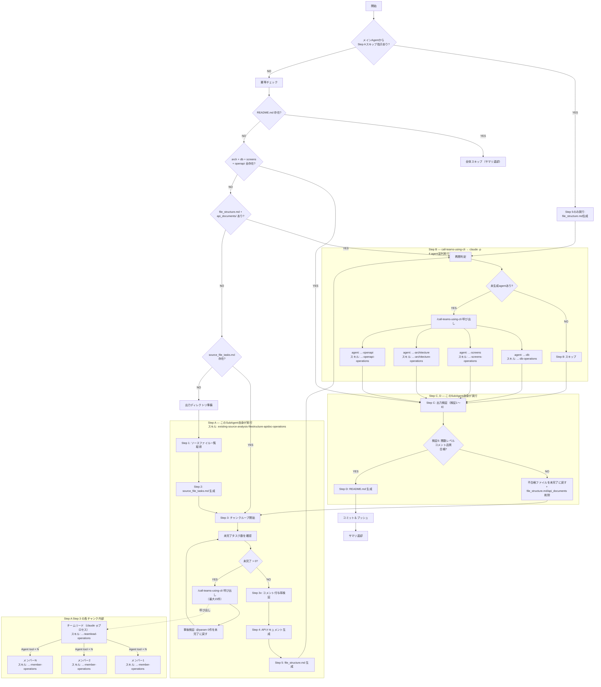

# 既存ソース解析手順

ソースコードのみを解析し、requirements形式の中間ファイルを `ai_generated/intermediate_files/from_source/` に生成します。

## 参照制約

解析対象は `output_system*/` 配下のソースコードが主体。

以下のディレクトリ・ファイルは**参照禁止**:

- `.claude/`
- `docs_with_ai/`
- `existing_docs/`
- `ai_generated/intermediate_files/from_docs/`


以下は**参照可能**:

- `output_system*/` 配下のすべてのファイル
- `ai_generated/intermediate_files/from_source/devops.md`（ローカル実行フェーズの出力。ビルド手順・URL等のヒントとして活用）

## 冪等チェック（再開対応）

開始前に `ai_generated/intermediate_files/from_source/` の状態を確認し、どのStepから再開するか判定する。

```bash
echo "=== 冪等チェック ==="
HAS_README=$([ -f ai_generated/intermediate_files/from_source/README.md ] && echo 1 || echo 0)
HAS_ARCH=$([ -f ai_generated/intermediate_files/from_source/architecture.md ] && echo 1 || echo 0)
HAS_DB=$([ -f ai_generated/intermediate_files/from_source/db.md ] && echo 1 || echo 0)
HAS_SCREENS=$([ -f ai_generated/intermediate_files/from_source/screens.md ] && echo 1 || echo 0)
HAS_OPENAPI=$([ -f ai_generated/intermediate_files/from_source/openapi.yaml ] && echo 1 || echo 0)
HAS_FILESTRUCT=$([ -f ai_generated/intermediate_files/from_source/file_structure.md ] && echo 1 || echo 0)
HAS_APIDOCS=$([ -d ai_generated/intermediate_files/from_source/api_documents ] && [ "$(find ai_generated/intermediate_files/from_source/api_documents/ -type f 2>/dev/null | wc -l)" -gt 0 ] && echo 1 || echo 0)
HAS_TASKS=$([ -f ai_generated/intermediate_files/from_source/progress/source_file_tasks.md ] && echo 1 || echo 0)
echo "README.md=$HAS_README architecture.md=$HAS_ARCH db.md=$HAS_DB screens.md=$HAS_SCREENS openapi.yaml=$HAS_OPENAPI"
echo "file_structure.md=$HAS_FILESTRUCT api_documents=$HAS_APIDOCS source_file_tasks.md=$HAS_TASKS"
```

### 判定ルール（上から順に評価し、最初に一致した行を適用する）

| # | 条件 | スキップする処理 | 実行する処理 |
|---|------|----------------|-------------|
| 1 | README.md が存在する | Step A, B, C, D 全てスキップ | サマリ返却のみ |
| 2 | architecture.md + db.md + screens.md + openapi.yaml が全て存在する | Step A, B をスキップ | Step C（出力検証）→ Step D（README.md生成）→ コミット |
| 3 | file_structure.md が存在 + api_documents/ にファイルあり | Step A をスキップ | Step B（4 agent並列実行）→ Step C → Step D → コミット |
| 4 | source_file_tasks.md が存在する | Step A の Step 1（ファイル一覧取得）と Step 2（tasks.md生成）をスキップ | Step A の Step 3（コメント付与チャンクループ、未完了分から再開）→ Step 3v → Step 4 → Step 5 → Step B → Step C → Step D → コミット |
| 5 | 上記いずれにも該当しない | なし | Step A（Step 1から）→ Step B → Step C → Step D → コミット |

## Step Aスキップ判定

メインAgentがこのSubAgentを起動する際のプロンプトに、Step Aの実行/スキップ指示が含まれる。

- プロンプトに「Step Aをスキップ」の指示がある場合: Step AのStep 1〜4（コメント付与・APIドキュメント生成）をスキップし、**Step 5（file_structure.md生成）のみ実行**してからStep Bへ進む
- プロンプトにスキップ指示がない場合: 冪等チェックの結果に従い、通常通りStep Aを実行する

**注意**: ASKツールによる人間への確認はメインAgentが行う（SubAgentはASKツールを使えないため）。このスキル内ではASKツールを呼び出さないこと。

## 全体フロー（エージェント・スキル担当付き）



## 出力ディレクトリ準備

```bash
mkdir -p ai_generated/intermediate_files/from_source/api_documents
```

## 出力ファイル一覧

| ファイル | 担当 | 内容 |
|---------|------|------|
| `README.md` | このスキル自身（Step D） | どんな時に何ファイルを読めばいいかのガイド |
| `file_structure.md` | Step A | ディレクトリ・ファイル一覧と概要 |
| `api_documents/` | Step A | TSDoc/PyDoc等によるAPIドキュメント |
| `db.md` | Step B | データベースER図（型情報込み） |
| `screens.md` | Step B | 画面遷移図（WebシステムならURL込み） |
| `architecture.md` | Step B | アーキテクチャ |
| `openapi.yaml` | Step B | WebAPI定義（OpenAPI形式） |
| `devops.md` | ローカル実行フェーズ | ビルド・デプロイ構成（本フェーズでは生成しない） |
| `others.md` | 各agent共有 | 上記に該当しない情報の受け皿（追記のみ） |

各ファイルの内容は、ソースコードから読み取れた事実のみを記載すること。推測は「推測:」と明記する。

---

## Step A: コメント付与・APIドキュメント・file_structure.md 生成

ソースコードにコメント・ドキュメントを追加し、APIドキュメントとfile_structure.mdを生成する。
**ソースコードを変更するため、Step Bより先に完了させること。**

**自分自身で直接ファイルにコメントを書いてはならない。** コメント付与は必ず `/call-teams-using-cli` 経由で実行すること。

### Step 1〜2: ファイル一覧取得・source_file_tasks.md 生成

`existing-source-analysis-filestructure-apidoc-operations` スキル（プリロード済み）の Step 1, Step 2 に従って実行する。

### Step 3: コメント付与（チャンク分割ループ）

`source_file_tasks.md` の未完了タスクが0件になるまで、以下の手順1〜4を繰り返す。

**手順1. 未完了タスク数を確認する:**

```bash
TODO_COUNT=$(grep -c '^\- \[ \]' ai_generated/intermediate_files/from_source/progress/source_file_tasks.md)
echo "未完了タスク: ${TODO_COUNT}件"
```

**手順2. 未完了が0件なら Step 3v に進む。1件以上なら手順3に進む。**

**手順3. `/call-teams-using-cli` を実行する:**

`existing-source-analysis-filestructure-apidoc-operations` スキルの Step 3 に記載されたテンプレートをそのまま使用して `/call-teams-using-cli` を呼び出す。最大15件ずつ処理される。

**手順4. `/call-teams-using-cli` 完了後、事後検証を実行する:**

```bash
# [x] のファイルに関数レベルコメント（@param or 引数:）がなければ未完了に戻す
while IFS= read -r line; do
  FILE=$(echo "$line" | sed 's/^- \[x\] //')
  if [ -f "$FILE" ]; then
    HAS_PARAM=$(grep -c '@param\|引数:' "$FILE" 2>/dev/null || echo 0)
    if [ "$HAS_PARAM" -eq 0 ]; then
      echo "関数レベルコメント不足: $FILE → 未完了に戻す"
      sed -i "s|^\- \[x\] ${FILE}$|- [ ] ${FILE}|" ai_generated/intermediate_files/from_source/progress/source_file_tasks.md
    fi
  fi
done < <(grep '^\- \[x\]' ai_generated/intermediate_files/from_source/progress/source_file_tasks.md)
```

**手順1に戻る。**

### Step 3v〜Step 5

`existing-source-analysis-filestructure-apidoc-operations` スキルの Step 3v, Step 4, Step 5 に従って実行する。

Step Aが完了するまでStep Bに進まないこと。

---

## Step B: 4 agent 並列実行

コメント付与済みのソースコードを解析する4 agentを `/call-teams-using-cli` で並列起動する。

### 再開判定

```bash
# 再開判定: 既に生成済みのファイルをスキップ
TODO_AGENTS=""
for f in db.md:existing-source-analysis-db screens.md:existing-source-analysis-screens architecture.md:existing-source-analysis-architecture openapi.yaml:existing-source-analysis-openapi; do
  FILE="${f%%:*}"
  AGENT="${f##*:}"
  if [ -f "ai_generated/intermediate_files/from_source/$FILE" ]; then
    echo "SKIP: $FILE（既に存在） → $AGENT をスキップ"
  else
    echo "TODO: $FILE → $AGENT を実行"
    TODO_AGENTS="$TODO_AGENTS $AGENT"
  fi
done
```

- 全ファイルが存在する場合: Step Bをスキップし、Step Cに進む
- 一部未生成の場合: 未生成のagentだけを `/call-teams-using-cli` で並列実行する

### 実行

**`/call-teams-using-cli` を使用して実行すること。** 上記の再開判定で TODO となったagentのみを実行する。

```
/call-teams-using-cli --model sonnet 以下のagentを1レスポンスで並列実行してください。すべてのagentの処理が終わったら各処理結果をレポートしてください。

## 事前準備（各agentが最初に実行）
解析の精度を高めるため、作業開始前に以下のStep Aの成果物を読んでください:
- ai_generated/intermediate_files/from_source/file_structure.md（ファイル構成・役割一覧）
- ai_generated/intermediate_files/from_source/api_documents/ 配下の主要ファイル（APIドキュメント）
これらはStep Aで生成済みの成果物です。コメント付与済みソースコード＋構造情報を踏まえて解析してください。

## 実行するagent
1. existing-source-analysis-db: ソースコードからDB構造を解析し db.md を生成
2. existing-source-analysis-screens: ソースコードから画面構成を解析し screens.md を生成
3. existing-source-analysis-architecture: ソースコードからアーキテクチャを解析し architecture.md を生成
4. existing-source-analysis-openapi: ソースコードからWebAPI定義を解析し openapi.yaml を生成
各agentはagent定義に従って処理を実行してください。すべての出力は日本語で記述してください。英語で出力してはなりません。担当外だが記録すべき情報は ai_generated/intermediate_files/from_source/others.md に追記してください（追記のみ、既存内容の編集禁止）。
```

Step Bが完了するまで次に進まないこと。

---

## Step C: 出力検証

**全agentの出力がルールに従っているか検証する。** 問題があれば修正してからStep Dに進む。

### 検証1: 日本語出力ルール

各ファイルの先頭部分を読み取り、説明文が日本語で書かれていることを確認する。英語の説明文が含まれている場合は、該当ファイルを日本語に書き直す。

```bash
for f in ai_generated/intermediate_files/from_source/*.md ai_generated/intermediate_files/from_source/*.yaml; do
  echo "=== $(basename $f) ==="
  head -20 "$f" 2>/dev/null
  echo ""
done
```

### 検証2: APIドキュメントがツール出力であること

```bash
find ai_generated/intermediate_files/from_source/api_documents/ -type f 2>/dev/null
grep -rl "FALLBACK" ai_generated/intermediate_files/from_source/api_documents/ 2>/dev/null
```

- ツール出力ファイルが存在すること
- FALLBACKファイルがある場合は、フォールバック理由が妥当か確認する

### 検証3: 必須ファイルの存在確認

```bash
for f in file_structure.md db.md screens.md architecture.md openapi.yaml; do
  if [ -f "ai_generated/intermediate_files/from_source/$f" ]; then
    echo "OK: $f ($(wc -l < ai_generated/intermediate_files/from_source/$f) 行)"
  else
    echo "NG: $f が存在しない"
  fi
done
```

### 検証4: mermaid記法の使用確認

```bash
for f in db.md screens.md architecture.md; do
  COUNT=$(grep -c '```mermaid' "ai_generated/intermediate_files/from_source/$f" 2>/dev/null || echo 0)
  echo "$f: mermaidブロック ${COUNT}件"
done
```

mermaidブロックが0件のファイルがあれば、該当ファイルに適切なmermaid図を追加する。

### 検証5: AUTO_GENERATED コメントの確認

```bash
COMMENT_COUNT=$(grep -rl "AUTO_GENERATED:" output_system*/ 2>/dev/null | wc -l)
echo "AUTO_GENERATED: コメント追加ファイル数: $COMMENT_COUNT"
```

### 検証6: 関数レベルのドキュメントコメント品質

ファイル先頭の概要コメントだけでは不十分。**関数・メソッドレベルの `@param`/`@returns` が必須。**

```bash
echo "=== TypeScript: TSDoc形式コメント ==="
TS_PARAM=$(grep -r '@param' output_system*/ --include='*.ts' --include='*.tsx' 2>/dev/null | wc -l)
TS_RETURNS=$(grep -r '@returns' output_system*/ --include='*.ts' --include='*.tsx' 2>/dev/null | wc -l)
TS_AUTODOC=$(grep -r 'AUTO_GENERATED' output_system*/ --include='*.ts' --include='*.tsx' 2>/dev/null | wc -l)
echo "@param: ${TS_PARAM}件, @returns: ${TS_RETURNS}件, AUTO_GENERATED: ${TS_AUTODOC}件"

echo "=== Go: GoDoc形式コメント ==="
GO_FUNC_TOTAL=$(grep -r '^func ' output_system*/ --include='*.go' 2>/dev/null | wc -l)
GO_AUTODOC=$(grep -r 'AUTO_GENERATED:' output_system*/ --include='*.go' 2>/dev/null | wc -l)
echo "関数定義: ${GO_FUNC_TOTAL}件, AUTO_GENERATEDコメント: ${GO_AUTODOC}件"
```

**合格基準:**
- TypeScript: `@param` 件数が公開関数数の80%以上
- Go: AUTO_GENERATEDコメント数 + 既存GoDocコメント数が関数定義数の80%以上
- `source_file_tasks.md` の完了率が100%であること

**不合格の場合:** 以下を実行してStep Aのコメント付与をやり直す。

1. `source_file_tasks.md` で `[x]` のファイルのうち `@param` も `引数:` もないファイルを `[ ]` に戻す:
```bash
while IFS= read -r line; do
  FILE=$(echo "$line" | sed 's/^- \[x\] //')
  if [ -f "$FILE" ]; then
    HAS_PARAM=$(grep -c '@param\|引数:' "$FILE" 2>/dev/null || echo 0)
    if [ "$HAS_PARAM" -eq 0 ]; then
      echo "関数レベルコメント不足: $FILE → 未完了に戻す"
      sed -i "s|^\- \[x\] ${FILE}$|- [ ] ${FILE}|" ai_generated/intermediate_files/from_source/progress/source_file_tasks.md
    fi
  fi
done < <(grep '^\- \[x\]' ai_generated/intermediate_files/from_source/progress/source_file_tasks.md)
```
2. `file_structure.md` と `api_documents/` を削除する（コメント追加後に再生成が必要なため）:
```bash
rm -f ai_generated/intermediate_files/from_source/file_structure.md
rm -rf ai_generated/intermediate_files/from_source/api_documents/
mkdir -p ai_generated/intermediate_files/from_source/api_documents
```
3. Step A Step 3（コメント付与チャンクループ）に戻り、未完了分から再開する。

### 検証7: 既存英語コメントの扱い

```bash
grep -r '^// ' output_system*/ --include='*.go' | grep -v AUTO_GENERATED | head -5
```

既存コメントは「変更禁止」ルールがあるため、英語のままでよい。この事実を返却サマリに記載する。

**検証で問題が見つかった場合**: 該当ファイルをこのスキル内で直接修正する。

### 検証8: AUTO_GENERATED: ブロックコメント形式の確認

1つのコメントブロック内に `AUTO_GENERATED:` が複数回出現していないか確認する。

```bash
echo "=== TypeScript: ブロックコメント内AUTO_GENERATED:重複チェック ==="
# /** */ ブロック内にAUTO_GENERATED:が2回以上ある箇所を検出
awk '/\/\*\*/{block=$0"\n";inblock=1;next} inblock{block=block$0"\n"} inblock&&/\*\//{inblock=0;n=gsub(/AUTO_GENERATED:/,"&",block);if(n>=2)print "重複("n"回):\n"block"---";block=""}' output_system*/**/*.ts output_system*/**/*.tsx 2>/dev/null | head -20
echo ""
echo "=== Go: コメントブロック内AUTO_GENERATED:重複チェック ==="
# // 連続行ブロック内にAUTO_GENERATED:が2回以上あるか簡易チェック（連続する//行をブロックとみなす）
awk '/^\/\// {block=block $0 "\n"; next} {if(block!=""){n=gsub(/AUTO_GENERATED:/,"&",block); if(n>=2) print "重複("n"回):\n" block "---"; block=""}} END{if(block!=""){n=gsub(/AUTO_GENERATED:/,"&",block); if(n>=2) print "重複("n"回):\n" block "---"}}' output_system*/**/*.go 2>/dev/null | head -20
```

**合格基準:** 重複が0件であること。

**不合格の場合:** 該当ファイルをこのスキル内で直接修正する。1つのブロックコメントにつき `AUTO_GENERATED:` は先頭行に1回だけにし、`@param`/`@returns`/引数・返り値の行からは `AUTO_GENERATED:` を除去する。

---

## Step D: README.md 生成

全出力を踏まえて、`ai_generated/intermediate_files/from_source/README.md` を生成する。

README.mdには以下を含める（日本語で記述すること）:
- 生成されたファイルの一覧と概要
- どんな時にどのファイルを読めばいいかのガイド
- 検出した技術スタックの概要

---

## コミット＆プッシュ

生成した中間ファイルをコミット＆プッシュする（`.claude/rules/git-rules.md` に従う）。

```bash
git add ai_generated/intermediate_files/from_source/
git commit -m "docs(analysis): Add source analysis intermediate files

Co-Authored-By: Claude <noreply@anthropic.com>"
git push
```

## 完了条件

- 該当するカテゴリの中間ファイルが `ai_generated/intermediate_files/from_source/` に出力されていること
- すべてのドキュメントが日本語で記述されていること
- APIドキュメントがツール出力であること（フォールバック時は理由が記録されていること）
- 参照禁止ディレクトリのファイルを参照していないこと
- 生成ファイルがコミット＆プッシュされていること

## 完了時の返却サマリ

```
## 既存ソース解析 完了サマリ
- 生成ファイル数: N件
- 生成ファイル: [ファイル名一覧]
- 検出した技術スタック: [主要技術]
- 出力先: ai_generated/intermediate_files/from_source/
- 検証結果: [日本語出力OK/NG, APIドキュメント: ツール出力/フォールバック, AUTO_GENERATEDファイル数, @param件数]
```

## 注意事項

- ドキュメント（`existing_docs/`）は参照禁止。ソースコードのみから情報を抽出すること
- `others.md` は追記のみ許可。既存内容の編集は禁止

## 参照ファイル

| ファイル | 内容 |
|---------|------|
| `references/devops-output.md` | devops.md出力仕様（セクション構造・記載ルール） |
