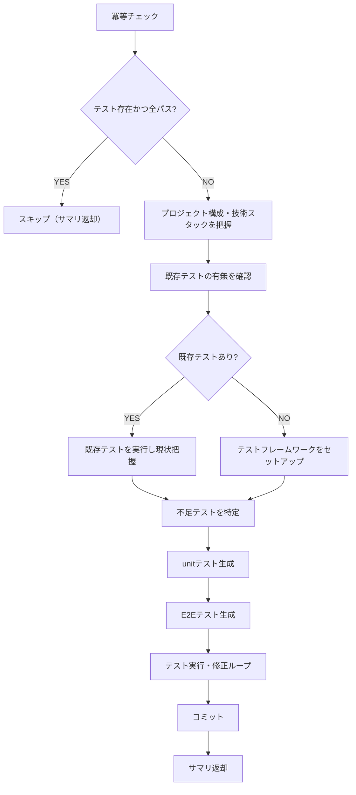

# 既存テスト生成手順

既存コードに対するunit/E2Eテストを生成します。カバレッジ80-90%を目標とします。

## 冪等チェック（再開対応）

テストファイルが既に存在し、すべてパスする場合はスキップする。

```bash
# テストファイルの存在確認（プロジェクト構成に依存）
# 既存テストがある場合はテスト実行して結果を確認
```

## フェーズ内フロー



## Step 1: プロジェクト構成の把握

- 使用言語・フレームワークを特定
- 既存テストの有無を確認
- テストフレームワークの設定を確認

## Step 2: テスト生成

### unitテスト

- 主要なモジュール・関数・クラスに対するunitテストを生成
- 既存テストがあれば維持し、不足分を追加
- 正常系・異常系・境界値をカバー

### E2Eテスト

- 主要なユーザーフローに対するE2Eテストを生成
- Webアプリの場合はPlaywrightを使用（`test-standards`スキル参照）
- APIの場合は適切なテストツールを使用

## Step 3: テスト実行・修正ループ

1. 生成したテストを実行
2. 失敗するテストを修正
3. 全テストがパスするまで繰り返す

## Step 4: コミット

テストコードをコミットする（`.claude/rules/git-rules.md` の規約に従う）。

## 完了条件

- 既存コードに対するunit/E2Eテストが生成されていること
- すべてのテストがパスすること
- カバレッジが80-90%の範囲内であること（計測可能な場合）

## 完了時の返却サマリ

```
## 既存テスト生成 完了サマリ
- unitテスト: N件（新規N件 / 既存維持N件）
- E2Eテスト: N件
- テスト結果: 全パス
- カバレッジ: N%（計測可能な場合）
```

## 注意事項

- 既存テストは削除・変更せず、不足分を追加する方針とする
- テストフレームワークの選択はプロジェクトの既存構成に合わせる
- カバレッジ計測が困難な場合はその旨をサマリに記載する
