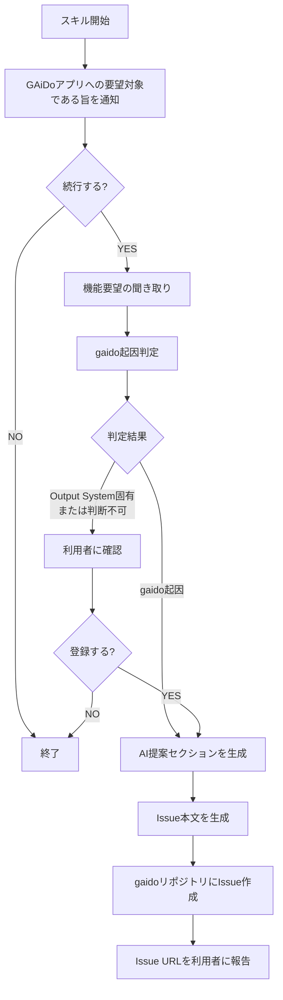

# 機能要望（利用者向け）

利用者との対話で機能要望を聞き取り、gaidoリポジトリにIssue登録します。

## 重要: スキル開始時の通知

スキル実行開始時に、以下の内容を利用者に **必ず通知** すること:

> この機能要望は **GAiDoアプリ自体** への要望を対象としています。
> AIに作ってもらったシステム（Output System）への要望ではありません。
> Output Systemへの要望は、Output System内で別途対応してください。

この通知を表示した上で、利用者が機能要望を続行する意思を確認してから次に進むこと。

## フロー



## Step 1: 機能要望の聞き取り

AskUserQuestionで以下を聞き取る。一度にすべてを聞くのではなく、段階的に聞き取ること。

1. **問題領域**: 今どんなことに困っているか、何が不便か
2. **どうなれば嬉しいか**: その問題がどう解決されれば理想か

## Step 2: gaido起因判定

聞き取った内容から、この要望がGAiDoアプリ自体に対するものかを判定する。

### 判定基準

| 分類 | 条件 | 例 |
|------|------|-----|
| gaido起因 | GAiDoアプリの機能として追加すべきもの | 新しいスキル、UI改善、ワークフロー改善 |
| Output System固有 | Output Systemの実装方法に関する要望 | 特定フレームワークのサポート、特定テストパターンの追加 |
| 判断不可 | どちらか判断できない | |

### 判定後のフロー

- **gaido起因**: そのままAI提案セクション生成に進む
- **Output System固有** または **判断不可**: 利用者に以下を通知し、それでも登録するか確認する

> この要望はOutput System固有の内容と思われます。
> GAiDoアプリ自体への要望ではない可能性がありますが、それでもgaidoリポジトリにIssue登録しますか？
>
> **判定理由**: [判定理由を説明]

利用者が「登録しない」と回答した場合は終了する。

## Step 3: ラベルの存在確認

```bash
# 機能要望ラベルが存在するか確認、なければ作成
gh label list --repo TS3-SE4/gaido --search "機能要望" --json name | grep -q '"機能要望"' || \
  gh label create "機能要望" --repo TS3-SE4/gaido --color "a2eeef" --description "利用者からの機能要望"
```

## Step 4: AI提案セクションの生成

聞き取った「問題領域」と「どうなれば嬉しいか」を分析し、以下の観点でGAiDo全体へのメリットを記述する:

- ワークフロー上の改善点
- 他の既存機能との相乗効果
- 想定される利用シーン

## Step 5: Issue作成

聞き取った内容とAI提案からIssue本文を生成し、gaidoリポジトリにIssue作成する。

**gaidoリポジトリ操作時のトークン:**
環境変数 `TOKEN_FOR_ISSUE_REPORT_SYSTEM` が設定されている場合は、それを `GH_TOKEN` に指定して実行する。未設定の場合は通常の認証で実行する。

```bash
# TOKEN_FOR_ISSUE_REPORT_SYSTEM が設定されている場合
GH_TOKEN="$TOKEN_FOR_ISSUE_REPORT_SYSTEM" gh issue create --repo TS3-SE4/gaido \
  --title "[利用者要望] {問題領域の要約}" \
  --label "機能要望" \
  --body "Issue本文"

# 未設定の場合
gh issue create --repo TS3-SE4/gaido \
  --title "[利用者要望] {問題領域の要約}" \
  --label "機能要望" \
  --body "Issue本文"
```

### Issue本文テンプレート

```markdown
## 問題領域

[聞き取った問題領域をそのまま記録]

## どうなれば嬉しいか

[聞き取った理想状態をそのまま記録]

## AI提案: この機能による全体メリット

[AIが分析した、この機能を追加した場合のGAiDo全体へのメリット]
- ワークフロー上の改善点
- 他の既存機能との相乗効果
- 想定される利用シーン

## gaido起因判定

- **判定結果**: [gaido起因 / Output System固有（利用者確認済み） / 判断不可（利用者確認済み）]
- **判定理由**: [なぜそう判断したかの説明]

## メタ情報

- 報告元: pockode経由（利用者要望）
```

## Step 6: 完了報告

利用者に以下を報告する:

- 作成したIssue URL
- Issue番号
- 「この要望はIceboxに登録されました。開発チームが棚卸しで優先度を判断します」

## 注意事項

- 登録先は **gaidoリポジトリ**（`--repo TS3-SE4/gaido`）であり、ターゲットリポジトリではない
- バグパイプライン（root cause analysis → dependencies → resolve）には乗らない
- Issueタイトルには `[利用者要望]` プレフィックスを付けて識別可能にする
- `bug` ラベルは付けない（バグではなく機能要望のため）
