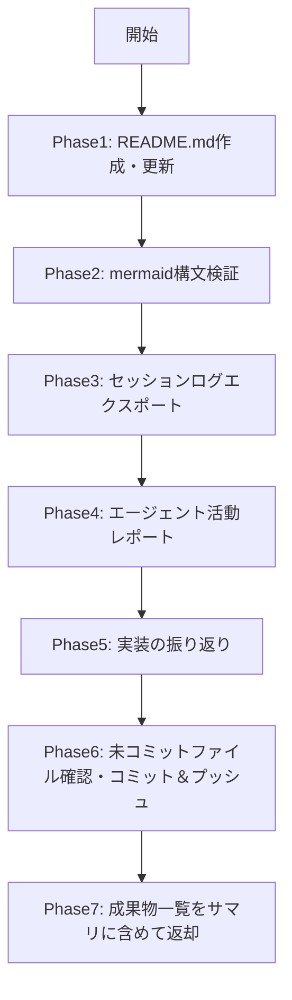

# 成果まとめフェーズ手順

成果まとめフェーズでは、以下を実行します：
1. README.mdの作成・更新（画面詳細セクション含む）
2. mermaid構文検証
3. セッションログのエクスポート
4. エージェント活動レポート生成
5. 実装の振り返り（problems.md作成）
6. 未コミットファイルの確認・コミット＆プッシュ
7. 成果物一覧の返却

## 前提条件

- テスト実装フェーズが完了していること
- 全テストケースIssueがclosedであること

## フェーズ内フロー



## Phase 1: README.md作成

**Readツールで `references/ReadmeGenerator.md` を読み込み**、手順に従ってREADME.mdを作成する。

## Phase 2: mermaid構文検証

README.mdにmermaid図（システム構成図・画面フロー・ER図等）が含まれる場合、コミット前に構文検証する。
`rules/mermaid-validation.md` に従うこと。

```bash
npx md-mermaid-lint "README.md"
```

エラーが出た場合は修正して再検証し、エラーが解消されるまで繰り返す。

## Phase 3: セッションログエクスポート

スクリプトによる一括処理:
```bash
bash .claude/skills/finalize-operations/scripts/export_session.sh
```

## Phase 4: エージェント活動レポート

セッションログからスキル・SubAgentの使用状況を分析しレポートを生成する:
```bash
python3 .claude/skills/finalize-operations/scripts/generate_activity_report.py session_*/
```

出力: `agent_activity_report.md`（リポジトリルート）

## Phase 5: 実装の振り返り

**Readツールで `references/Reflection.md` を読み込み**、手順に従ってproblems.mdを作成する。

## Phase 6: 未コミットファイル確認・コミット＆プッシュ

**Readツールで `references/UncommittedCheck.md` を読み込み**、手順に従って未コミットファイルを確認・コミット＆プッシュする。`.claude/rules/git-rules.md` に従うこと。

## Phase 7: 成果物一覧

すべての作業完了後、以下の成果物一覧をサマリに含める：

### ファイル成果物

| 成果物 | パス | 説明 |
|--------|------|------|
| 要件ファイル | `ai_generated/requirements/` | 確定した要件（ディレクトリ） |
| スクリーンショット | `ai_generated/screenshots/` | Playwrightキャプチャ |
| デザインスクリーンショット | `ai_generated/pencil_screenshots/` | Pencilデザインキャプチャ |
| README用スクリーンショット | `ai_generated/readme_screenshots/` | README.md画面詳細用キャプチャ |
| README.md | `README.md` | プロジェクト説明 |
| 振り返り | `problems.md` | 実装の苦労点・改善提案 |
| コストメトリクス | `cost_metrics.jsonl` | フェーズ別コスト記録 |
| セッションログ | `session_*/` | 会話履歴（JSONL + Markdown） |
| エージェント活動状況 | `agent_activity_report.md` | エージェント活動レポート |
| OpenAPI定義 | `openapi.yaml` | APIエンドポイント定義（APIがある場合のみ） |

### GitHub成果物

| 種類 | 内容 |
|------|------|
| Epic Issue | 作成されたEpic一覧 |
| PBI Issue | 作成されたPBI一覧 |
| Task Issue | 作成されたTask一覧（すべてclosed） |
| Test Case Issue | 作成されたテストケース一覧（すべてclosed） |
| Pull Request | 作成されたPR一覧（すべてmerged） |

## 完了時の返却サマリ

このフェーズが完了したら、以下のサマリを親オーケストレーターに返却すること:

```
## 成果まとめフェーズ完了サマリ

### 成果物
- README.md: 作成済み
- problems.md: 作成済み（N件の振り返り項目）
- セッションログ: session_YYYYMMDD_HHMMSS/
- agent_activity_report.md: 作成済み

### GitHub
- リポジトリURL: https://github.com/xxx/yyy
- 作成したIssue: Epic N件、PBI N件、Task N件、テストケース N件
- マージしたPR: N件

開発作業は以上で完了です。
```

## 注意事項

- README.mdは既存ファイルがある場合は上書き
- **このフェーズで生成されたファイルはすべてコミット対象。詳細はPhase 6の `references/UncommittedCheck.md` を参照**

## 参照ファイル一覧

| ファイル | 用途 | 読込タイミング |
|---------|------|-------------|
| `references/ReadmeGenerator.md` | README.md作成手順 | Phase 1 |
| `scripts/export_session.sh` | セッションログエクスポート | Phase 3 |
| `scripts/generate_activity_report.py` | エージェント活動レポート生成 | Phase 4 |
| `references/Reflection.md` | 実装振り返り手順 | Phase 5 |
| `references/UncommittedCheck.md` | 未コミットファイル確認手順 | Phase 6 |
