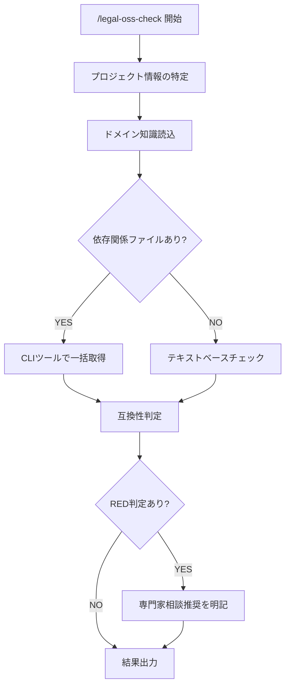

# OSSライセンスチェック

> **免責事項**
> - 本ツールは法的アドバイスを提供するものではありません。ユーザー自身の判断を支援するための参考情報整理ツールです
> - 判断主体はユーザー自身です。AIは第三者への法的助言を行う立場にはありません
> - 弁護士法・行政書士法・司法書士法・税理士法・社会保険労務士法・弁理士法等の士業法に基づき、最終的な法的判断には有資格専門家への相談を推奨します
> - 出力内容を専門家のレビューなしに最終的な法的判断として使用しないでください

## 振る舞い指針

- 「〜すべきです」「〜が正しい解釈です」のような断定的な法的判断を出力しない
- 「〜という観点があります」「〜を確認することが考えられます」のようにチェックポイントの提示に留める
- 出力はあくまで「ユーザーが自分で判断するための整理資料」であることを文面上明確にする

## 概要

プロジェクトの依存関係からOSSライセンスの互換性を検証し、リスク判定付きのライセンス一覧を生成するスキル。

## 使用場面

- 新規プロジェクトの依存パッケージのライセンス確認
- リリース前のOSSコンプライアンスチェック
- ライセンス互換性の確認（例: GPLと自社ライセンスの互換性）

## フロー

## 実行手順

### Step 1: プロジェクト情報の特定

以下を特定する。プロジェクトのコンテキスト（`ai_generated/requirements/README.md`、依存関係ファイルの`license`フィールド等）から読み取れる場合はそれを使用し、不足する情報のみユーザーに確認する。

1. **プロジェクトのライセンス**: MIT / Apache-2.0 / 独自ライセンス / 未定 等
2. **配布形態**: OSSとして公開 / SaaSとして提供 / 社内利用のみ / パッケージ配布
3. **特に気になるパッケージ**: （オプション）

### Step 2: ドメイン知識読込

1. **Readツールで `legal-playbook.local.md`（リポジトリルート）を読み込む**（存在しない場合はスキップ）
2. **Readツールで `.claude/skills/legal-oss-check/LicenseCompatibility.md` を読み込む**

### Step 3: ライセンス特定

**チェック対象**: 本番実行に必要な依存（直接依存＋推移的依存）のみ。開発・テスト目的の依存（テストフレームワーク、リンター、ビルドツール等）は製品に含まれないため対象外とする。

- ライセンスが不明なパッケージはUNKNOWNとしてマークする
- 個別パッケージの追加調査は最小限にとどめる

#### ファイルベースチェック（依存関係ファイルがある場合）

プロジェクト内の依存関係ファイル（`package.json`、`requirements.txt`、`go.mod`、`Cargo.toml`等）を検出し、エコシステムに応じたCLIツールで本番依存のライセンスを一括取得する。

- エコシステムごとに1回の実行で完了させる（再取得やフォーマット変換は不要）
- CSV等のコンパクトな出力形式を使用すること（JSON形式は出力が大きくなりやすいため避ける）
- 本番依存のみを取得するフラグ（`--production`等）を必ず使用し、開発依存を取得するコマンドは実行しないこと

代表的な例:

| エコシステム | 一括取得コマンド例 |
|-------------|-------------------|
| Node.js (npm) | `npx license-checker --production --csv` |
| Python (pip) | `pip-licenses --format=csv`（未インストール時は `pip install pip-licenses` してから実行） |
| Go | `go-licenses report ./...` |
| Rust (Cargo) | `cargo license` |
| PHP (Composer) | `composer licenses` |

上記以外のエコシステムでも、同様にライセンス一括取得が可能なCLIツールを使用すること。

CLIツールが利用できない場合は、依存関係ファイルから直接依存のみを読み取り、各パッケージのライセンスを確認する。

#### テキストベースチェック（依存関係ファイルがない場合）

Backlog後など、まだコードが存在しない段階でのチェック:
- 要件ファイル・Issue記載の技術スタック・ライブラリ名から、公式リポジトリやパッケージレジストリのライセンス情報を確認する
- 具体的なバージョンが未定の場合は、最新安定版のライセンスを基準とする

### Step 4: 互換性判定

LicenseCompatibilityマトリクスに基づき判定:

- プロジェクトライセンスと各依存パッケージのライセンスの互換性
- 配布形態に応じたコピーレフト条項の影響

### Step 5: 結果出力

結果を `ai_generated/legal/oss_check_YYYYMMDD_HHMMSS.md` に保存し、サマリをユーザーに表示。

出力に含める内容:
- 依存パッケージのライセンス一覧（GREEN/YELLOW/RED判定付き）
- 互換性に関する注意事項
- 推奨アクション（ライセンス不明パッケージの調査等）

## 注意事項

- ライセンスの法的解釈は専門家の確認が必要。本ツールは一般的な互換性の観点を整理するのみ
- `UNKNOWN` ライセンスのパッケージは自動的にYELLOW判定とし、手動確認を推奨すること
- デュアルライセンスのパッケージは、利用者が選択可能なライセンスを明示すること
