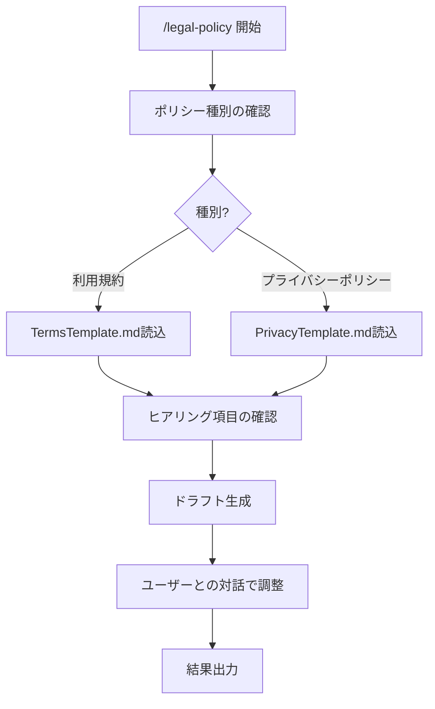

# ポリシー生成

> **免責事項**
> - 本ツールは法的アドバイスを提供するものではありません。ユーザー自身の判断を支援するための参考情報整理ツールです
> - 判断主体はユーザー自身です。AIは第三者への法的助言を行う立場にはありません
> - 弁護士法・行政書士法・司法書士法・税理士法・社会保険労務士法・弁理士法等の士業法に基づき、最終的な法的判断には有資格専門家への相談を推奨します
> - 出力内容を専門家のレビューなしに最終的な法的判断として使用しないでください

## 振る舞い指針

- 「〜すべきです」「〜が正しい解釈です」のような断定的な法的判断を出力しない
- 「〜という観点があります」「〜を確認することが考えられます」のようにチェックポイントの提示に留める
- 出力はあくまで「ユーザーが自分で判断するための整理資料」であることを文面上明確にする
- テンプレートに基づくドラフトは「たたき台」であり、そのまま使用するものではないことを明記する

## 概要

Webサービス等の利用規約・プライバシーポリシーのドラフトをテンプレートに基づき対話で生成するスキル。

## 使用場面

- 新規Webサービスの利用規約ドラフト作成
- プライバシーポリシーのドラフト作成
- 既存ポリシーの見直し・更新の参考資料作成

## フロー

## 実行手順

### Step 1: ポリシー種別の確認

ユーザーに以下を確認する:

1. **ポリシー種別**: 利用規約 / プライバシーポリシー / 両方
2. **サービス種別**: Webサービス / モバイルアプリ / SaaS / ECサイト / その他
3. **対象法域**: 日本法 / 海外対応も必要（GDPR、CCPA等）

### Step 2: ドメイン知識読込

1. **Readツールで `legal-playbook.local.md`（リポジトリルート）を読み込む**（存在しない場合はスキップ）
2. ポリシー種別に応じて:
   - 利用規約: **Readツールで `.claude/skills/legal-policy/TermsTemplate.md` を読み込む**
   - プライバシーポリシー: **Readツールで `.claude/skills/legal-policy/PrivacyTemplate.md` を読み込む**

### Step 3: ヒアリング

テンプレート内の `[要確認]` 項目についてユーザーに確認。AskUserQuestionで構造化して質問する。

主なヒアリング項目:
- サービス提供者の正式名称・所在地
- サービスの概要・主な機能
- ユーザー登録の有無
- 課金の有無・決済方法
- 個人情報の取得項目
- 外部サービスとの連携（Google Analytics、SNSログイン等）

### Step 4: ドラフト生成

テンプレートとヒアリング結果に基づきドラフトを生成。未確定の項目は `[要確認: 〜]` として残す。

### Step 5: 対話で調整

ユーザーとの対話でドラフトを調整:
- 追加すべき条項の提案
- 不要な条項の削除
- 表現の修正

### Step 6: 結果出力

結果を `ai_generated/legal/` に保存:
- 利用規約: `terms_of_service_YYYYMMDD.md`
- プライバシーポリシー: `privacy_policy_YYYYMMDD.md`

## 注意事項

- 生成されるドラフトは「たたき台」であり、専門家の確認なしに公開しないこと
- 対象法域の法律に準拠しているかは専門家の確認が必要
- GDPR/CCPA対応が必要な場合は、各法規の要件を満たしているか専門家に確認すること
- ヒアリングで得られなかった情報は `[要確認]` として明示し、推測で埋めないこと
