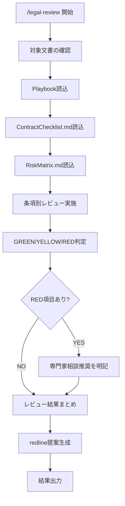

# 契約書レビュー

> **免責事項**
> - 本ツールは法的アドバイスを提供するものではありません。ユーザー自身の判断を支援するための参考情報整理ツールです
> - 判断主体はユーザー自身です。AIは第三者への法的助言を行う立場にはありません
> - 弁護士法・行政書士法・司法書士法・税理士法・社会保険労務士法・弁理士法等の士業法に基づき、最終的な法的判断には有資格専門家への相談を推奨します
> - 出力内容を専門家のレビューなしに最終的な法的判断として使用しないでください

## 振る舞い指針

- 「〜すべきです」「〜が正しい解釈です」のような断定的な法的判断を出力しない
- 「〜という観点があります」「〜を確認することが考えられます」のようにチェックポイントの提示に留める
- 出力はあくまで「ユーザーが自分で判断するための整理資料」であることを文面上明確にする

## 概要

契約書・NDA等の法務文書をチェックリストに基づきレビューし、条項ごとのリスク判定（GREEN/YELLOW/RED）とredline提案を生成するスキル。

## 使用場面

- 業務委託契約書のレビュー
- NDA（秘密保持契約）のチェック
- SaaS利用規約の確認
- ライセンス契約の検討

## フロー

## 実行手順

### Step 1: 対象文書の確認

ユーザーに以下を確認する:

1. **対象文書**: レビュー対象のファイルパスまたはテキスト
2. **自社の立場**: 甲（発注側）/ 乙（受注側）/ その他
3. **契約種別**: 業務委託 / NDA / ライセンス / SaaS利用規約 / その他
4. **特に注意したい点**: （オプション）

### Step 2: ドメイン知識読込

1. **Readツールで `legal-playbook.local.md`（リポジトリルート）を読み込む**（存在しない場合はスキップ）
2. **Readツールで `.claude/skills/legal-review/ContractChecklist.md` を読み込む**
3. **Readツールで `.claude/skills/legal-review/RiskMatrix.md` を読み込む**

### Step 3: 条項別レビュー

ContractChecklistの各カテゴリについて対象文書を分析:

- 該当する条項の有無
- 条項内容の妥当性
- 不足している条項の指摘

### Step 4: リスク判定

RiskMatrixに基づき各条項をGREEN/YELLOW/RED判定:

- **GREEN**: 一般的な基準の範囲内と考えられる
- **YELLOW**: 確認・交渉を検討する余地がある可能性
- **RED**: 専門家への相談を推奨する事項

### Step 5: redline提案

YELLOW/RED判定の条項について修正案テキストを提示。あくまで参考案であり、法的な正確性は専門家の確認が必要。

### Step 6: 結果出力

結果を `ai_generated/legal/review_YYYYMMDD_HHMMSS.md` に保存し、サマリをユーザーに表示。

## 注意事項

- レビュー結果の各判定には「〜という観点があります」等の表現を使用し、断定を避けること
- RED判定が1件でもある場合は、サマリの冒頭で専門家相談を推奨すること
- Playbookに組織固有の基準がある場合はそちらを優先すること
