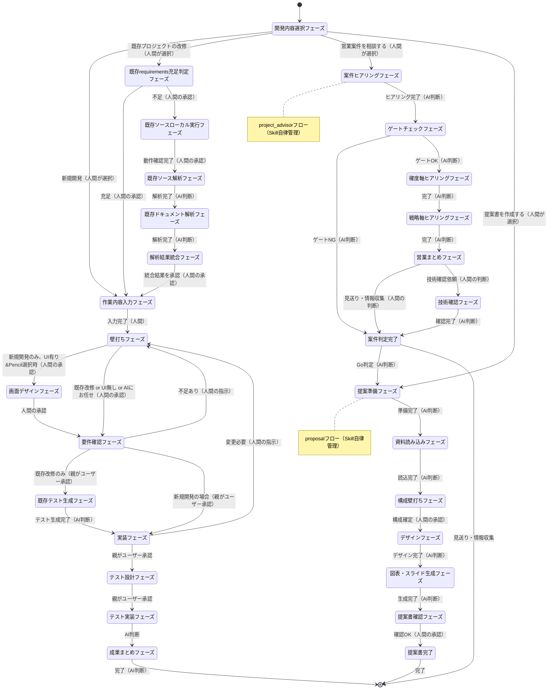

# フェーズ遷移ワークフロー

人間の指示や承認が必要な個所は**必ず人間待ちになること**。AIが勝手に進めてはいけない。

## 表記について

`Task(phase-xxx)` はTask toolでCustom Subagentを呼び出すことを指す。`/analyze` はSkill toolで壁打ちフェーズを実行することを指す。

## フェーズ遷移図



### 既存プロジェクト解析フェーズの補足

| フェーズ | 制約 |
|---------|------|
| 既存requirements充足判定フェーズ | ai_generated/requirements/配下のみ調査。人間がスキップ/解析実行を判断 |
| 既存ソースローカル実行フェーズ | 既存システムをローカルで起動し動作確認 |
| 既存ソース解析フェーズ | Subagent A。ソースのみ参照、ドキュメント参照禁止 |
| 既存ドキュメント解析フェーズ | Subagent B。ドキュメントのみ参照、ソース参照禁止 |
| 解析結果統合フェーズ | ai_generated/intermediate_files/のみ参照、原本参照禁止 |
| 作業内容入力フェーズ | Skill `/requirements-intake` で受付。新規・既存共通 |
| 既存テスト生成フェーズ | unit & e2eテスト、カバレッジ80-90%目標 |

## フェーズ一覧

| フェーズ名 | 実行方式 | フェーズ内の動作 |
|-----------|----------|-----------------|
| 開発内容選択フェーズ | Skill `/welcome-message` | メェナビ自己紹介 → 次のアクションをASKで選択 |
| 既存requirements充足判定フェーズ | Skill `/requirements-completeness-check` | requirements充足状況を調査・提示 → 人間がスキップ/解析実行を判断 |
| 作業内容入力フェーズ | Skill `/requirements-intake` | 作業内容を自然文で聞き取り、README.mdに保存 |
| 壁打ちフェーズ | Skill `/analyze` | 専門家による質問・回答ループ |
| 画面デザインフェーズ | Skill `/screen-design-phase` | UIキット選択 → 全画面作成 → ユーザーレビュー → 修正ループ |
| 要件確認フェーズ | Subagent `phase-backlog` | Epic → PBI → Task作成 → 品質検証 → 親子関係構築 |
| 実装フェーズ | Subagent `phase-develop` | PBI単位でSubagent呼出。各SubagentがTask実装 → コミット → PR作成 |
| └ コードレビュー | Subagent `code-reviewer` | AIレビュー設定時、PBI単位でPR差分の品質・保守性をチェック → GitHub Review投稿 |
| └ セキュリティレビュー | Subagent `security-reviewer` | AIレビュー設定時、PBI単位でPR差分のOWASP Top 10・脆弱性をチェック → GitHub Review投稿 |
| テスト設計フェーズ | Subagent `phase-test-design` | ユーザーストーリー → テストケースIssue化 |
| テスト実装フェーズ | Subagent `phase-test-run` | Playwright E2Eテスト実装・確認 |
| 成果まとめフェーズ | Subagent `phase-finalize` | README.md作成 → セッションエクスポート |
| 既存ソースローカル実行フェーズ | Skill `/existing-local-run-operations` | 既存システムのローカル起動・動作確認（AskUserQuestionで直接対話） |
| 既存ソース解析フェーズ | Subagent `phase-existing-source-analysis` | ソースコードのみを解析し中間ファイルに出力 |
| 既存ドキュメント解析フェーズ | Subagent `phase-existing-doc-analysis` | ドキュメントのみを解析し中間ファイルに出力 |
| 解析結果統合フェーズ | Subagent `phase-analysis-integration` | 中間ファイルを統合しrequirements/に出力 |
| 既存テスト生成フェーズ | Subagent `phase-existing-test-gen` | 既存コードのunit & e2eテスト生成 |
| 案件ヒアリングフェーズ | Skill `/project-advisor`（自律管理） | Box資料読み込み → 基本情報ヒアリング |
| ゲートチェックフェーズ | Skill `/project-advisor`（自律管理） | ゲート項目の評価・判定 |
| 確度軸ヒアリングフェーズ | Skill `/project-advisor`（自律管理） | 確度軸3指標のヒアリング |
| 戦略軸ヒアリングフェーズ | Skill `/project-advisor`（自律管理） | 戦略軸6指標のヒアリング |
| 営業まとめフェーズ | Skill `/project-advisor`（自律管理） | スコアリング・判定レポート生成 |
| 技術確認フェーズ | Skill `/project-advisor`（自律管理） | 技術者への確認依頼・回答取得 |
| 案件判定完了 | Skill `/project-advisor`（自律管理） | 最終判定・Go時は /proposal-init へ遷移 |
| 提案準備フェーズ | Skill `/proposal-init`（自律管理） | レポート検出 → 案件名確認 → ワークスペース作成 |
| 資料読み込みフェーズ | Skill `/proposal-init`（自律管理） | 入力資料（RFP等）の読み込み |
| 構成壁打ちフェーズ | Skill `/proposal-init`（自律管理） | スライド構成の壁打ち → story.md作成 |
| デザインフェーズ | Skill `/proposal-init`（自律管理） | HTMLモック生成（/frontend-design） |
| 図表・スライド生成フェーズ | Skill `/proposal-init`（自律管理） | 図表作成 → PPTX生成（/slide-generator） |
| 提案書確認フェーズ | Skill `/proposal-init`（自律管理） | ユーザーによるPPTX確認 |
| 提案書完了 | Skill `/proposal-init`（自律管理） | Git操作＆Box連携 → 完了 |

## フェーズ遷移と判断主体

| 遷移 | 判断主体 | 条件 |
|------|---------|------|
| 開始 → 開発内容選択フェーズ | AI | 開発依頼を受けたとき |
| 開発内容選択フェーズ → 作業内容入力フェーズ | 人間 | 新規開発を選択 |
| 開発内容選択フェーズ → 既存requirements充足判定フェーズ | 人間 | 既存プロジェクトの改修を選択 |
| 既存requirements充足判定フェーズ → 作業内容入力フェーズ | 人間 | 充足（解析スキップ） |
| 既存requirements充足判定フェーズ → 既存ソースローカル実行フェーズ | 人間 | 不足（解析実行） |
| 既存ソースローカル実行フェーズ → 既存ソース解析フェーズ | 人間 | 動作確認完了 |
| 既存ソース解析フェーズ → 既存ドキュメント解析フェーズ | AI | 解析完了 |
| 既存ドキュメント解析フェーズ → 解析結果統合フェーズ | AI | 解析完了 |
| 解析結果統合フェーズ → 作業内容入力フェーズ | 人間 | 統合結果を承認 |
| 作業内容入力フェーズ → 壁打ちフェーズ | 人間 | 入力完了 |
| 壁打ちフェーズ → 画面デザインフェーズ | 人間 | 新規開発のみ。壁打ちで「Pencilで設計」を選択（UI有りの場合のみ） |
| 壁打ちフェーズ → 要件確認フェーズ | 人間 | 「実装して」等の終了合図（既存改修 or UI無し or AIにお任せ） |
| 画面デザインフェーズ → 要件確認フェーズ | 人間 | 画面デザイン完了の合図 |
| 要件確認フェーズ → 壁打ちフェーズ | 人間 | バックログ確認時に不足（親がユーザーに確認） |
| 要件確認フェーズ → 既存テスト生成フェーズ | 人間 | 既存改修の場合のみ。バックログ承認後（親がユーザーに確認） |
| 既存テスト生成フェーズ → 実装フェーズ | AI | テスト生成完了 |
| 要件確認フェーズ → 実装フェーズ | 人間 | 新規開発の場合。バックログ一覧を確認・承認（親がユーザーに確認） |
| 実装フェーズ → 壁打ちフェーズ | 人間 | 動作確認後、変更が必要（親がユーザーに確認） |
| 実装フェーズ → テスト設計フェーズ | 人間 | 動作確認OK（親がユーザーに確認） |
| テスト設計フェーズ → テスト実装フェーズ | 人間 | テスト要件が十分（親がユーザーに確認） |
| テスト実装フェーズ → 成果まとめフェーズ | AI | 全テスト実装・確認完了 |
| 成果まとめフェーズ → 完了 | AI | README作成完了後 |
| 開発内容選択フェーズ → 案件ヒアリングフェーズ | 人間 | 「営業案件を相談する」を選択 |
| 案件ヒアリングフェーズ → ゲートチェックフェーズ | AI | ヒアリング完了 |
| ゲートチェックフェーズ → 確度軸ヒアリングフェーズ | AI | ゲートOK |
| ゲートチェックフェーズ → 案件判定完了 | AI | ゲートNG（早期終了） |
| 確度軸ヒアリングフェーズ → 戦略軸ヒアリングフェーズ | AI | 完了 |
| 戦略軸ヒアリングフェーズ → 営業まとめフェーズ | AI | 完了 |
| 営業まとめフェーズ → 案件判定完了 | 人間 | 見送り/情報収集 |
| 営業まとめフェーズ → 技術確認フェーズ | 人間 | 技術確認依頼 |
| 技術確認フェーズ → 案件判定完了 | AI | 確認完了 |
| 案件判定完了 → 提案準備フェーズ | AI | Go判定 |
| 開発内容選択フェーズ → 提案準備フェーズ | 人間 | 「提案書を作成する」を選択 |
| 提案準備フェーズ → 資料読み込みフェーズ | AI | 準備完了 |
| 資料読み込みフェーズ → 構成壁打ちフェーズ | AI | 読込完了 |
| 構成壁打ちフェーズ → デザインフェーズ | 人間 | 構成確定 |
| デザインフェーズ → 図表・スライド生成フェーズ | AI | デザイン完了 |
| 図表・スライド生成フェーズ → 提案書確認フェーズ | AI | 生成完了 |
| 提案書確認フェーズ → 提案書完了 | 人間 | 確認OK |

**重要**: Subagent内ではAskUserQuestionは使用不可（Claude Codeのハードコード制約）。ユーザー承認ゲートは親オーケストレーターがAskUserQuestionで仲介する。壁打ちフェーズと画面デザインフェーズと既存ソースローカル実行フェーズはSkill（親コンテキスト）で実行するため、AskUserQuestionを直接使用可能。

## コスト・進捗記録タイミング

以下タイミングで**確実に実行すること**。AIの勝手な判断でスキップしてはならない。

**親オーケストレーターがSubagent/Skill呼出前に `/record-costs` と `/record-progress` を両方実行する。**

| # | タイミング | フェーズ名 | コスト記録 | 進捗記録 |
|---|-----------|-----------|-----------|---------|
| 1 | /welcome-message 実行前 | 開発内容選択フェーズ | `/record-costs` | `/record-progress ... "starting"` |
| 2 | /requirements-completeness-check 実行前 | 既存requirements充足判定フェーズ | `/record-costs` | `/record-progress ... "starting"` |
| 3 | /requirements-intake 実行前 | 作業内容入力フェーズ | `/record-costs` | `/record-progress ... "starting"` |
| 4 | /analyze 実行前 | 壁打ちフェーズ | `/record-costs` | `/record-progress ... "starting"` |
| 5 | /screen-design-phase 実行前 | 画面デザインフェーズ | `/record-costs` | `/record-progress ... "starting"` |
| 6 | Task(phase-backlog) 呼出前 | 要件確認フェーズ | `/record-costs` | `/record-progress ... "starting"` |
| 7 | Task(phase-develop) 呼出前 | 実装フェーズ | `/record-costs` | `/record-progress ... "starting"` |
| 8 | Task(phase-test-design) 呼出前 | テスト設計フェーズ | `/record-costs` | `/record-progress ... "starting"` |
| 9 | Task(phase-test-run) 呼出前 | テスト実装フェーズ | `/record-costs` | `/record-progress ... "starting"` |
| 10 | Task(phase-finalize) 呼出前 | 成果まとめフェーズ | `/record-costs` | `/record-progress ... "starting"` |
| 11 | /report-costs 実行後 | 完了 | （自動） | `/record-progress "完了" "completed"` |
| 12 | /existing-local-run-operations 実行前 | 既存ソースローカル実行フェーズ | `/record-costs` | `/record-progress ... "starting"` |
| 13 | Task(phase-existing-source-analysis) 呼出前 | 既存ソース解析フェーズ | `/record-costs` | `/record-progress ... "starting"` |
| 14 | Task(phase-existing-doc-analysis) 呼出前 | 既存ドキュメント解析フェーズ | `/record-costs` | `/record-progress ... "starting"` |
| 15 | Task(phase-analysis-integration) 呼出前 | 解析結果統合フェーズ | `/record-costs` | `/record-progress ... "starting"` |
| 16 | Task(phase-existing-test-gen) 呼出前 | 既存テスト生成フェーズ | `/record-costs` | `/record-progress ... "starting"` |
| 17-23 | /project-advisor 各フェーズ境界 | 案件ヒアリング〜案件判定完了 | Skill自身が管理 | Skill自身が管理 |
| 24-30 | /proposal-init 各フェーズ境界 | 提案準備〜提案書完了 | Skill自身が管理 | Skill自身が管理 |

**フェーズ完了時**: 各フェーズ終了時に `/record-progress "<フェーズ名>" "completed"` を実行する。

## フェーズ遷移時の必須アクション

フェーズを遷移する前に、以下を必ず実行すること：

1. Subagentの返却サマリを確認
2. サマリに「ユーザー確認依頼」が含まれている場合、AskUserQuestionでユーザーに確認を取る
3. ユーザーの回答が「修正が必要」等の場合、修正内容をプロンプトに含めて同じSubagentを再呼出
4. TaskCreateで現在のフェーズを記録する

## フェーズ管理

各フェーズ開始時に、TodoWriteで現在のフェーズを記録すること。

例（テスト設計フェーズ開始時）：
```json
{"todos": [{"content": "【テスト設計フェーズ】テストケース作成", "status": "in_progress"}]}
```
