# Proposal Init

## 概要

提案書作成の入口となるスキル。ワークスペースの初期化とストーリー（スライド構成）の壁打ちを対話で行う。

**既存Skillとの関係:**
- `/epic-workshop`: 開発Issue（Epic+Spike）の壁打ち
- `/proposal-init`: 提案書スライド構成の壁打ち
- `/project-advisor`: 案件評価 → Go系判定後に本スキルを自動実行

## 進捗・コスト記録

本Skillは自律的に進捗記録・コスト記録を管理する（orchestration-guideの共通ルール4,5の例外）。
各フェーズ境界で `/record-progress` と `/record-costs` を実行すること。

**`/record-progress` と `/record-costs` は必ず同じタイミングで使用すること。**

### flow_type の取得

Skill開始時に `gaido_progress.json` を読み込み、`flow_type` の値を取得する。
取得できない場合は `"proposal"` をデフォルトとする。

### フェーズ境界での記録手順

{FT} = `--flow-type proposal`
proposal フローに skip_phases はない。

**Step 0-1（レポート検出＋案件名確認）開始前:**
  `gaido_progress.json` を読み、`phase` が `提案準備フェーズ` かつ `status` が `starting` の場合はskip（`/project-advisor` のGo判定から遷移してきた場合、既に記録済みのため）。
  それ以外の場合:
  `/record-costs "提案準備フェーズ"`
  `/record-progress "提案準備フェーズ" "starting" {FT}`

**Step 2（ワークスペース作成）完了後:**
  `/record-progress "提案準備フェーズ" "completed" {FT}`

**Step 3（入力資料読み込み）開始前:**
  `/record-costs "資料読み込みフェーズ"`
  `/record-progress "資料読み込みフェーズ" "starting" {FT}`

**Step 3 完了後:**
  `/record-progress "資料読み込みフェーズ" "completed" {FT}`

**Step 4（構成案提示）開始前:**
  `/record-costs "構成壁打ちフェーズ"`
  `/record-progress "構成壁打ちフェーズ" "starting" {FT}`

**Step 8（要件検証）完了後:**
  `/record-progress "構成壁打ちフェーズ" "completed" {FT}`

**Step 9（HTMLモック生成）開始前:**
  `/record-costs "デザインフェーズ"`
  `/record-progress "デザインフェーズ" "starting" {FT}`

**Step 9 完了後:**
  `/record-progress "デザインフェーズ" "completed" {FT}`

**Step 10（図表作成）開始前:**
  `/record-costs "図表・スライド生成フェーズ"`
  `/record-progress "図表・スライド生成フェーズ" "starting" {FT}`

**Step 11 PPTX生成完了後:**
  `/record-progress "図表・スライド生成フェーズ" "completed" {FT}`

**Step 11 ユーザー最終確認前:**
  `/record-costs "提案書確認フェーズ"`
  `/record-progress "提案書確認フェーズ" "starting" {FT}`
  `/record-progress "提案書確認フェーズ" "waiting_approval" {FT} --message "PPTXを確認してください"`

**Step 12（Box連携）完了後:**
  `/record-progress "提案書確認フェーズ" "completed" {FT}`
  `/record-progress "提案書完了" "completed" {FT} --message "提案書作成完了"`

## 使用場面

- RFP（提案依頼書）に対する提案書を作成したい
- 提案書のスライド構成を対話で練り上げたい
- 既存の資料をもとに提案書の骨格を作りたい
- `/project-advisor` のGo系判定後、案件情報を引き継いで提案書を作成したい

## フロー

```mermaid
flowchart TD
    A["/proposal-init 開始"] --> A2{"ai_generated/advisor/ に<br>確定レポートあり?"}
    A2 -->|"YES"| A3["レポートから案件情報を抽出"]
    A3 --> A4["案件名の確認（レポートから提案）"]
    A4 --> C["ワークスペース作成"]
    A2 -->|"NO"| B["案件名の確認"]
    B --> C
    C --> D{"入力資料あり?"}
    D -->|"YES"| E["資料読み込み・要点抽出"]
    D -->|"NO"| F["背景・目的のヒアリング"]
    E --> E2{"質疑一覧を生成する?"}
    F --> E2
    E2 -->|"YES"| E3["/rfp-qa-generator 実行<br>顧客回答反映まで完了"]
    E3 --> G["スライド構成案の提示"]
    E2 -->|"NO"| G
    G --> G2["デザイン方針の決定<br>DesignGuidelines.md参照"]
    G2 --> H["対話でストーリー練り上げ"]
    H --> I{"ユーザーOK?"}
    I -->|"NO"| H
    I -->|"YES"| J["story.md 書き出し<br>デザイン方針含む"]
    J --> V["要件網羅性の検証<br>RFP項目×スライド突合"]
    V --> V2{"漏れあり?"}
    V2 -->|"YES"| V3["漏れをstory.mdに反映"]
    V3 --> FD["1枚目HTMLモック生成<br>/frontend-design"]
    V2 -->|"NO"| FD
    FD --> FD_SS["PlaywrightでPNG変換"]
    FD_SS --> FD_BOX{"Box credentials<br>あり?"}
    FD_BOX -->|"YES"| FD_UPLOAD["BoxにPNGアップロード<br>（インライン表示可）"]
    FD_UPLOAD --> FD2["PNG/URLをユーザーに提示<br>デザイン方向性確認"]
    FD_BOX -->|"NO"| FD2
    FD2 --> FD3{"方向性OK?"}
    FD3 -->|"NO"| FD4["デザイン修正・再生成<br>再アップロード"]
    FD4 --> FD2
    FD3 -->|"YES"| FD5["残りのHTMLモックを生成"]
    FD5 --> FD5_BOX{"Box credentials<br>あり?"}
    FD5_BOX -->|"YES"| FD5_UPLOAD["BoxにPNG全件アップロード"]
    FD5_UPLOAD --> FD6["全スライドをユーザーに提示<br>全体デザイン確認"]
    FD5_BOX -->|"NO"| FD6
    FD6 --> FD7{"全体OK?"}
    FD7 -->|"NO"| FD8["修正・再生成・再アップロード"]
    FD8 --> FD6
    FD7 -->|"YES"| DG["図表作成<br>draw.io MCP"]
    DG --> SG["/slide-generator 自動実行<br>PPTX生成"]
    SG --> SG_BOX{"Box credentials<br>あり?"}
    SG_BOX -->|"YES"| SG_UPLOAD["BoxにPPTXアップロード"]
    SG_UPLOAD --> SG2["URLをユーザーに提示<br>確認依頼"]
    SG_BOX -->|"NO"| SG2
    SG2 --> SG3{"修正あり?"}
    SG3 -->|"YES"| SG4["該当スライド修正・再生成・再アップロード"]
    SG4 --> SG2
    SG3 -->|"NO"| BOX{"Box credentials<br>あり?"}
    BOX -->|"YES"| UPLOAD["story.md + assets/をBoxアップロード"]
    UPLOAD --> K["完了"]
    BOX -->|"NO"| K
```



## ワークスペース構成

以下のディレクトリ構造を `ai_generated/proposals/{案件名}/` に作成する。

```
ai_generated/proposals/{案件名}/
├── story.md              # スライド構成（壁打ち成果物）
├── design/
│   └── (HTMLデザインファイル)
├── assets/
│   └── (draw.io図、画像等)
└── output/
    └── (最終成果物 .pptx)
```

## 実行手順

### Step 0: 案件アドバイザーレポートの検出

`ai_generated/advisor/` ディレクトリに `report_*.md`（確定レポート）が存在するか確認する。

**レポートが存在する場合:**

1. 最新の `report_*.md` をReadツールで読み込む
2. 以下の情報を抽出する:
   - 案件名
   - 顧客名
   - 案件概要（判定結果セクションの記載から）
   - 判定結果（最終アクション）
   - スコアサマリ（確度・戦略・提案難易度の各ランク）
3. 抽出した情報をユーザーに提示し、「この案件の提案書を作成しますか？」と確認する
4. YESの場合: 案件名をディレクトリ名用に変換して提案し、Step 1へ（案件名はレポートから提案、ユーザーに確認）
5. NOの場合: 通常フロー（Step 1へ、レポート情報は使わない）

**レポートが存在しない場合:** Step 1へ進む（通常フロー）

### Step 1: 案件名の確認

ユーザーに案件名を確認する。ディレクトリ名に使うため、短い英語またはローマ字表記にする。

例: `sdn3_virtualization`, `cloud_migration_2025`

**AskUserQuestion** で確認すること。

Step 0でレポートから案件名を提案している場合は、その案件名をデフォルト値として提示する。

### Step 2: ワークスペース作成

以下のディレクトリとテンプレートファイルを作成する。

```bash
mkdir -p ai_generated/proposals/{案件名}/design
mkdir -p ai_generated/proposals/{案件名}/assets
mkdir -p ai_generated/proposals/{案件名}/output
```

**Readツールで `references/StoryTemplate.md` を読み込み**、テンプレートの内容を `story.md` の初期内容として配置する。

### Step 3: 入力資料の読み込み（ある場合）

#### 既存入力ファイルの保護

`ai_generated/input/` にファイルが既に存在する場合（手動で配置済みの場合）、誤編集・誤削除を防ぐためread-onlyにする。

```bash
if [ -d ai_generated/input/ ] && [ "$(ls -A ai_generated/input/)" ]; then
  chmod -R a-w ai_generated/input/
fi
```

#### Box資料の読み込み（オプション）

`.box/credentials.json` が存在する場合のみ実行する。存在しない場合はスキップする。

1. AskUserQuestionで「Boxから資料（RFP等）を読み込みますか？」と確認する
   - 選択肢: 「はい（BoxフォルダIDを入力）」「いいえ」
2. 「はい」の場合:
   - AskUserQuestionでBoxフォルダIDの入力を求める
   - 以下のコマンドでフォルダ内のファイルを再帰的にダウンロードする
     ```bash
     python3 tools/box_client.py download-folder {フォルダID}
     # ダウンロード完了後、元ファイルへの誤編集・誤削除を防ぐためread-onlyにする
     chmod -R a-w ai_generated/input/
     ```
   - ダウンロードされたファイルは `ai_generated/input/` に保存される（read-only保護済み）
   - **エラー時の対処**: ダウンロードコマンドがエラーになった場合、エラーメッセージの内容に応じて以下のように対応する:
     - 「接続認証の有効期限が切れています」→ ユーザーに「Boxとの接続認証が期限切れです。GAiDoアプリのStep 4でBox連携を再設定してください」と伝え、Box読み込みをスキップする
     - 「IDが存在しません」(404) → ユーザーに「入力したBoxフォルダIDが見つかりません。Box画面でフォルダを開いたときのURLに含まれるIDを確認してください」と伝え、再入力を求める
     - 「アクセス権限がありません」(403) → ユーザーに「指定したBoxフォルダへのアクセス権限がありません。Box上でそのフォルダの共有設定を確認してください」と伝える
     - 「接続できません」→ ユーザーに「Boxのサーバーに接続できません。インターネット接続を確認してください」と伝え、Box読み込みをスキップする
     - その他のエラー → エラーメッセージをそのままユーザーに伝え、Box読み込みをスキップする

#### Excel設計書の自動読み込み

`ai_generated/input/` に `.xlsx` ファイルが存在する場合、Skillツールで `/read-excel-design` を自動実行する。

```bash
find ai_generated/input/ -name "*.xlsx" | sort
```

`.xlsx` が1件以上存在する場合:
- ユーザーへの確認なしに `/read-excel-design` を実行する
- `/read-excel-design` が `ai_generated/input/design_summary.md` を生成する
- 生成されたサマリは以降の資料読み込み・要点抽出で追加コンテキストとして扱う

#### 資料の読み込みと要点抽出

RFP等の入力資料がある場合（Boxからダウンロードした資料、または `ai_generated/input/` に既にある資料）：

1. PDFやドキュメントを読み込む
2. 以下の要点を抽出して整理する：
   - 案件の背景・目的
   - 要求仕様の概要
   - 回答依頼事項（＝提案書に含めるべきセクション）
   - 非機能要件
   - スケジュール制約
3. 抽出した要点をユーザーに提示して確認する

Step 0で確定レポートを読み込んでいる場合、レポートの案件情報も入力資料として扱う。レポートから抽出した案件概要・判定結果・スコアサマリを、提案書の背景・目的セクションの素材として活用する。

### Step 3.5: 質疑一覧生成（オプション）

RFP読み込み完了後、提案書のスライド構成を検討する前に、顧客への質疑一覧を生成するかどうかを確認する。

AskUserQuestionで以下を確認する:

```
AskUserQuestion(
  questions=[
    {
      "question": "RFPの読み込みが完了しました。提案書作成の前に顧客への質疑一覧を生成しますか？",
      "header": "質疑一覧の生成",
      "multiSelect": false,
      "options": [
        {"label": "質疑一覧を生成する", "description": "4観点（要件曖昧さ/技術的前提/評価基準/体制・日程）から質疑を自動生成し、Excel/Markdownで出力します"},
        {"label": "スキップして提案書作成へ進む", "description": "質疑なしで直接スライド構成の検討に進みます"}
      ]
    }
  ]
)
```

**「質疑一覧を生成する」を選択した場合:**

Skillツールで `/rfp-qa-generator` を実行する。
`/rfp-qa-generator` は案件名・入力資料を引き継いで動作する。

**`/rfp-qa-generator` の「完了」の定義:**
以下の2段階を経て完了とする。

| 段階 | 内容 | 完了の判断 |
|------|------|----------|
| 1. 質疑一覧出力 | 4観点の質疑をExcel/Markdownで生成し、ユーザーに提示 | ユーザーが顧客に質疑を送付したことを確認 |
| 2. 回答の取り込み | ユーザーが顧客回答をシステムに入力し、`/rfp-qa-generator` が回答内容を `ai_generated/proposals/{案件名}/qa/` に保存 | ユーザーが「回答を取り込んだ」と明示したとき |

段階1のみで「顧客回答待ち」の状態で止まることがある。この場合は proposal-init を一時中断してよい。
ユーザーが「回答が来た」と伝えたタイミングで段階2を再開し、完了後に Step 4 へ進む。

顧客の回答で判明した新たな要件・制約は、スライド構成案の検討に反映すること。

**「スキップ」を選択した場合:**

そのまま Step 4 に進む。

### Step 4: スライド構成案の提示

入力資料またはヒアリング内容をもとに、スライド構成案を提示する。

各スライドについて以下を定義：

| 項目 | 内容 |
|---|---|
| スライド番号 | 連番 |
| タイトル | スライドの見出し |
| 種別 | `text` / `table` / `diagram` / `mixed` |
| 内容概要 | 箇条書きで記載する内容 |
| 図表 | 必要な図表の種類（体制図、スケジュール、アーキテクチャ図等） |

### Step 5: デザイン方針の決定

**Readツールで `references/DesignGuidelines.md` を読み込み**、ガイドラインをもとにデザイン方針を決定する。

ユーザーに以下を確認（デフォルト値で良ければそのまま採用）：

| 項目 | デフォルト | 確認内容 |
|---|---|---|
| フォント | Noto Sans JP | 変更希望があるか |
| ベースカラー | ダークネイビー系 | 企業カラー等の指定があるか |
| アクセントカラー | ブルー系 | 強調色の好みがあるか |
| トーン | ビジネス・フォーマル | カジュアル寄り等の希望があるか |

決定した方針は story.md の「デザイン方針」セクションに記入する。

### Step 6: 対話でストーリー練り上げ

ユーザーとの対話で以下を詰める：

1. **ストーリーの流れ**: スライドの順番は論理的か
2. **過不足の確認**: 足りないスライド、不要なスライドはないか
3. **図表の要否**: 各スライドで必要な図表は何か
4. **メッセージ**: 各スライドで一番伝えたいことは何か

また、以下の**内容品質**についてもこの段階で方針を決める。決定内容はstory.mdの各スライドのメモ欄に記録すること。

5. **課題理解の独自洞察**: 課題スライドはRFPの記載を並べるだけでなく、「自社として深掘りした解釈」や「ヒアリングで発見した隠れた課題の仮説」を少なくとも1点加えること。どのSIerでも書ける内容にしない
6. **強みと案件の紐付け**: 弊社の強みスライドは、今回の案件（領域・技術・規模・リスク）に対して各強みがどう効くかを具体的に示すこと。数字・実績は案件との関連性を明示する
7. **費用のレンジ提示**: 費用スライドは「別途見積」だけで終わらず、規模感のレンジ（例: 数千万〜1億円規模）または削減効果の定量値を少なくとも1つ含めること。RFI段階でも概算感を示すことで比較の土俵に乗る
8. **技術・アーキテクチャの案件適用**: 技術やアーキテクチャの説明スライドは一般論に留まらず、今回の対象システムへの具体的な適用方法（Before/After、現行課題との対応等）を示すこと
9. **未解決リスクの対応方針**: 移行・切替等で未確定・未解決のリスクがある場合、「検討中」で放置せず、対応方針の選択肢と判断基準を明示すること
10. **リスクの横断反映**: リスクスライドで識別した重要リスク（影響度：中以上）は、スケジュール・費用・体制の各スライドにも波及影響として記載すること
11. **体制・人員の根拠**: 体制・内製化スライドで人数を示す場合、必要スキルセットと現状体制とのギャップ分析を含めること。「なぜその人数か」を説明できるようにする

### Step 7: story.md 書き出し

確定した構成を `story.md` に書き出す。フォーマットは `references/StoryTemplate.md` に従う。
デザイン方針がStep 5で決定済みであることを確認すること。

### Step 8: 要件網羅性の検証

story.md書き出し後、入力資料の要求事項とスライド構成を体系的に突合する。

1. **回答依頼事項の列挙**: RFPの「回答依頼事項」セクション（例: 3.1～3.16）を1項目ずつリストアップ
2. **スライド対応の確認**: 各項目がstory.mdのどのスライドに対応するかマッピング表を作成
3. **漏れの検出**: 対応スライドがない項目、または記載が薄い項目を漏れとして報告
4. **ユーザーとの協議**: 検出した漏れをユーザーに提示し、スライド追加・内容強化を協議
5. **story.mdへの反映**: 合意した修正をstory.mdに反映

**出力形式（マッピング表）:**

| RFP項目 | 内容 | 対応スライド | 判定 |
|---|---|---|---|
| 3.1 全体構成 | ソリューションの全体構成と開発対象範囲 | スライド5,6,7 | OK |
| 3.2 開発内容 | 設計方針・実現方式 | スライド12-16 | OK |
| ... | ... | ... | ... |
| 2.6.3 納品成果物 | 成果物一覧 | なし | **漏れ** |

### Step 9: HTMLデザインモック生成

story.mdのデザイン方針に基づき、Skillツールで `/frontend-design` を実行してHTMLモックを生成する。

> **注意**: BoxはHTMLファイルをインライン表示せず、外部CSS参照のHTMLはhtmlpreviewでも正しく描画されない。
> このため、ユーザーへの確認はHTMLを**Playwrightでスクリーンショット（PNG）に変換してBoxにアップ**する形で行う。

**手順:**

1. まず **1枚目のスライド**（表紙またはキービジュアル）のHTMLモックを生成する
   - story.mdのデザイン方針（配色・フォント・トーン）を `/frontend-design` に指示として渡す
   - **すべてのテキストは日本語で出力すること。英語のサンプルテキスト・プレースホルダは使用禁止**と明示すること
   - スライドの内容はstory.mdに記載された実際の内容を使うこと（"Lorem ipsum"等のダミーテキスト禁止）
   - 以下の品質要件を指示に含めること：
     - **CSS/JSはすべて `<style>`/`<script>` タグにインライン埋め込みで記述し、外部ファイルを参照しない**（htmlpreviewで正しく描画するため）
     - **幅1280px・高さ720px（16:9）の単一スライドとして、bodyにスクロールバーが出ない構成にする**
     - プレースホルダ（XX、○○、TBD、[会社名]等）を一切残さない
     - サブタイトルに `text-decoration: none` を明示指定してスクリーンショット時の崩れを防ぐ
     - 箇条書きは `・`（中黒）で統一、評価記号（◎○△）と混在させない
     - 色を意味で使う場合は凡例を図内に必ず追加する
     - 表のカラム幅は内容量に合わせ、空白列を作らない。セル内の最長テキストが1行で収まる幅を確保し、単語・単語の途中での折り返しを禁止する（`PostgreSQL`→`PostgreSQ/L` や `アプリリ`→`アプリ/リ` のような折り返しはNG）
     - カード・ボックス要素のテキストは `overflow: hidden` を指定し、他要素に重ならないようにする
     - ラベル・補足テキストがボックスや枠線に重ならないよう、位置・サイズを調整する
     - **全スライドで同一テーマ（ダーク or ライト）を使用すること**。story.mdのデザイン方針で決定したテーマを全スライドに統一する。テーマを途中で切り替えない

2. **自己レビュー**: 生成後、`references/QualityChecklist.md` を読み込み、全チェック項目をクリアしているか確認する。NGがあれば修正してからスクリーンショット撮影に進む

3. PlaywrightでHTMLをスクリーンショット（PNG）に変換する

   ```bash
   python3 - <<'PYEOF'
   from playwright.sync_api import sync_playwright
   import os

   html_path = "ai_generated/proposals/{案件名}/design/slide_1.html"
   png_path  = "ai_generated/proposals/{案件名}/design/slide_1.png"
   os.makedirs(os.path.dirname(png_path), exist_ok=True)

   with sync_playwright() as p:
       browser = p.chromium.launch()
       page = browser.new_page(viewport={"width": 1280, "height": 720})
       page.goto(f"file://{os.path.abspath(html_path)}")
       page.wait_for_load_state("networkidle")
       page.screenshot(path=png_path, full_page=False)
       browser.close()

   print(f"スクリーンショット生成: {png_path}")
   PYEOF
   ```

4. **PNG**をBoxにアップロードする（`.box/credentials.json` が存在する場合）

   ```bash
   python3 tools/box_client.py upload \
     ai_generated/proposals/{案件名}/design/slide_1.png \
     --folder-path "GAiDo/{案件名}/proposal/design"
   ```

   アップロード後、「BoxのGAiDo/{案件名}/proposal/design フォルダにスクリーンショットを保存しました。Box上でスライドの見た目を確認できます」とユーザーに伝える。

5. ユーザーに以下を提示して方向性確認を依頼する
   - **Box**（credentialsがある場合）: 手順4でアップロードしたPNG（メイン確認手段）

   確認ポイント：配色・フォント・レイアウトの方向性がOKか

6. 修正があれば反映し、再度スクリーンショット生成・Boxアップロードして再確認する。OKが出たら次へ進む

8. 方向性が決まったら、残りのスライドのHTMLモックを一括生成する。生成後 **再度 `references/QualityChecklist.md` で全スライドを自己レビュー** し、NGがあれば修正してから以下を実行する

   ```bash
   # 全スライドのスクリーンショットを一括生成
   python3 - <<'PYEOF'
   from playwright.sync_api import sync_playwright
   import os, glob

   design_dir = "ai_generated/proposals/{案件名}/design"
   html_files = sorted(glob.glob(f"{design_dir}/slide_*.html"))

   with sync_playwright() as p:
       browser = p.chromium.launch()
       for html_file in html_files:
           png_file = html_file.replace(".html", ".png")
           page = browser.new_page(viewport={"width": 1280, "height": 720})
           page.goto(f"file://{os.path.abspath(html_file)}")
           page.wait_for_load_state("networkidle")
           page.screenshot(path=png_file, full_page=False)
           page.close()
           print(f"生成: {png_file}")
       browser.close()
   PYEOF

   ```

9. 全スライドのスクリーンショットをBoxにアップロードし、**ユーザーに全スライドのデザイン確認を依頼する**。OKが出るまでStep 10に進んではならない。

   - **Box**（credentialsがある場合）: 手順5と同様の方法で全スライドPNGを `design/` フォルダにアップロードし、「全スライドのHTMLデザインをBoxで確認してください。OKであれば次に進みます」と伝える
   - **Boxがない場合**: htmlpreview URL一覧を提示し、「全スライドのHTMLデザインを確認してください。OKであれば次に進みます」と伝える

   修正があれば反映し、再度スクリーンショット生成・Boxアップロードして再確認する。OKが出たらStep 10へ進む。

生成先: `ai_generated/proposals/{案件名}/design/slide_{番号}.html` および `slide_{番号}.png`

### Step 10: 図表作成

story.mdで `diagram` 種別のスライドがある場合、draw.io MCPまたは `tools/drawio_builder.py` で図を作成する。

- 作成した図は `ai_generated/proposals/{案件名}/assets/` に保存
- `.drawio` の元ファイルも保存（後から `/slide-generator` がdiagrams.net編集URLを生成するために必要）
- PNGにエクスポートして `assets/` に保存

### Step 11: PPTX生成

Skillツールで `/slide-generator` を実行し、story.md + 図表からPowerPointファイルを生成する。

`/slide-generator` が以下を自動で行う:
- story.md読み込み
- story.mdのデザイン方針を参考にテーマ設定（`design/slide_*.png` はテーマ参考のみ、PPTXへの貼り付け禁止）
- スライド種別ごとのネイティブ要素生成（text / table / diagram / mixed）
- `ai_generated/proposals/{案件名}/output/proposal.pptx` に出力

生成後、以下の手順でユーザーが確認できるようにする：

1. **自己レビュー**: `references/QualityChecklist.md` を読み込み、全チェック項目をクリアしているか確認する。NGがあれば `/slide-generator` で該当スライドを修正・再生成する

2. PPTXをBoxにアップロードする

   ```bash
   python3 tools/box_client.py upload \
     ai_generated/proposals/{案件名}/output/proposal.pptx \
     --folder-path "GAiDo/{案件名}/proposal"
   ```

   **仮（Boxなしの場合）**: ローカルに生成された `ai_generated/proposals/{案件名}/output/proposal.pptx` を手動でダウンロードしてください。

3. ユーザーに確認を依頼する
   - **Box**（credentialsがある場合）: 「BoxのGAiDo/{案件名}/proposal フォルダにPPTXを保存しました。ご確認ください」
   - **Boxがない場合**: 「ローカルに生成されたPPTXをダウンロードしてご確認ください（パス: ai_generated/proposals/{案件名}/output/proposal.pptx）」

4. 修正が必要な場合は `references/QualityChecklist.md` で再確認し、該当スライドを修正して再生成し、Boxにアップロードして再確認する

### Step 12: 残成果物のBox連携

story.mdとassets/をBoxにアップロードする。

```bash
# credentials.jsonがあれば実行、なければスキップ
if [ -f .box/credentials.json ]; then
  python3 tools/box_client.py upload \
    ai_generated/proposals/{案件名}/story.md \
    --folder-path "GAiDo/{案件名}/proposal"
  # assets/ 内のファイルを1件ずつアップロード
  for f in ai_generated/proposals/{案件名}/assets/*; do
    [ -f "$f" ] && python3 tools/box_client.py upload "$f" \
      --folder-path "GAiDo/{案件名}/proposal/assets"
  done
fi
```

Box アップロード完了後、以下のフォーマットでユーザーに完了報告すること:

---

## 提案書が完成しました

### 成果物一覧（Box: `GAiDo/{案件名}/proposal/`）

| ファイル | 内容 |
|---------|------|
| `proposal.pptx` | 提案書スライド（完成版） |
| `claude_in_pptx_prompt.md` | Claude in PowerPoint 仕上げ用プロンプト |
| `story.md` | スライド構成・ナレーション原稿 |
| `assets/` | draw.io 図ファイル（編集可能） |

### 次のステップ

#### 1. Claude in PowerPoint で仕上げる（推奨）

PPTXをダウンロードしてPowerPointで開き、Claude in PowerPoint アドインで仕上げを行うことをお勧めします。

**アドインのインストール手順（未インストールの場合）:**
1. [Microsoft Marketplace の Claude for PowerPoint ページ](https://marketplace.microsoft.com/en-us/product/office/WA200010001?tab=Overview) にアクセスして「Get it now」をクリック
2. 「Get it now」でインストール
3. PowerPoint を開いてアドインを有効化 → Claude アカウントでサインイン

参考: https://support.claude.com/en/articles/13521390-use-claude-for-powerpoint

**仕上げ用プロンプト:** Box の `claude_in_pptx_prompt.md` を開き、内容をClaude in PowerPointに貼り付けて実行してください。

#### 2. draw.io 図を編集する（必要に応じて）

Box の `assets/` フォルダに draw.io ファイルがあります。[draw.io](https://app.diagrams.net/) でファイルを開いて編集し、PowerPoint に貼り直すことができます。

---

## 注意事項

- 対話を重視し、ユーザーの意図を正確に把握すること
- 入力資料がある場合は、回答依頼事項を漏れなくスライドに反映すること
- スライド1枚あたりの情報量を詰め込みすぎないこと（1スライド1メッセージが原則）
- story.mdは壁打ちの成果物であり、後工程の入力になる重要なファイルであることを意識すること
- ユーザーの判断が必要なのは Step 9（1枚目デザイン方向性確認）、Step 9（全スライドデザイン確認）、Step 11（PPTX最終確認）の3箇所。それ以外のStep 9〜12は自動実行される
