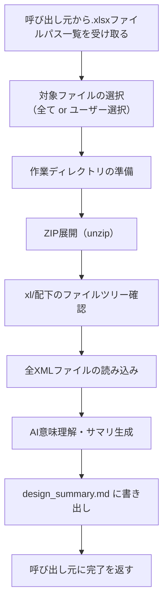

# Read Excel Design

## 概要

Excel方眼紙設計書(.xlsx)を読み取り、AIが図形・テキスト・接続関係を意味理解した上で、
設計内容のサマリを `ai_generated/input/design_summary.md` に生成する内部スキル。

**呼び出し元:**
- `/proposal-init`: Boxダウンロード後に `.xlsx` ファイルを検出した場合に自動実行

**このスキルの責任範囲:**
- `.xlsx` ファイルを受け取り、ZIP展開・XML読み取り・AI意味理解を実行
- 理解結果を `ai_generated/input/design_summary.md` に書き出す
- 呼び出し元スキルへ結果を返す（次のアクション判断は呼び出し元が行う）

## フロー



## 実行手順

### Step 1: 対象ファイルの選択

呼び出し元から受け取った `.xlsx` ファイルパス一覧をユーザーに提示し、どれを読み込むか確認する。

**AskUserQuestion** でどのファイルを使用するか確認する。

```
AskUserQuestion(
  questions=[
    {
      "question": "以下の設計書が見つかりました。どれを読み込みますか？\n{ファイル一覧}",
      "header": "読み込む設計書の選択",
      "multiSelect": true,
      "options": [
        {"label": "すべて読み込む", "description": "見つかった全ての.xlsxを対象にする"},
        {"label": "{ファイル名1}", "description": "{ファイルサイズ}"},
        {"label": "{ファイル名2}", "description": "{ファイルサイズ}"},
        ...
      ]
    }
  ]
)
```

- 選択肢はファイル一覧から動的に生成する
- 「すべて読み込む」が選ばれた場合は全ファイルを対象とする
- 複数ファイルが選択された場合、Step 2以降を各ファイルに対して順番に実行する

### Step 2: 作業ディレクトリの準備

処理対象ファイルごとに展開先ディレクトリを作成する。ファイル名（拡張子なし）をディレクトリ名に使用する。

```bash
XLSX_PATH="{対象ファイルパス}"
BASENAME=$(basename "${XLSX_PATH}" .xlsx)
EXTRACT_DIR="ai_generated/intermediate_files/excel_design/${BASENAME}"

mkdir -p "${EXTRACT_DIR}"
echo "展開先: ${EXTRACT_DIR}"
```

### Step 3: ZIP展開

`.xlsx`はZIPファイルであるため、`unzip`で展開する。

```bash
unzip -o "${XLSX_PATH}" -d "${EXTRACT_DIR}"
echo "展開完了"
```

**エラー時の対処:**
- `unzip: command not found` → `apt-get install -y unzip` を実行してからリトライ
- `cannot find or open` → ファイルパスを確認してユーザーに報告

### Step 4: ファイルツリー確認

展開された `xl/` 配下の構造を確認し、内容を把握する。

```bash
find "${EXTRACT_DIR}/xl" -type f | sort
```

**主要ファイルの意味:**

| パス | 内容 |
|------|------|
| `xl/worksheets/sheet*.xml` | シートデータ（セル値・数式） |
| `xl/drawings/drawing*.xml` | drawingML（図形・コネクタ・テキストボックス） |
| `xl/charts/chart*.xml` | グラフデータ |
| `xl/diagrams/data*.xml` | SmartArt データ |
| `xl/sharedStrings.xml` | テキスト文字列の共有プール |
| `xl/workbook.xml` | シート構成・名前 |
| `xl/_rels/workbook.xml.rels` | ファイル間の関係定義 |
| `xl/worksheets/_rels/sheet*.xml.rels` | シートとdrawingの紐付け |

### Step 5: XMLファイルの読み込み

`constraints.md`の大きなファイルの読み込みルールに従い、以下の順序で読み込む。

#### 5-1: workbook.xml（シート構成の把握）

```bash
cat "${EXTRACT_DIR}/xl/workbook.xml"
```

シート名の一覧を把握する。

#### 5-2: sharedStrings.xml（テキスト内容の把握）

```bash
ls -lh "${EXTRACT_DIR}/xl/sharedStrings.xml" 2>/dev/null && \
  wc -l "${EXTRACT_DIR}/xl/sharedStrings.xml"
```

2000行を超える場合はoffset/limitで分割して読む。

#### 5-3: drawingML（図形の把握）

drawingファイルが存在する場合、すべて読み込む。

```bash
find "${EXTRACT_DIR}/xl/drawings" -name "drawing*.xml" 2>/dev/null | sort
```

各drawingファイルについてサイズを確認してから読み込む:

```bash
for f in "${EXTRACT_DIR}/xl/drawings/drawing"*.xml; do
  echo "=== $f ==="
  wc -l "$f"
done
```

2000行以内のファイルはReadツールで全体を読む。超える場合はoffset/limitで分割して読む。

#### 5-4: worksheets（セルデータの把握）

```bash
find "${EXTRACT_DIR}/xl/worksheets" -name "sheet*.xml" | sort
```

各シートについてサイズを確認し、必要に応じて分割して読む。

#### 5-5: SmartArt（ある場合）

```bash
find "${EXTRACT_DIR}/xl/diagrams" -name "*.xml" 2>/dev/null | sort
```

### Step 6: AI意味理解とサマリ生成

読み込んだXMLを解析し、以下の観点で設計書の内容を意味理解する。

#### drawingMLの解析観点

| 図形種別 | 識別方法 | 変換先 |
|---------|---------|--------|
| フローチャート | `<a:prstGeom prst="process/decision/...">` | 処理フロー・業務フロー |
| システム構成図 | コネクタ（`<xdr:cxnSp>`）+ブロック図形 | アーキテクチャ定義 |
| 画面レイアウト | テキストボックス+矩形の配置パターン | UI仕様・画面定義 |
| ER図 | テーブル状の図形+コネクタ | DB設計・エンティティ定義 |

#### 理解した内容の整理

以下のサマリを作成する:

```markdown
## 設計書読み取り結果

### シート構成
- シート1: {名前} - {推定内容}
- シート2: {名前} - {推定内容}

### 検出された図形・ダイアグラム
| シート | 図形種別 | 件数 | 内容概要 |
|--------|---------|------|---------|
| {名前} | フローチャート | {N}個 | {概要} |
| {名前} | システム構成図 | {N}個 | {概要} |

### テキスト内容の要約
{セル・テキストボックスから読み取った主要な内容}

### 理解した設計内容
{AIが意味理解した設計内容の説明}
```

### Step 7: design_summary.md に書き出し

複数ファイルを処理した場合は、すべてのサマリをまとめて `ai_generated/input/design_summary.md` に書き出す。

```bash
mkdir -p ai_generated/input
```

書き出した後、呼び出し元スキルに以下を伝えて完了とする:

```
設計書の読み取りが完了しました。
- 処理ファイル数: {N}件
- サマリ保存先: ai_generated/input/design_summary.md
- 検出された図形種別: {一覧}
```

## 注意事項

- `.xlsx`ファイルは読み取り専用で扱うこと（元ファイルを変更しない）
- XMLはnamespaceが複数含まれるため、タグ名は`<a:xxx>`や`<xdr:xxx>`等のプレフィックス付きで解釈する
- drawingMLの座標系はEMU（English Metric Unit）単位。位置関係の相対的な把握に使用する
- セルのスタイル（背景色・罫線）は`xl/styles.xml`に定義されており、Excel方眼紙の判定に使える
  - 全セルが同じサイズ（幅・高さ）であれば方眼紙形式と判断する
- 大きなXMLファイルは`constraints.md`のルールに従い分割して読む
