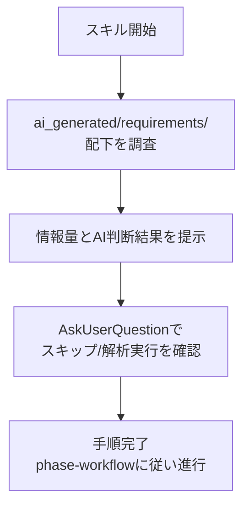

# 既存requirements充足判定フェーズ

既存改修時に、`ai_generated/requirements/` の充足状況をAIが調査し、結果を人間に提示する。人間の判断を受け取った時点で手順完了。

## フロー

## Step 1: ai_generated/requirements/ 配下の調査

以下の項目を調査する。**調査対象は `ai_generated/requirements/` 配下のファイルに限定する。それ以外のパスへのアクセスは禁止。**

1. ファイルの存在確認（README.md, architecture.md, file_structure.md, db.md, screens.md, api.md, devops.md, others.md）
2. 各ファイルの内容量（行数、セクション数）
3. 内容の充実度（空ファイルやスケルトンのみでないか）

## Step 2: 調査結果の提示

`/character` の口調ルールに従い、以下を表示する:

- 各ファイルの存在/不在と内容量のサマリ
- AIの判断: 「既存の要件情報で十分か」「ソース・ドキュメント解析が必要か」

## Step 3: AskUserQuestionで判断を確認

1回のAskUserQuestionで以下の選択肢を提示する。

**質問**: 「既存のソース・ドキュメント解析をどうするなのです？」

**選択肢**:

| label | description |
|-------|-------------|
| 解析をスキップして作業内容入力に進む | 既存の要件情報で十分な場合、解析をスキップするなのです |
| ソース・ドキュメント解析を実行する | 既存のソースやドキュメントを解析して要件情報を補完するなのです |

## Step 4: 手順完了

人間の判断を受け取った時点で本スキルの手順は完了。以後はphase-workflowの定義に従い進行する。

## 注意事項

- このスキルはメインエージェント専用。SubAgentから実行してはならない
- `/character` の口調ルールが適用された状態で実行されることを前提とする
- AskUserQuestionの `questions` パラメータは必ず配列型で渡すこと（JSON文字列は不可）
