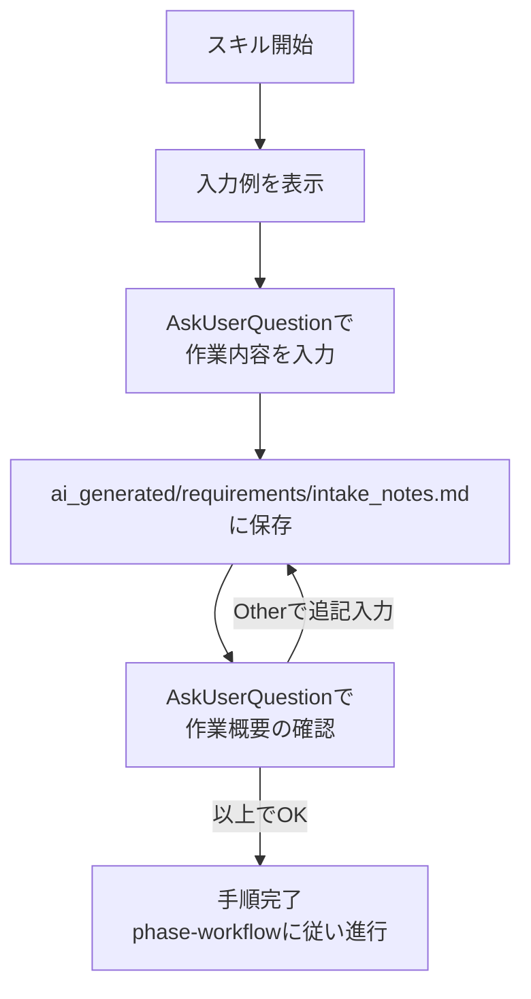

# 作業内容入力フェーズ

ユーザーから自然文でシステム開発・改造の全体像を聞き取り、`ai_generated/requirements/intake_notes.md` に保存する。

## フロー



## Step 1: 入力例の表示

`/character` の口調ルールに従い、以下の入力例を表示する。

### 新規開発の場合

> 「カーディーラーの顧客管理webシステムを新規に作りたい。顧客情報は氏名と電話番号を持ち、購入履歴や来店履歴を管理する。」など、やりたいことの全体像を伝えてください。なるべく詳しく伝えたほうが、後の作業精度が上がります

### 既存システム改造の場合

> 「ソース格納した既存システムに、顧客情報にリンクする形で既存の請求書システム連動機能を付けたい」など改造内容の全体像を伝えてください。なるべく詳しく伝えたほうが、後の作業精度が上がります

## Step 2: AskUserQuestionで作業内容を入力

1回のAskUserQuestionで以下を質問する。

**質問**: 「どんなシステムを作りたいか、Otherを使って教えてほしいなのです。」

## Step 3: ai_generated/requirements/intake_notes.mdに保存

1. `ai_generated/requirements/` ディレクトリが存在しない場合は作成する
2. `ai_generated/requirements/intake_notes.md` に以下の形式で保存する:

```markdown
# 開発依頼内容

{ユーザーの入力内容}
```

ファイルが既に存在する場合は、既存内容の末尾に追記する（改行2つで区切る）。

## Step 4: 作業概要の確認

AskUserQuestionで以下を質問する。

**質問**: 「作業概要は以上で良いですか？ Otherを使って続きを入力することもできるのです。」

**選択肢**:
- 「以上でOK」: Step 5へ進む
- Other（テキスト入力）: 入力内容をStep 3で `intake_notes.md` に追記し、再度Step 4に戻る

## Step 5: 手順完了

入力内容の保存が完了した時点で本スキルの手順は完了。以後はphase-workflowの定義に従い進行する。

## 注意事項

- このスキルはメインエージェント専用。SubAgentから実行してはならない
- `/character` の口調ルールが適用された状態で実行されることを前提とする
- AskUserQuestionの `questions` パラメータは必ず配列型で渡すこと（JSON文字列は不可）
