# RFP QA Generator

## 概要

RFPやヒアリング結果を読み込み、4つの観点（要件曖昧さ/技術的前提/評価基準/体制・日程）から質疑一覧を自動生成する。
複数資料間の矛盾も検出して質疑に含める。
生成した質疑はExcel（Boxテンプレートあり）またはMarkdown形式で出力し、顧客回答の取込・提案書への反映までを一気通貫で行う。

**既存Skillとの関係:**
- `/proposal-init`: RFP読み込み後にオプション呼び出し。案件名・入力資料を引き継ぐ
- `/read-excel-design`: 入力資料がExcel設計書形式の場合に呼び出し
- `/project-advisor`: Go判定後に `/proposal-init` → 本スキルの流れが典型的な利用パターン

## 進捗・コスト記録

本Skillは自律的に進捗記録・コスト記録を管理する（orchestration-guideの共通ルール4,5の例外）。
各フェーズ境界で `/record-progress` と `/record-costs` を実行すること。

**`/record-progress` と `/record-costs` は必ず同じタイミングで使用すること。**

### flow_type の取得

Skill開始時に `gaido_progress.json` を読み込み、`flow_type` の値を取得する。
取得できない場合は `"rfp_qa"` をデフォルトとする。

### フェーズ境界での記録手順

{FT} = `--flow-type rfp_qa`

**Step 1（ワークスペース作成）開始前:**
  `/record-costs "QA準備フェーズ"`
  `/record-progress "QA準備フェーズ" "starting" {FT}`

**Step 2（入力資料読み込み）完了後:**
  `/record-progress "QA準備フェーズ" "completed" {FT}`

**Step 3（質疑生成）開始前:**
  `/record-costs "質疑生成フェーズ"`
  `/record-progress "質疑生成フェーズ" "starting" {FT}`

**Step 4（一括確認）完了後:**
  `/record-progress "質疑生成フェーズ" "completed" {FT}`

**Step 5（出力）開始前:**
  `/record-costs "QA出力フェーズ"`
  `/record-progress "QA出力フェーズ" "starting" {FT}`

**Step 6（Boxアップロード）完了後:**
  `/record-progress "QA出力フェーズ" "completed" {FT}`

**Step 7（回答取込）開始前:**
  `/record-costs "回答取込フェーズ"`
  `/record-progress "回答取込フェーズ" "starting" {FT}`

**Step 8（提案反映）完了後:**
  `/record-progress "回答取込フェーズ" "completed" {FT}`
  `/record-progress "QA完了" "completed" {FT} --message "質疑回答プロセス完了"`

## 使用場面

- RFP・ヒアリング結果をもとに顧客への質疑一覧を作成したい
- 複数入力資料間の矛盾を整理したい
- 質疑一覧をExcel形式で顧客に提出したい
- 顧客回答を受け取り、提案書に反映したい
- `/proposal-init` から呼び出された（Step 3.5 経由）

## フロー

```mermaid
flowchart TD
    A["/rfp-qa-generator 開始"] --> A1{"gaido_progress.jsonから<br>案件名を取得できるか?"}
    A1 -->|"YES"| A2["案件名を引き継ぎ確認"]
    A1 -->|"NO"| A3["AskUserQuestion:<br>案件名入力"]
    A2 --> B
    A3 --> B
    B["ワークスペース作成<br>ai_generated/proposals/{案件名}/qa/"] --> C{"ai_generated/input/ に<br>ファイルあり?"}
    C -->|"YES"| D["既存ファイルをリスト表示"]
    C -->|"NO"| E["AskUserQuestion:<br>ai_generated/input/ に資料を置くよう案内"]
    D --> F{"Boxから追加取込?<br>credentials.jsonあれば選択肢表示"}
    E --> F
    F -->|"YES"| G["BoxフォルダIDを入力<br>box_client.py download-folder"]
    F -->|"NO"| H
    G --> H["全入力資料を読み込み・解析<br>.xlsxあれば /read-excel-design を呼び出し"]
    H --> I["資料間の矛盾・不整合を検出<br>qa/contradictions.md に記録"]
    I --> J["4観点の質疑を生成<br>references/PerspectiveGuide.md に従う"]
    J --> K["矛盾起因の質疑を追加<br>観点: 矛盾・不整合、タグ: [矛盾]"]
    K --> L["統合・重複排除<br>qa/qa_draft.json に保存"]
    L --> M["QA一覧をMarkdownで書き出し<br>qa/qa_review.md（一括確認用）"]
    M --> N["AskUserQuestion:<br>qa/qa_review.md を確認・編集して完了と教えてください"]
    N --> O{"編集完了?"}
    O -->|"NO・修正あり"| P["ユーザーの修正内容を<br>qa_draft.json と qa_review.md に反映"]
    P --> N
    O -->|"完了"| Q{"Boxテンプレート使用?"}
    Q -->|"テンプレートを使う"| R["AskUserQuestion:<br>BoxフォルダID / ファイル名を入力"]
    R --> S["テンプレートExcelをDL<br>qa_excel_handler.py read-template"]
    S --> T["テンプレートフォーマットで<br>qa_list.xlsx を生成"]
    Q -->|"Markdownのみ"| U["qa_list.md を生成"]
    T --> V
    U --> V["Boxアップロード<br>（credentialsあれば）"]
    V --> X["=== 顧客提出 ===<br>AskUserQuestion: 顧客提出後、回答が来たら教えてください"]
    X --> Y{"回答の受け取り方法?"}
    Y -->|"BoxからDL"| Z["BoxフォルダID/ファイル名を入力<br>回答済みファイルをDL"]
    Y -->|"手動配置済み"| Z2["ai_generated/input/ のファイルを確認"]
    Z --> AA
    Z2 --> AA["qa_excel_handler.py import-answers<br>で回答内容を解析<br>qa/answers.md に整理"]
    AA --> AB{"story.mdが存在するか?<br>ai_generated/proposals/{案件名}/story.md"}
    AB -->|"YES"| AC["story.mdの各スライドに<br>回答示唆・注記を追記"]
    AB -->|"NO"| AD["反映サマリのみ生成<br>qa/reflection_summary.md"]
    AC --> AD
    AD --> AE["Boxアップロード<br>（credentialsあれば）"]
    AE --> AF["完了"]
```



## ワークスペース構成

```
ai_generated/proposals/{案件名}/
├── qa/
│   ├── contradictions.md      # 矛盾・不整合の検出結果
│   ├── qa_draft.json          # 質疑一覧（内部JSON）
│   ├── qa_review.md           # 一括確認・編集用Markdown
│   ├── qa_list.md             # 最終出力（Markdownの場合）
│   ├── qa_list.xlsx           # 最終出力（Excelの場合）
│   ├── answers.md             # 回答取込結果
│   └── reflection_summary.md  # 提案への反映サマリ
└── story.md                   # 存在する場合、反映先
```

## 実行手順

### Step 1: ワークスペース作成・案件名確認

#### 1-1: 案件名の確認

`gaido_progress.json` を読み込み、現在の案件名（`project_name` フィールド）を取得する。

取得できた場合:
- 「案件名 `{案件名}` で質疑一覧を作成します。よろしいですか？」と確認する（AskUserQuestion）
- NOの場合は案件名を新規入力させる

取得できない場合:
- AskUserQuestionで案件名を入力させる（ディレクトリ名に使うため、短い英語またはローマ字）

#### 1-2: ディレクトリ作成

```bash
mkdir -p ai_generated/proposals/{案件名}/qa
```

### Step 2: 入力資料の読み込み

#### 2-1: 既存ファイルの確認

```bash
find ai_generated/input/ -type f 2>/dev/null | sort
```

ファイルが見つかった場合: 一覧をユーザーに提示する。

ファイルが見つからなかった場合:
AskUserQuestionで「`ai_generated/input/` に資料（RFP・ヒアリング議事録等）を配置してください。配置完了後、続けてください」と案内し、ユーザーの確認を待つ。

#### 2-2: Boxからの追加取込（オプション）

`.box/credentials.json` が存在する場合のみ実行する。

AskUserQuestionで「Boxから追加の資料を読み込みますか？」と確認する。
YESの場合: BoxフォルダIDを入力させ、以下を実行する。

```bash
python3 tools/box_client.py download-folder {フォルダID}
chmod -R a-w ai_generated/input/
```

エラー時の対処は `/proposal-init` のStep 3と同様に対応する。

#### 2-3: Excelファイルの処理

```bash
find ai_generated/input/ -name "*.xlsx" | sort
```

`.xlsx` が1件以上存在する場合、Skillツールで `/read-excel-design` を自動実行する（ユーザー確認不要）。
`/read-excel-design` が `ai_generated/input/design_summary.md` を生成したら、以降の資料読み込みで追加コンテキストとして使用する。

#### 2-4: 全資料の読み込み

RFP（PDF/Word）、ヒアリング議事録、その他資料を順番に読み込む。
`constraints.md` の大きなファイルの読み込みルールに従い、分割して読む。

読み込み結果を以下の形式で整理する:
- 各資料の主要要件・制約・前提条件
- 資料の種別（RFP / ヒアリング結果 / 仕様書 / その他）
- 資料のバージョン・日付（記載があれば）

### Step 3: 矛盾・不整合の検出

複数の入力資料を比較し、矛盾・不整合を検出する。

検出した矛盾を `qa/contradictions.md` に記録する:

```markdown
# 矛盾・不整合の検出結果

| ID | 概要 | 資料A | 箇所A | 資料B | 箇所B |
|----|------|-------|-------|-------|-------|
| C001 | 納期の不一致 | RFP_XXX.pdf | 3章 | hearing_20250101.docx | 2ページ |
```

矛盾が検出されなかった場合: 「矛盾・不整合は検出されませんでした」と記録する。

**注意:** `contradictions.md` は内部分析メモとして扱い、顧客送付用の `qa_list.md` / `qa_list.xlsx` には矛盾検出テーブルを含めない。矛盾由来の質疑はStep 4でQ番号に統合し、`[矛盾 Cxxx]` タグで参照関係を示す。

### Step 4: 質疑生成

**Readツールで `references/PerspectiveGuide.md` を読み込み**、各観点の定義に従って質疑を生成する。

#### 4-1: 4観点の質疑生成

以下の順で各観点の質疑を生成する:
1. 観点1: 要件曖昧さ
2. 観点2: 技術的前提
3. 観点3: 評価基準
4. 観点4: 体制・日程

各観点で生成した質疑は、PerspectiveGuide.mdの「生成ルール」（1質疑1論点・背景付与・優先度分類）に従うとともに、以下のルールも必ず守ること。

**優先度の細分化:**
- `必須-P1`: 未回答では提案書の骨格（構成・アーキテクチャ・費用の大枠）が書けない質疑
- `必須-P2`: 未回答では費用・体制・リスクの定量化ができない質疑
- `推奨`: 回答があれば提案品質が向上するが、なくても提案書は成立する質疑

**P1件数の上限:** 必須-P1は全質疑の15%以下（目安3〜5件）に絞ること。上限を超える場合は「これが不明だと提案書の構成・費用の大枠が決定できない」か否かを1件ずつ再評価し、該当しないものは必須-P2に降格すること。「全部最優先」は優先度なしと同義である。

**1問1論点の原則:** 1つの質疑に確認事項は1点のみ。「AとBについてご教示ください」「AおよびBをお聞かせください」など複数論点を含む文は必ず分割すること。1問に論点が2つ以上混在している場合は、各論点を独立した質疑として起票し直すこと。

**文末表現のバリエーション:** 質疑文末は口語的表現（「〜ですか？」「〜想定ですか？」）を使わず敬体に統一しつつ、「〜をご教示ください。」「〜をお聞かせください。」「〜をご確認いただけますか。」「〜をご回答ください。」等を混在させること。同一文末が3件以上連続しないよう注意すること。

**背景の具体性:** 背景フィールドは「〜を把握するため。」のような抽象表現を避け、回答がない場合の具体的な影響を示すこと。例: 「データ量が未確定の場合、ストリーミング構成と夜間バッチ構成のどちらが適切か判断できず、構成・費用試算が2案に分岐する」。背景を読んだ相手が回答の重要性を自分で判断できる記述にすること。

**観点タグの付与:** 全質疑に観点タグを付与すること。タグはQAOutputFormat.mdの「観点タグ一覧」を参照。

**参照箇所の記法:** `reference` フィールドは `{資料名} {章番号}（p.{ページ番号}「{引用文言}」）` 形式で統一すること。詳細はQAOutputFormat.mdの「参照箇所の記法」セクションを参照。

#### 4-2: 矛盾起因の質疑の追加

Step 3で検出した矛盾を、観点「矛盾・不整合」の質疑として追加する。
各質疑の `question` 先頭に `[矛盾]` タグを付与する。

#### 4-3: 統合・重複排除

全観点の質疑を統合し、重複している質疑を排除する。

**Readツールで `references/QAOutputFormat.md` を読み込み**、内部JSON形式に従って `qa/qa_draft.json` に保存する。

### Step 5: 一括確認・編集

`qa/qa_draft.json` の内容をMarkdown表形式で `qa/qa_review.md` に書き出す。

フォーマットは `references/QAOutputFormat.md` の「Markdown出力形式」セクションに従う。

ユーザーに以下を案内する（AskUserQuestionで完了を待つ）:

```
【質疑一覧を生成しました】

以下のファイルに {N} 件の質疑を出力しました（必須-P1: {N1}件 / 必須-P2: {N2}件 / 推奨: {N3}件）:
  ai_generated/proposals/{案件名}/qa/qa_review.md

ファイルを開いて内容を確認・編集してください。
  - 不要な質疑は行ごと削除してください
  - 質疑内容を修正したい場合は直接書き換えてください
  - 質疑を追加したい場合は同じ形式で行を追加してください

編集完了後、「完了」と返信してください。
追加で依頼したい修正があれば内容を教えてください。
```

**完了** と返信があった場合:
- `qa_review.md` を読み込み、変更内容を `qa_draft.json` に反映する
- 変更があった場合のみ「○件を削除、△件を修正、□件を追加しました」と報告する

**修正依頼** があった場合:
- 依頼内容を `qa_draft.json` と `qa_review.md` に反映し、再度確認を待つ

### Step 6: 出力形式の選択

AskUserQuestionで出力形式を確認する:

```
AskUserQuestion(
  questions=[
    {
      "question": "質疑一覧の出力形式を選択してください",
      "header": "出力形式",
      "multiSelect": false,
      "options": [
        {"label": "Boxのテンプレートを使ってExcel出力", "description": "BoxにあるQA表テンプレートを読み込み、そのフォーマットで出力します"},
        {"label": "Markdownファイルとして出力（参照用）", "description": "qa_list.mdとして顧客参照用に出力します。回答収集にはExcelを使用することを推奨します（テンプレートなし）"}
      ]
    }
  ]
)
```

#### Excelテンプレートを使う場合

AskUserQuestionでBoxフォルダIDとファイル名を入力させる。

```bash
# テンプレートをDL
python3 tools/box_client.py download-file {ファイルID} ai_generated/proposals/{案件名}/qa/template.xlsx

# テンプレートのカラム構造を読み取り、QA JSONをExcelに出力
python3 tools/qa_excel_handler.py write-excel \
  --template ai_generated/proposals/{案件名}/qa/template.xlsx \
  --qa-json  ai_generated/proposals/{案件名}/qa/qa_draft.json \
  --output   ai_generated/proposals/{案件名}/qa/qa_list.xlsx
```

**エラー時**: テンプレートの読み込みに失敗した場合はMarkdown出力にフォールバックし、ユーザーに報告する。

#### Markdownのみの場合

`qa/qa_review.md` を確定版として `qa/qa_list.md` にコピーする。

```bash
cp ai_generated/proposals/{案件名}/qa/qa_review.md \
   ai_generated/proposals/{案件名}/qa/qa_list.md
```

### Step 7: Boxアップロード

#### 7-1: Boxアップロード（credentialsがある場合）

```bash
# qa_list.xlsx または qa_list.md をアップロード
python3 tools/box_client.py upload \
  ai_generated/proposals/{案件名}/qa/qa_list.{xlsx|md} \
  --folder-path "GAiDo/{案件名}/qa"
```

アップロード後、「BoxのGAiDo/{案件名}/qa フォルダに質疑一覧を保存しました」とユーザーに伝える。

#### 7-2: 顧客提出の案内

AskUserQuestionで以下を表示し、回答が届いたら知らせるよう案内する:

```
質疑一覧の準備が完了しました。

顧客への提出:
  {Boxのフォルダパス}

顧客から回答済みファイルを受け取ったら、このチャットで続けてください。
「回答が届いた」と教えていただければ、取込処理を開始します。
```

### Step 8: 顧客回答の取込

AskUserQuestionで回答ファイルの受け取り方法を確認する:

```
AskUserQuestion(
  questions=[
    {
      "question": "回答済みファイルをどのように取り込みますか？",
      "header": "回答取込方法",
      "multiSelect": false,
      "options": [
        {"label": "BoxからDL", "description": "BoxフォルダIDとファイル名を入力してDLします"},
        {"label": "手動配置済み（Excel）", "description": "回答済みExcelファイルをai_generated/input/ に配置済みの場合はこちら"}
      ]
    }
  ]
)
```

#### BoxからDLの場合

```bash
python3 tools/box_client.py download-file {ファイルID} \
  ai_generated/proposals/{案件名}/qa/qa_answered.{xlsx|md}
```

#### 回答内容の解析

```bash
python3 tools/qa_excel_handler.py import-answers \
  --answered  ai_generated/proposals/{案件名}/qa/qa_answered.{xlsx|md} \
  --qa-json   ai_generated/proposals/{案件名}/qa/qa_draft.json \
  --output    ai_generated/proposals/{案件名}/qa/answers.md
```

`qa/answers.md` に以下の形式で整理する:

```markdown
# 回答取込結果 - {案件名}

取込日時: {日時}
回答済み: {N}件 / 全{M}件

## 回答内容サマリ

| No | 質疑 | 回答 | 提案への示唆 |
|----|------|------|------------|
| Q001 | ... | ... | ... |
```

### Step 9: 提案書への反映

#### story.mdが存在する場合

`ai_generated/proposals/{案件名}/story.md` を読み込み、各スライドに関連する回答示唆を追記する。

追記形式（story.mdの各スライドの「メモ」欄）:
```
**[QA回答反映]** Q001: {回答内容の要点} → {スライドへの示唆}
```

`qa/reflection_summary.md` に反映内容のサマリを生成する。

#### story.mdが存在しない場合

`qa/reflection_summary.md` のみ生成する:

```markdown
# 提案への反映サマリ - {案件名}

## 反映すべき重要事項

### 必須対応
- {Q001の回答}: {提案への影響・対応方針}

### 推奨対応
- {Q005の回答}: {提案品質向上のための対応}

## 未回答の質疑（提案書作成前に確認推奨）
- Q003: {質疑内容}
```

#### 最終Boxアップロード

`.box/credentials.json` が存在する場合、成果物をBoxにアップロードする。

```bash
python3 tools/box_client.py upload \
  ai_generated/proposals/{案件名}/qa/ \
  --folder-path "GAiDo/{案件名}/qa"
```

完了後、ユーザーに `qa/reflection_summary.md` の内容を提示して終了する。

## 注意事項

- 入力資料はread-onlyで扱うこと（`chmod -R a-w ai_generated/input/` が適用済みの場合は変更不要）
- 質疑は「回答がなければ提案書が書けない」ものと「あれば品質が向上する」ものを必ず区別すること
- 矛盾検出は確実な矛盾のみを報告し、解釈の違いによる疑似矛盾は注記付きで報告すること
- Excel出力時、テンプレートのカラム構造に合わせること（独自カラムを追加しない）
