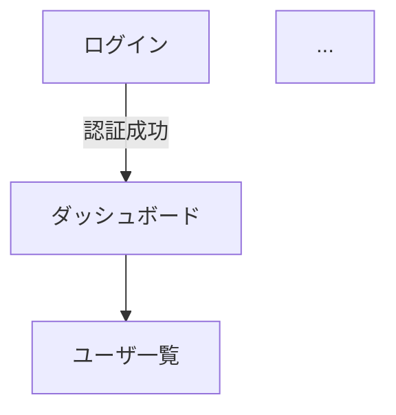

# 画面デザインフェーズ

壁打ちフェーズで「Pencilで詳細な画面設計を行う」が選択された場合に実行される。
このスキルは親コンテキスト（Skill）で実行されるため、AskUserQuestionを直接使用可能。

## 前提

- 壁打ちフェーズが完了し、`ai_generated/requirements/` ディレクトリが存在すること
- `ai_generated/requirements/screens.md` に画面一覧・画面遷移図が含まれていること
- Pencil App（Electron）がXvfb上で起動済みであること
- MCP Server（pencil）が接続済みであること

## 実行フロー

### 1. ライセンス確認

pencil-draw SKILL.md「ライセンス確認（最初に実行）」の手順に従う。

### 2. pencil_templateのcommit&push + design_catalog表示確認

デザインカタログをGitHub上で人間に表示するため、先にpencil_templateをcommit&pushする。

```bash
# pencil_template以下をcommit&push
git add pencil_template/
git commit -m "docs(design): Add pencil template files for screen design

Co-Authored-By: Claude <noreply@anthropic.com>"
git push

# GitHub上でdesign_catalog.mdが表示できることを確認
REPO_URL=$(gh repo view --json url -q .url)
BRANCH=$(git branch --show-current)
RAW_URL="${REPO_URL}/raw/${BRANCH}/pencil_template/design_catalog.md"
HTTP_STATUS=$(curl -sI "$RAW_URL" | head -1)
echo "$HTTP_STATUS"
```

- HTTP 200が返ること。200以外の場合はエラーを表示して中断する。

### 3. デザインカタログ表示 + UIキット選択

デザインカタログのURLをチャット上に表示し、AskUserQuestionでUIキットを選択してもらう。

```bash
# デザインカタログURLを生成
REPO_URL=$(gh repo view --json url -q .url)
BRANCH=$(git branch --show-current)
echo "${REPO_URL}/blob/${BRANCH}/pencil_template/design_catalog.md"
```

**手順**:
1. まずテキスト出力でクリック可能なリンクを表示する:
```
各スタイルのサンプル画面はこちらで確認できます:

[デザインカタログを確認]({repo_url}/blob/{branch}/pencil_template/design_catalog.md)
```
2. 続けてAskUserQuestionでUIキットを選択してもらう（AskUserQuestion内にはリンクを含めない）:

**AskUserQuestionの選択肢**: Shadcn UI / Halo / Lunaris / Nitro

選択結果を `ai_generated/requirements/README.md` の「開発プロセス設定」に記録:
```markdown
## デザイン設定
- UIキット: {選択したキット名}（shadcn / halo / lunaris / nitro）
- デザインファイル: ai_generated/screens.pen
```

### 4. テンプレートコピー + ファイルオープン

```bash
mkdir -p ai_generated && cp pencil_template/pencil-{選択}.pen ai_generated/screens.pen
```

その後、pencil-draw SKILL.md ユースケース1 の手順に従い、ファイルオープンとコンポーネント取得を行う。

### 5. ER図整合性チェック

`ai_generated/requirements/db.md` にER図が含まれる場合、**画面作成前に**以下を検証する:

- 画面の各UI要素がDBスキーマと整合するか確認
- DBに存在しない項目を「よくある形だから」と安直に追加してはいけない
- すべてのUI要素について、なぜ必要なのか説明できること
- **画面のUI変更に伴いDBも変更する場合は、必ず画面変更とセットでER図（`ai_generated/requirements/db.md`）も変更すること**

### 6. デザインテンプレートの確認

画面作成の前に、選択したUIキットのデザインテンプレートの中身を確認し、利用可能なコンポーネントの種類と使い方を把握する。

1. `get_editor_state` でReusable Componentsの一覧を取得する
2. 各コンポーネントの種類（ボタン、入力フィールド、カード、テーブル、ナビゲーション等）を把握する
3. 各コンポーネントのプロパティ（サイズ、カラーバリエーション、状態等）を確認する
4. 把握した内容を元に、以降の画面作成で適切なコンポーネントを選択・活用する

**⚠ デザインテンプレート保護（厳守）**:
- .penファイル内のデザインテンプレート部分（UIキットのReusable Components）は**絶対に削除してはならない**
- `batch_design` の `D()` 操作はユーザが作成した画面ノードに対してのみ使用すること
- デザインテンプレートのフレーム（デザインシステムのコンポーネント定義を含む部分）を削除すると、以降の画面作成でコンポーネントが使用不能になる
- 画面作成前に `get_editor_state` で確認したReusable Componentsの数を記録し、作成後にも再確認して減っていないことを検証すること

### 7. 全画面作成 + スクリーンショット撮影

`ai_generated/requirements/screens.md` の画面一覧に基づき、全画面を作成する。

pencil-draw SKILL.md ユースケース3 の手順に従う。

**各画面の作成後、スクリーンショットを撮影する**:

```bash
mkdir -p ai_generated/screen_design_phase/screenshots
python3 .claude/skills/pencil-draw/scripts/pencil_export_png.py "{screenID}" \
  "ai_generated/screen_design_phase/screenshots/{screenID}_{english_name}.png"
```

- `{screenID}`: Pencil上のnodeId
- `{english_name}`: 画面名の英語表記（例: `dashboard`, `user_list`, `login`）

### 8. 画面詳細ドキュメント作成

`ai_generated/screen_detail.md` を以下の構成で作成する。

# 画面設計詳細

## 概要

本ドキュメントは、画面デザインフェーズで作成した全画面の詳細仕様をまとめたものである。

| 項目 | 値 |
|------|-----|
| UIキット | {選択したキット名}（shadcn / halo / lunaris / nitro） |
| デザインファイル | `ai_generated/screens.pen` |
| 作成画面数 | N画面 |

## 画面遷移図

`ai_generated/requirements/screens.md` の画面遷移図をベースに、Pencil上での設計内容を反映した画面遷移図。



## 画面詳細

### {画面名}

- **画面ID**: `{Pencil上のnodeId}`
- **URL**: `/{path}`


#### UI要素

| 要素 | 挙動 | DB対応（テーブル.カラム） |
|------|------|--------------------------|
| ユーザ名テキスト | 表示のみ | users.name |
| 編集ボタン | クリックで編集画面へ遷移 | - |
| ... | ... | ... |

#### 画面遷移条件
- 編集ボタンをクリック → ユーザ編集画面へ遷移
- 戻るボタンをクリック → ダッシュボードへ遷移

**記載内容の要件**:
- 全画面の全UI要素について、挙動（クリック時の動作、入力バリデーション、状態変化等）を記載
- ER図との対応関係（どのテーブル・カラムに対応するか）を記載
- 画面間の遷移条件を記載
- このドキュメントは後の要件確認フェーズ・実装フェーズで活用される

### 9. mermaid検証 + commit&push

#### 9a. mermaid図の文法を検証

`rules/mermaid-validation.md` に従い、commit&push前に `md-mermaid-lint` で構文検証する。

```bash
npx md-mermaid-lint "ai_generated/screen_detail.md"

# 要件ファイルにもmermaid図がある場合は同様に検証
npx md-mermaid-lint "ai_generated/requirements/**/*.md"
```

エラーが出た場合は修正して再検証し、エラーが解消されるまで繰り返す。

#### 9b. commit&push

mermaid検証が通ったら、commit&pushしてGitHub上で閲覧可能にする。

```bash
git add ai_generated/screen_design_phase/screenshots/ ai_generated/screen_detail.md
# 要件ファイルにmermaid図がある場合はそれも追加
git commit -m "docs(design): Add screen detail document with screenshots

Co-Authored-By: Claude <noreply@anthropic.com>"
git push
```

GitHub URLを生成:
```bash
REPO_URL=$(gh repo view --json url -q .url)
BRANCH=$(git branch --show-current)
SCREEN_DETAIL_URL="${REPO_URL}/blob/${BRANCH}/ai_generated/screen_detail.md"
echo "$SCREEN_DETAIL_URL"
```

### 10. 人間に画面設計を提示

screen_detail.mdのGitHub URLを利用して、人間に画面設計の確認を依頼する。

**⚠ AskUserQuestionツールの制約**: AskUserQuestionツール内ではマークダウン記法（リンク、太字等）がレンダリングされない。リンクは**AskUserQuestionの前にテキスト出力でマークダウンリンクとして表示**し、クリック可能にすること。

**手順（厳守: 省略禁止。リンクと修正指示の例は毎回必ず両方表示すること）**:
1. まずテキスト出力でリンクと修正指示の例を表示する:
```
画面設計が完了しました。以下のリンクから全画面の設計詳細（スクリーンショット付き）を確認できます:

[画面設計詳細ドキュメント]({SCREEN_DETAIL_URL})

修正が必要な場合は、以下のように指示してください:
- 「画面ID xxxxx について、一覧表にソート機能を付けて」
- 「画面ID yyyyy について、もっと画面をかっこよくして」
- 「全画面のボタンに、それっぽいアイコンを付けて」
- 「画面ID zzzzz のレイアウトを縦並びから横並びに変えて」
```
2. 続けてAskUserQuestionで修正指示を受け付ける（AskUserQuestion内にはリンクや例を含めない）:
```
画面設計の確認をお願いします。上のリンクから確認し、修正指示があれば入力してください。問題なければ「完了」と入力してください。
```

### 11. 修正指示ループ

人間が「完了」と言うまで、以下を繰り返す:

1. 人間からの修正指示を受ける
2. 修正指示の影響度を判定し、以下のいずれかに該当する場合は **実装前に人間へ確認**する:
   - 複数画面にまたがる変更
   - DB構造（ER図）の変更を伴う
   - 画面遷移フローの大幅な変更
   - 新しい画面やコンポーネントの追加

   該当する場合、AskUserQuestionで以下を確認してから実装に進む:
   ```
   修正内容を確認させてください。

   【修正指示の理解】
   （指示内容をAIが要約）

   【影響範囲】
   - 変更対象画面: （画面IDと名称を列挙）
   - DB変更: （あり/なし。ありの場合は変更内容を記載）
   - 画面遷移への影響: （あり/なし。ありの場合は変更内容を記載）

   この理解で合っていますか？問題なければ「OK」、修正があれば内容を教えてください。
   ```
   人間が「OK」と回答したら次のステップへ進む。修正があれば理解を修正して再確認する。
   軽微な変更（単一画面内のレイアウト調整、テキスト変更など）の場合はこのステップをスキップして直接実装に進む。
3. pencil-draw SKILL.md ユースケース6 の手順に従い修正
4. 修正した画面のスクリーンショットを再撮影:
   ```bash
   python3 .claude/skills/pencil-draw/scripts/pencil_export_png.py "{screenID}" \
     "ai_generated/screen_design_phase/screenshots/{screenID}_{english_name}.png"
   ```
5. `ai_generated/screen_detail.md` の該当画面の記載を更新（UI要素・遷移条件・画面遷移図等）
6. ER図に影響がある修正の場合、`ai_generated/requirements/db.md` のER図も更新
7. 修正結果を `get_screenshot` で確認し、AIが視覚的に妥当性を確認
8. **commit&push**して人間が確認できるようにする:
   ```bash
   git add ai_generated/screen_design_phase/screenshots/ ai_generated/screen_detail.md
   # 要件ファイルを更新した場合はそれも追加（例: git add ai_generated/requirements/db.md）
   git commit -m "docs(design): Update screen design per feedback

   Co-Authored-By: Claude <noreply@anthropic.com>"
   git push
   ```
9. **mermaid図の文法を検証**（ステップ9aと同じ手順: `npx md-mermaid-lint`）。エラーがあれば修正→再検証
10. **GitHub URLを再提示**して確認を依頼（ステップ10と同じ形式: テキスト出力でリンク+修正指示の例を表示 → AskUserQuestionで受付。例の省略禁止）

### 12. ファイル保存

pencil-draw SKILL.md ユースケース9 の手順に従い、.penファイルを保存する。

### 13. 要件ファイル更新

画面デザインフェーズ完了前に、要件ファイルと `ai_generated/screen_detail.md` の整合性を確認し更新する。

1. screen_detail.mdと要件ファイルの以下の項目を比較:
   - 画面一覧（`ai_generated/requirements/screens.md` — 画面の追加・削除・名称変更がないか）
   - 画面遷移図（`ai_generated/requirements/screens.md` — 遷移先・遷移条件の変更がないか）
   - ER図（`ai_generated/requirements/db.md` — 画面のUI変更に伴うDB変更がないか）
2. **差分がある場合、screen_detail.mdを正として** 対応する要件ファイル（`screens.md`, `db.md`）を更新する
3. `ai_generated/requirements/screens.md` に画面設計ドキュメントへのリンクを追加:
   ```markdown
   ## 画面設計
   詳細な画面設計は [画面設計詳細ドキュメント](../screen_detail.md) を参照。
   ```

### 14. コミット＆プッシュ

以下のファイルをコミット＆プッシュする（`.claude/rules/git-rules.md` に従う）:

- `ai_generated/screens.pen`
- `ai_generated/screen_detail.md`
- `ai_generated/screen_design_phase/screenshots/*.png`
- `ai_generated/requirements/`（screens.md, db.md 等が更新された場合）

### 15. サマリ返却

```
## 画面デザインフェーズ完了サマリ
- UIキット: {選択したキット名}
- 作成画面数: N画面
- デザインファイル: ai_generated/screens.pen
- 画面詳細ドキュメント: ai_generated/screen_detail.md
- スクリーンショット: ai_generated/screen_design_phase/screenshots/
- ER図更新: あり/なし
- requirements/更新: あり/なし
```
