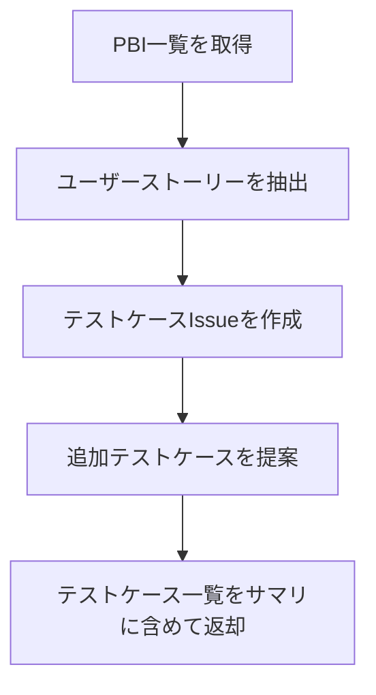

# テスト設計フェーズ手順

PBIレベルのユーザーストーリーを集計し、テストケースをGitHub Issueとして作成します。

## 前提条件

- 実装フェーズが完了し、人間から「テスト設計へ進む」承認を得ていること
- すべてのPBI Issueがclosedであること

## 冪等チェック（再開対応）

```bash
gh issue list --label "test-case" --state all --json number,title,state --limit 100
```

既存のテストケースIssueがある場合は、未作成のものから再開する。

## フェーズ内フロー



## Step 1: PBI情報収集

```bash
# PBI一覧を取得（ユーザーストーリー収集用）
gh issue list --label "pbi" --state closed --json number,title,body --limit 100
```

## Step 2: テストケースIssue作成

**Readツールで `references/TestCaseTemplate.md` を読み込み**、手順に従ってテストケースIssueを作成する。

## Step 3: テストケース一覧の確認

テストケースIssueの作成が完了したら、一覧を取得する:

```bash
gh issue list --label "test-case" --state open --json number,title --limit 100
```

**注意**: ユーザーへのテスト要件確認は親オーケストレーターが担当する（Subagent内ではAskUserQuestionは使用不可）。

## 完了条件

- 全PBIのユーザーストーリーに対応するテストケースIssueが作成されていること
- 追加テストケース（異常系・境界値等）が提案・作成されていること

## 完了時の返却サマリ

このフェーズが完了したら、以下のサマリを親オーケストレーターに返却すること:

```
## テスト設計フェーズ完了サマリ
- テストケース数: N件（Issue番号: #X, #Y, ...）
- 正常系: N件
- 異常系: N件

### ユーザー確認依頼
以下のテストケースが十分か確認をお願いします:
- [テストケース一覧（Issue番号とタイトル）]
- 追加すべきテストケースがあればお知らせください
```

## 注意事項

- テスト実装フェーズへの遷移には人間の承認が必要

## 参照ファイル一覧

| ファイル | 用途 | 読込タイミング |
|---------|------|-------------|
| `references/TestCaseTemplate.md` | テストケースIssue作成ルール | Step 2 |
