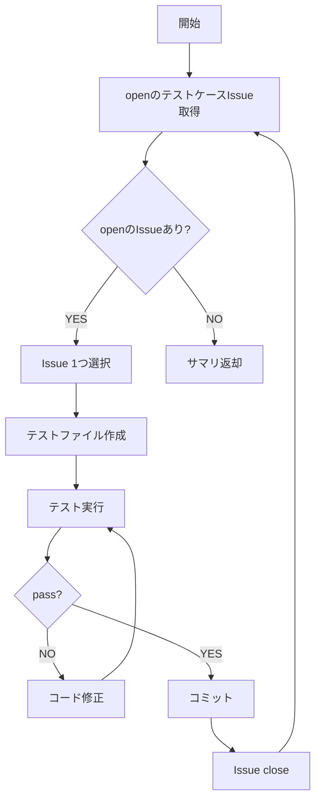

# テスト実装フェーズ手順

Playwrightを使用してE2Eテストを実装します。テストケースIssueごとにテストファイルを作成し、passするまでコード修正を繰り返します。

## 前提条件

- テスト要件確認フェーズが完了し、人間から「テスト実装へ進む」承認を得ていること
- `npm install --save-dev @playwright/test`が実行済みであること
- AI Agent containerにPlaywrightがプリインストール済み（`npx playwright install chromium`は不要）

## 冪等チェック（再開対応）

```bash
gh issue list --label "test-case" --state open --json number,title --limit 100
gh issue list --label "test-case" --state closed --json number,title --limit 100
```

closedのテストケースIssueはスキップし、openのものから再開する。

## プロジェクトコンテキストの引継ぎ

`ai_generated/HANDOVER.md` が存在する場合は最初にReadし、プロジェクト構造を把握した上でE2Eテストを実装すること。

## 実行開始時（必須）

1. Playwrightがインストールされているか確認
   ```bash
   npm list @playwright/test
   ```
2. インストールされていない場合は実行
   ```bash
   npm install --save-dev @playwright/test
   ```
3. openのテストケースIssueを取得
   ```bash
   gh issue list --label "test-case" --state open --json number,title,body --limit 100
   ```

## フェーズ内フロー



## Step 1: テスト実装ループ

各テストケースIssueに対して:

1. **Readツールで `references/E2E.md` を読み込み**、手順に従ってテストを実装
2. テスト実行: `npx playwright test test/e2e/test-case-{issue番号}.spec.ts`
3. passするまで修正を繰り返す
4. コミット（`.claude/rules/git-rules.md` に従うこと）
   ```bash
   git add output_system/test/e2e/test-case-{issue番号}.spec.ts
   git commit -m "test: add E2E test for [テスト内容] (#{issue番号})"
   git push
   ```
5. Issue close: `gh issue close {issue番号}`
6. 次のテストケースIssueへ

## 完了条件

- 全テストケースIssueがclosedであること
- 全テストがpassすること

```bash
# openのテストケースIssueが0件であることを確認
gh issue list --label "test-case" --state open --json number --limit 100
```

結果が空配列 `[]` であれば、完了。

## 完了時の返却サマリ

このフェーズが完了したら、以下のサマリを親オーケストレーターに返却すること:

```
## テスト実装フェーズ完了サマリ
- テストケース実装数: N件
- 全テストpass: はい
- テストファイル一覧: output_system/test/e2e/test-case-XX.spec.ts, ...
```

## 注意事項

- テスト実装フェーズでは人間は別の作業をしているので、実装作業を止めずに次のIssueを処理すること
- E2Eテストは`output_system/test/e2e/`ディレクトリに配置（実装フェーズのUnit/Integrationテストとは別）
- スクリーンショットが必要な場合は`ai_generated/screenshots/`に保存
- テストコードは test-standards スキルの規約に従うこと
- こまめにコミットすること（エラーリカバリ時のコード喪失防止）

## 参照ファイル一覧

| ファイル | 用途 | 読込タイミング |
|---------|------|-------------|
| `references/E2E.md` | E2Eテスト実装手順 | Step 1（各テストケースIssue実装時） |
