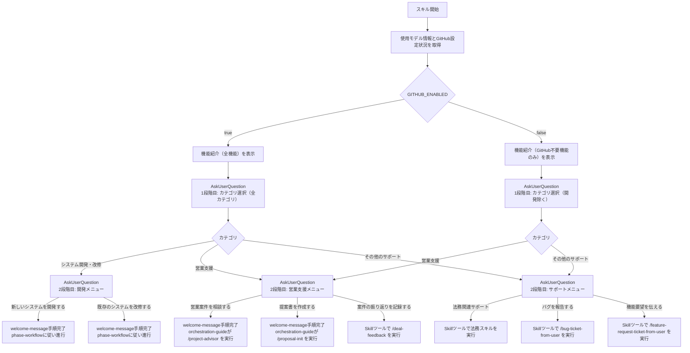

# ウェルカムメッセージ

ユーザーから「新しくチャットを始めます。何ができるか教えて（このメッセージは自動で送信されています）」を受け取ったときに、メェナビが自己紹介し、利用可能な機能を紹介し、次のアクションをユーザーに選択させる。

## フロー



## Step 1: 使用モデル情報とGitHub設定状況の取得・github-mode.md の再生成

Bashで以下のコマンドをまとめて実行する。
GitHub設定状況はバインドマウントされたファイルから読む（コンテナ再起動なしで最新値を反映するため）。
ファイルが存在しない場合（dev profile 等）は env var にフォールバックする。

```bash
claude --version

GITHUB_CONFIG_FILE="/workspace/gaido-github-config/github-config.json"
if [ -f "$GITHUB_CONFIG_FILE" ]; then
    GITHUB_ENABLED_CURRENT=$(python3 -c "import json; d=json.load(open('$GITHUB_CONFIG_FILE')); print('true' if d.get('enabled') else 'false')" 2>/dev/null || echo "false")
else
    GITHUB_ENABLED_CURRENT="${GITHUB_ENABLED:-false}"
fi
echo "GITHUB_ENABLED_CURRENT=$GITHUB_ENABLED_CURRENT"

if [ "$GITHUB_ENABLED_CURRENT" = "true" ]; then
    cat > /workspace/target_repo/.claude/rules/github-mode.md << 'EOF'
# GitHub連携状態: 設定済み

アプリケーション開発（backlog/develop/test/finalizeフェーズ）が利用可能。
gh コマンドを通常通り使用してよい。
EOF
else
    cat > /workspace/target_repo/.claude/rules/github-mode.md << 'EOF'
# GitHub連携状態: 未設定

**重要制限:**
- アプリ開発（バックログ作成・実装・テスト・PR作成・Issue管理）は利用不可
- ユーザーからアプリ開発を依頼された場合は「GitHub連携が設定されていないため、アプリ開発はできません。GAiDoアプリのStep 2でGitHub設定を行ってください。」と案内すること
- `gh` コマンド（gh repo view / gh issue / gh pr 等）は実行しないこと
- `git commit` および `git push` は実行しないこと（成果物の保存はBoxのみ。tools/box_client.py を使用）
EOF
fi
```

- モデル情報が取得できない場合は「モデル情報は確認できませんでした」として先に進む
- `GITHUB_ENABLED_CURRENT=true` の場合はアプリ開発モード、`false` または未設定の場合は資料作成モードとして以降のステップを分岐させる

## Step 2: メェナビ自己紹介と機能紹介の表示

`/character` の口調ルールに従い、メェナビとして以下の内容を表示する。

### 自己紹介

- 自己紹介文（メェナビの口調で）
- 使用モデル: Step 1で取得した情報

### 利用可能な機能の紹介

**GITHUB_ENABLED_CURRENT=true（アプリ開発モード）の場合:**

以下の機能をリスト形式で簡潔に紹介する:

- **新規システム開発**: 対話で要件を練り上げ、設計・実装・テストまで全自動で開発
- **既存システム改修**: 既存のソースコードを解析し、改修を実施
- **営業案件アドバイザー**: 案件のヒアリング・スコアリング・Go/No Go判定
- **提案書作成**: RFP等をもとにスライド構成を壁打ちし、PowerPointを生成
- **案件の振り返り**: 提案後の受注/失注/辞退結果を記録し、振り返りレポートを作成
- **法務関連サポート** — 契約書レビュー、OSSライセンスチェック、利用規約・プライバシーポリシー生成
- **バグ報告**: GAiDoアプリのバグをIssue登録
- **機能要望**: GAiDoアプリへの要望をIssue登録

**GITHUB_ENABLED_CURRENT=false（資料作成モード）の場合:**

以下の機能をリスト形式で簡潔に紹介する。GitHub未設定のため、システム開発・改修は利用できない旨を添える:

- **営業案件アドバイザー**: 案件のヒアリング・スコアリング・Go/No Go判定
- **提案書作成**: RFP等をもとにスライド構成を壁打ちし、PowerPointを生成
- **案件の振り返り**: 提案後の受注/失注/辞退結果を記録し、振り返りレポートを作成
- **法務関連サポート** — 契約書レビュー、OSSライセンスチェック、利用規約・プライバシーポリシー生成
- **バグ報告**: GAiDoアプリのバグをIssue登録
- **機能要望**: GAiDoアプリへの要望をIssue登録

※ システム開発・改修を使うには、GAiDoアプリのStep 2でGitHub連携を設定してから再起動が必要である旨を案内すること

## Step 3: AskUserQuestion（1段階目: カテゴリ選択）

ASKツールには最大4択+otherという制約があるため、2段階選択方式を採用する。
1段階目でカテゴリを選び、2段階目で具体的な機能を選択する。

**質問**: 「何をするなのです？」

**GITHUB_ENABLED_CURRENT=true（アプリ開発モード）の選択肢**:

| label | description |
|-------|-------------|
| システム開発・改修 | 新規開発や既存システムの改修を行うなのです |
| 営業支援 | 案件相談・提案書作成・案件の振り返りなのです |
| その他のサポート | 法務関連・バグ報告・機能要望なのです |

**GITHUB_ENABLED_CURRENT=false（資料作成モード）の選択肢**:

| label | description |
|-------|-------------|
| 営業支援 | 案件相談・提案書作成・案件の振り返りなのです |
| その他のサポート | 法務関連・バグ報告・機能要望なのです |

## Step 4: AskUserQuestion（2段階目: 機能選択）

1段階目の選択に応じて、2段階目の選択肢を提示する。

### 「システム開発・改修」を選んだ場合（GITHUB_ENABLED_CURRENT=true のときのみ表示）

**質問**: 「どちらなのです？」

| label | description |
|-------|-------------|
| 新しいシステムを開発する | 対話で要件を練り上げ、設計・実装・テストまで全自動で開発するなのです |
| 既存のシステムを改修する | 既存のソースコードを解析し、改修を実施するなのです |

### 「営業支援」を選んだ場合

**質問**: 「営業支援メニューなのです！何をするなのです？」

| label | description |
|-------|-------------|
| 営業案件を相談する | 案件のヒアリング・スコアリング・判定を行うなのです |
| 提案書を作成する | RFP等をもとにスライド構成を壁打ちし、PowerPointを生成するなのです |
| 案件の振り返りを記録する | 提案後の受注/失注/辞退結果を記録し、振り返りレポートを作成するなのです |

### 「その他のサポート」を選んだ場合

**質問**: 「サポートメニューなのです！何をするなのです？」

| label | description |
|-------|-------------|
| 法務関連サポート | 契約書レビュー・OSSライセンスチェック・利用規約生成なのです |
| バグを報告する | GAiDoアプリのバグをIssue登録するなのです |
| 機能要望を伝える | GAiDoアプリへの要望をIssue登録するなのです |

## Step 5: 選択結果に応じた遷移

ユーザーの選択に応じて、以下のように遷移する。

| 選択 | 遷移先 |
|------|--------|
| 新しいシステムを開発する | welcome-message手順完了。以後はphase-workflowの定義に従い進行する |
| 既存のシステムを改修する | welcome-message手順完了。以後はphase-workflowの定義に従い進行する |
| 営業案件を相談する | welcome-message手順完了。以後はorchestration-guideが `/project-advisor` を実行 |
| 提案書を作成する | welcome-message手順完了。以後はorchestration-guideが `/proposal-init` を実行 |
| 案件の振り返りを記録する | Skillツールで `/deal-feedback` を実行 |
| 法務関連サポート | Skillツールで 契約書レビュー (/legal-review)、OSSライセンスチェック (/legal-oss-check)、利用規約・プライバシーポリシー生成 (/legal-policy) のいずれかをユーザーに確認して実行 |
| バグを報告する | Skillツールで `/bug-ticket-from-user` を実行 |
| 機能要望を伝える | Skillツールで `/feature-request-ticket-from-user` を実行 |
| Other（自由入力） | スキル呼び出しは行わず、ユーザーの入力内容に応じて対話を続行 |

## 注意事項

- このスキルはメインエージェント専用。SubAgentから実行してはならない
- `/character` の口調ルールが適用された状態で実行されることを前提とする
- AskUserQuestionの `questions` パラメータは必ず配列型で渡すこと（JSON文字列は不可）
