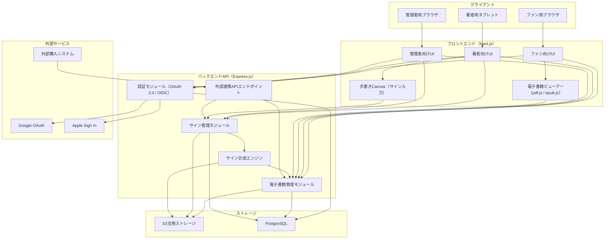
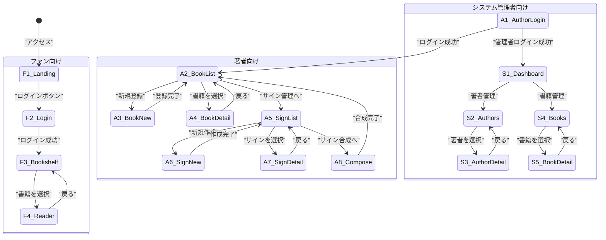
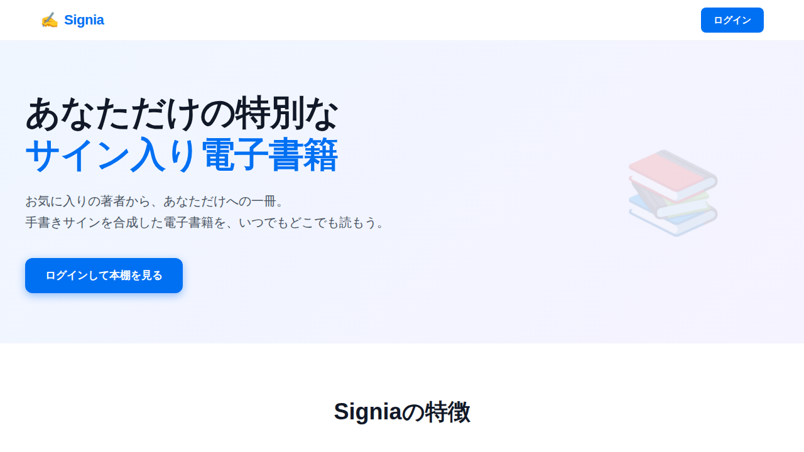
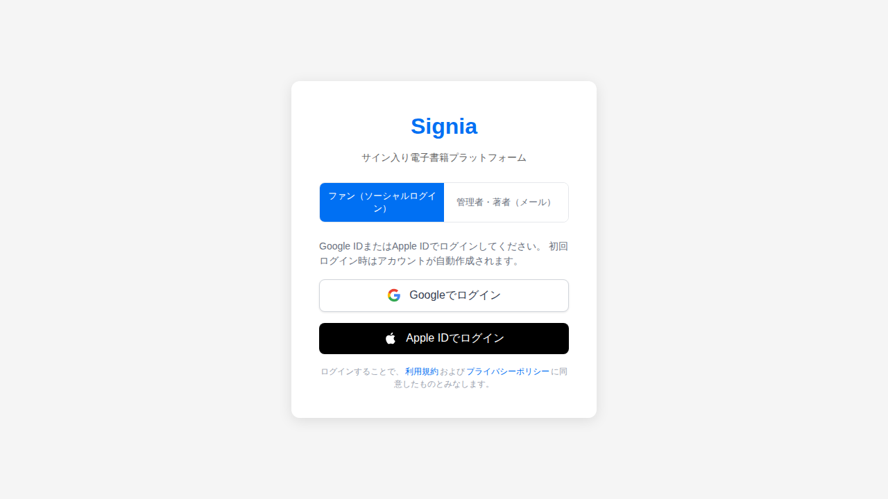
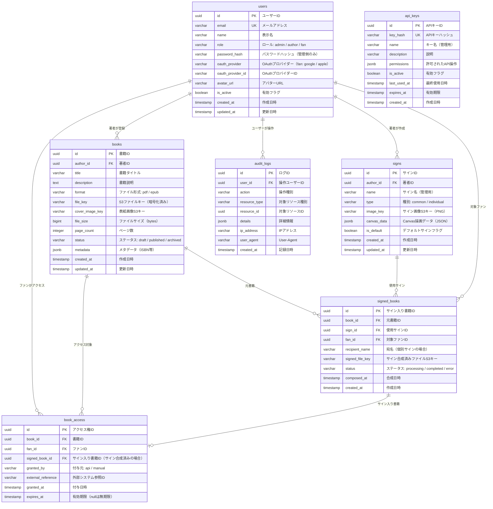

# Signia - 電子書籍サイン合成システム

## 概要

電子書籍に著者の手書きサインを合成して、ファンに個別に提供するSaaSシステム。著者がタブレット上で手書きしたサインを電子書籍の専用ページとして挿入し、各ファンに個別のサイン入り書籍を配付できます。

## 達成目標

- **MVP範囲**: 電子書籍登録・サイン登録・合成・閲覧の基本フローを実装
- **ビジネス価値**: 著者とファンの特別な繋がりを電子書籍で実現。物理的なサイン会の代替/補完
- **スケーラビリティ**: 中規模SaaS（～1,000人ユーザー）として、クラウドコストを抑えた設計

## システム構成



## 画面フロー



## 画面詳細

### F1: ランディングページ

- **URL**: `/`



#### UI要素

| 要素 | 挙動 | 説明 |
|------|------|------|
| ロゴ | 表示のみ | サービスロゴ |
| ログインボタン | クリックでログイン画面へ遷移 | ファン向けログイン |
| ヘッダー | 表示のみ | サービス紹介 |
| 特徴セクション | 表示のみ | 個別サイン、安全な閲覧、かんたんアクセスの3要素を強調 |

#### 画面遷移条件
- ログインボタンをクリック → ログイン画面へ遷移

---

### F2: ログイン画面

- **URL**: `/login`



#### UI要素

| 要素 | 挙動 | DB対応 |
|------|------|--------|
| ロゴ | 表示のみ | - |
| Googleでログインボタン | クリックでGoogle OAuth認証を開始 | users.oauth_provider = 'google' |
| Apple IDでログインボタン | クリックでApple Sign In認証を開始 | users.oauth_provider = 'apple' |
| 利用規約リンク | クリックで別ウィンドウで利用規約を表示 | - |

#### 画面遷移条件
- Google/Apple認証成功 → 本棚（F3）へ遷移
- キャンセル → ランディングページ（F1）へ戻る

---

### F3: 本棚

- **URL**: `/bookshelf`

#### UI要素

| 要素 | 挙動 | DB対応（テーブル.カラム） |
|------|------|--------------------------|
| ヘッダー | 表示のみ | - |
| ユーザー名 | 表示のみ | users.name |
| ログアウトボタン | クリックでセッション終了、ランディングページへ遷移 | - |
| 書籍リスト | 表示のみ | book_access.fan_id でフィルタされた books |
| 表紙サムネイル | クリックで書籍ビューアー（F4）へ遷移 | books.cover_image_key |
| タイトル | クリックで書籍ビューアー（F4）へ遷移 | books.title |
| 著者名 | 表示のみ | users.name (books.author_id経由) |
| サイン種別 | 表示のみ | signed_books.recipient_name (null = 共通サイン) |

#### 画面遷移条件
- 書籍をクリック → 電子書籍ビューアー（F4）へ遷移
- ログアウトボタン → ランディングページ（F1）へ遷移

---

### F4: 電子書籍ビューアー

- **URL**: `/reader/:bookId`

#### UI要素

| 要素 | 挙動 | DB対応 |
|------|------|--------|
| 戻るボタン | クリックで本棚（F3）へ遷移 | - |
| 書籍タイトル | 表示のみ | books.title |
| PDFビューアー | pdf.jsで렌더링（DRM保護） | signed_books.signed_file_key |
| EPUBビューアー | epub.jsで렌더링（DRM保護） | signed_books.signed_file_key |
| ページ送りボタン | 次/前ページに移動 | - |
| ズームボタン | ページをズーム | - |
| ページ番号表示 | 현재ページ / 全ページ数 | - |

#### 画面遷移条件
- 戻るボタン → 本棚（F3）へ遷移

---

### A1: 著者ログイン画面

- **URL**: `/admin/login`


#### UI要素

| 要素 | 挙動 | DB対応 |
|------|------|--------|
| ロゴ | 表示のみ | - |
| メールアドレス入力 | テキスト入力 | users.email |
| パスワード入力 | パスワード入力 | users.password_hash |
| ログインボタン | クリックでメール+パスワード認証 | - |
| パスワード忘却リンク | クリックでパスワード再設定画面へ | - |

#### 画面遷移条件
- ログイン成功（著者） → 書籍一覧（A2）へ遷移
- ログイン成功（管理者） → 管理ダッシュボード（S1）へ遷移
- ログイン失敗 → エラーメッセージ表示

---

### A2: 書籍一覧

- **URL**: `/author/books`

#### UI要素

| 要素 | 挙動 | DB対応 |
|------|------|--------|
| ナビゲーションメニュー | クリックで各ページへ遷移 | - |
| 「新しい書籍を登録」ボタン | クリックで書籍登録画面（A3）へ遷移 | - |
| 書籍リスト | テーブル表示 | books (author_id フィルタ) |
| タイトル | クリックで書籍詳細画面（A4）へ遷移 | books.title |
| フォーマット | 表示のみ | books.format (pdf / epub) |
| ファイルサイズ | 表示のみ | books.file_size |
| ページ数 | 表示のみ | books.page_count |
| ステータス | 表示のみ | books.status (draft / published / archived) |
| 削除ボタン | クリックで削除確認 → 削除実行 | DELETE books.id |
| サイン管理ボタン | クリックでサイン一覧（A5）へ遷移 | - |

#### 画面遷移条件
- 新規登録ボタン → 書籍登録画面（A3）へ遷移
- タイトルをクリック → 書籍詳細・編集画面（A4）へ遷移
- サイン管理ボタン → サイン一覧（A5）へ遷移
- ログアウト → ランディングページ（F1）へ遷移

---

### A3: 書籍登録

- **URL**: `/author/books/new`

#### UI要素

| 要素 | 挙動 | DB対応 |
|------|------|--------|
| ナビゲーションメニュー | クリックで各ページへ遷移 | - |
| タイトル入力 | テキスト入力（必須、最大200文字） | books.title |
| 説明入力 | テキストエリア | books.description |
| ファイルアップロード | ドラッグ&ドロップでPDF/EPUBをアップロード（最大50MB） | books.file_key, books.file_size, books.format |
| 表紙画像アップロード | 画像ファイルをアップロード（オプション） | books.cover_image_key |
| ISBN入力 | テキスト入力（オプション） | books.metadata ->> 'isbn' |
| 登録ボタン | クリックで登録実行 | INSERT INTO books |
| キャンセルボタン | クリックで書籍一覧（A2）へ遷移 | - |

#### 画面遷移条件
- 登録成功 → 書籍一覧（A2）へ遷移
- キャンセル → 書籍一覧（A2）へ遷移

---

### A5: サイン一覧

- **URL**: `/author/signs`

#### UI要素

| 要素 | 挙動 | DB対応 |
|------|------|--------|
| ナビゲーションメニュー | クリックで各ページへ遷移 | - |
| 「新しいサインを作成」ボタン | クリックでサイン作成画面（A6）へ遷移 | - |
| サインリスト | サムネイル表示 | signs (author_id フィルタ) |
| サイン画像 | クリックでサイン詳細・編集画面（A7）へ遷移 | signs.image_key |
| サイン名 | 表示のみ | signs.name |
| 種別 | 表示のみ | signs.type (common / individual) |
| 削除ボタン | クリックで削除確認 → 削除実行 | DELETE signs.id |
| サイン合成ボタン | クリックでサイン合成画面（A8）へ遷移 | - |

#### 画面遷移条件
- 新規作成ボタン → サイン作成画面（A6）へ遷移
- サイン画像をクリック → サイン詳細・編集画面（A7）へ遷移
- サイン合成ボタン → サイン合成画面（A8）へ遷移

---

### A6: サイン作成

- **URL**: `/author/signs/new`

#### UI要素

| 要素 | 挙動 | DB対応 |
|------|------|--------|
| ナビゲーションメニュー | クリックで各ページへ遷移 | - |
| サイン名入力 | テキスト入力（必須、最大100文字） | signs.name |
| Canvas領域 | タブレット対応。ペンで手書き | signs.canvas_data |
| ペン太さスライダー | スライダーでペンの太さを調整 | - |
| 色パレット | クリックでペン色を選択 | - |
| やり直しボタン | 最後の描画ストロークを取消 | - |
| クリアボタン | Canvas全体をクリア | - |
| 種別選択 | ラジオボタンで「共通サイン」または「個別サイン」を選択 | signs.type |
| プレビュー表示 | Canvas内容を画像として表示 | - |
| 保存ボタン | クリックでサイン保存 | INSERT INTO signs |
| キャンセルボタン | クリックでサイン一覧（A5）へ遷移 | - |

#### 画面遷移条件
- 保存成功 → サイン一覧（A5）へ遷移
- キャンセル → サイン一覧（A5）へ遷移

---

### A8: サイン合成画面

- **URL**: `/author/compose`

#### UI要素

| 要素 | 挙動 | DB対応 |
|------|------|--------|
| ナビゲーションメニュー | クリックで各ページへ遷移 | - |
| 書籍選択ドロップダウン | クリックで著者が登録した書籍一覧から選択 | books (author_id フィルタ) |
| サイン選択ドロップダウン | クリックで著者が作成したサイン一覧から選択 | signs (author_id フィルタ) |
| 合成モード選択 | ラジオボタンで「共通サイン（全員に適用）」または「個別サイン（宛名指定）」を選択 | signed_books.recipient_name |
| 宛名入力 | 個別サインの場合のみ表示。テキスト入力 | signed_books.recipient_name |
| 対象ファン選択 | 複数選択可。チェックボックスまたはマルチセレクト | book_access.fan_id |
| ファン検索フィルタ | テキスト入力でファン一覧を絞込 | users.name / users.email |
| 合成プレビュー | サインページのプレビュー表示 | - |
| 合成実行ボタン | クリックでサイン合成処理を開始 | INSERT INTO signed_books, UPDATE book_access |
| キャンセルボタン | クリックで書籍一覧（A2）へ遷移 | - |

#### 画面遷移条件
- 合成実行成功 → 結果表示「合成が完了しました」
- キャンセル → 書籍一覧（A2）へ遷移

---

### S1: 管理ダッシュボード

- **URL**: `/admin/dashboard`

#### UI要素

| 要素 | 挙動 | DB対応 |
|------|------|--------|
| ナビゲーションメニュー | クリックで各ページへ遷移 | - |
| 統計情報パネル | 表示のみ | 総著者数、総書籍数、総ファン数、合成処理数 |
| 最近の操作ログ | 表示のみ | audit_logs (ORDER BY created_at DESC LIMIT 10) |
| 著者管理ボタン | クリックで著者管理画面（S2）へ遷移 | - |
| 書籍管理ボタン | クリックで書籍管理画面（S4）へ遷移 | - |

#### 画面遷移条件
- 著者管理ボタン → 著者管理画面（S2）へ遷移
- 書籍管理ボタン → 書籍管理画面（S4）へ遷移

---

### S2: 著者管理

- **URL**: `/admin/authors`

#### UI要素

| 要素 | 挙動 | DB対応 |
|------|------|--------|
| ナビゲーションメニュー | クリックで各ページへ遷移 | - |
| 「新しい著者を作成」ボタン | クリックで著者作成画面へ遷移 | - |
| 著者リスト | テーブル表示 | users (role = 'author') |
| メールアドレス | 表示のみ | users.email |
| 名前 | クリックで著者詳細画面（S3）へ遷移 | users.name |
| 登録日時 | 表示のみ | users.created_at |
| ステータス | 表示のみ | users.is_active (有効 / 無効) |
| 編集ボタン | クリックで著者詳細画面（S3）へ遷移 | - |
| 無効化ボタン | クリックで無効化確認 → 無効化実行 | UPDATE users.is_active = false |

#### 画面遷移条件
- 新規作成ボタン → 著者作成画面へ遷移
- 名前をクリック → 著者詳細画面（S3）へ遷移
- 編集ボタン → 著者詳細画面（S3）へ遷移

---

## ER図



## ディレクトリ構成

```
output_system/
├── frontend/                  # フロントエンド（Next.js）
│   ├── public/
│   ├── src/
│   │   ├── app/              # Next.js App Router
│   │   │   ├── (auth)/       # 認証関連ページ
│   │   │   ├── (fan)/        # ファン向けページ
│   │   │   ├── (author)/     # 著者向けページ
│   │   │   ├── (admin)/      # 管理者向けページ
│   │   │   ├── layout.tsx
│   │   │   └── page.tsx
│   │   ├── components/       # React コンポーネント
│   │   ├── lib/             # ユーティリティ関数
│   │   ├── styles/          # CSS/Tailwind
│   │   └── types/           # TypeScript型定義
│   ├── package.json
│   ├── tsconfig.json
│   └── next.config.js
│
├── backend/                  # バックエンド（Express.js）
│   ├── src/
│   │   ├── controllers/     # リクエストハンドラー
│   │   ├── services/        # ビジネスロジック
│   │   ├── routes/          # APIルーティング
│   │   ├── middleware/      # ミドルウェア
│   │   ├── db/
│   │   │   ├── migrations/  # DBマイグレーション
│   │   │   └── schema.prisma
│   │   ├── config/          # 設定ファイル
│   │   └── main.ts
│   ├── dist/                # コンパイル後
│   ├── package.json
│   ├── tsconfig.json
│   └── Dockerfile
│
├── docker-compose.yml       # マルチコンテナ管理
├── Dockerfile               # フロントエンドコンテナ設定
├── .env.example            # 環境変数テンプレート
└── openapi.yaml            # API定義
```

## WebAPIエンドポイント一覧

### 認証API

| メソッド | エンドポイント | 説明 | 認証 |
|---------|---------------|------|------|
| POST | /api/auth/login | 管理側ログイン（メール+パスワード） | 不要 |
| POST | /api/auth/logout | ログアウト | 必要 |
| GET | /api/auth/me | 現在のユーザー情報取得 | 必要 |

### 書籍API

| メソッド | エンドポイント | 説明 | 認証/認可 |
|---------|---------------|------|-----------|
| GET | /api/books | 書籍一覧取得 | author: 自分の書籍, admin: 全書籍 |
| POST | /api/books | 書籍登録（ファイルアップロード） | author |
| GET | /api/books/:id | 書籍詳細取得 | author/admin |
| PUT | /api/books/:id | 書籍情報更新 | author（自分の書籍のみ） |
| DELETE | /api/books/:id | 書籍削除 | author（自分の書籍のみ）/admin |

### サインAPI

| メソッド | エンドポイント | 説明 | 認証/認可 |
|---------|---------------|------|-----------|
| GET | /api/signs | サイン一覧取得 | author: 自分のサイン |
| POST | /api/signs | サイン作成（画像+Canvas JSON） | author |
| GET | /api/signs/:id | サイン詳細取得 | author |
| PUT | /api/signs/:id | サイン更新 | author（自分のサインのみ） |
| DELETE | /api/signs/:id | サイン削除 | author（自分のサインのみ） |

### サイン合成API

| メソッド | エンドポイント | 説明 | 認証/認可 |
|---------|---------------|------|-----------|
| POST | /api/compose | サイン合成実行 | author |
| GET | /api/compose/:id | 合成結果取得 | author |

### ファン向けAPI

| メソッド | エンドポイント | 説明 | 認証/認可 |
|---------|---------------|------|-----------|
| GET | /api/fan/bookshelf | 本棚（自分の書籍一覧） | fan |
| GET | /api/fan/books/:id/read | 書籍閲覧URL取得（署名付きURL） | fan（自分の書籍のみ） |

### 管理者API

| メソッド | エンドポイント | 説明 | 認証/認可 |
|---------|---------------|------|-----------|
| GET | /api/admin/authors | 著者一覧取得 | admin |
| POST | /api/admin/authors | 著者アカウント作成 | admin |
| GET | /api/admin/authors/:id | 著者詳細取得 | admin |
| PUT | /api/admin/authors/:id | 著者情報更新 | admin |
| DELETE | /api/admin/authors/:id | 著者アカウント無効化 | admin |
| GET | /api/admin/stats | 統計情報取得 | admin |

### 外部連携API（外部システム → このシステム）

| メソッド | エンドポイント | 説明 | 認証 |
|---------|---------------|------|------|
| POST | /api/external/book-access | ファンに書籍アクセス権を付与 | API Key |
| DELETE | /api/external/book-access/:id | アクセス権を削除 | API Key |
| GET | /api/external/book-access | アクセス権一覧取得 | API Key |
| POST | /api/external/signs | サインデータ登録 | API Key |
| GET | /api/external/signs/:id | サインデータ取得 | API Key |

詳細は [openapi.yaml](./output_system/openapi.yaml) を参照。

## 起動方法

```bash
cd output_system
docker compose up -d
```

## アクセスURL

- **フロントエンド**: http://localhost:3005
- **バックエンドAPI**: http://localhost:3006

## 技術スタック

### フロントエンド

- **フレームワーク**: Next.js 14（App Router）
- **言語**: TypeScript
- **UI**: React
- **スタイリング**: Tailwind CSS
- **認証**: NextAuth.js（OAuth 2.0 / OIDC対応）
- **PDFビューアー**: pdf.js
- **EPUBビューアー**: epub.js
- **手書きCanvas**: Fabric.js

### バックエンド

- **フレームワーク**: Express.js
- **言語**: TypeScript
- **ORM**: Prisma
- **データベース**: PostgreSQL
- **ファイルストレージ**: S3互換（MinIO / AWS S3）
- **API認証**: JWT + API Key

### インフラ

- **コンテナ管理**: Docker / Docker Compose
- **データベース**: PostgreSQL 16
- **ファイルストレージ**: MinIO（S3互換）

## ライセンス

UNLICENSED
