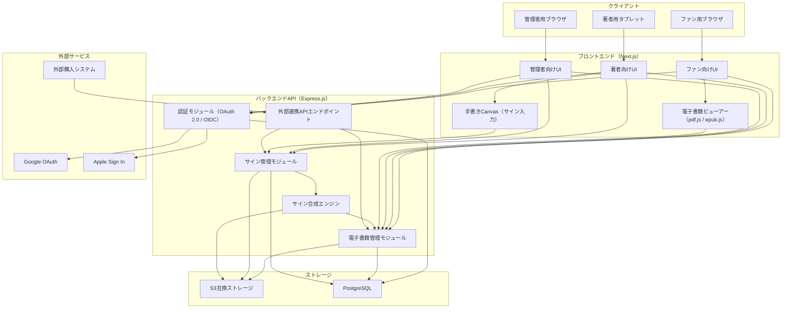

# システム構成図

## アーキテクチャ概要

フロントエンド（Next.js）とバックエンドAPI（Express.js）の2サービス構成。
ファイルストレージはS3互換、データベースはPostgreSQL。

## システム構成図

## 技術選定根拠

| カテゴリ | 選定技術 | 選定理由 | 却下した代替案 |
|---------|---------|---------|---------------|
| フロントエンド | Next.js (React) | SSR/SSG対応、Canvas API対応（手書きサイン）、豊富なエコシステム、MIT License | Vue.js（Canvas統合の実績がReactより少ない）、Angular（学習コストが高い） |
| バックエンドAPI | Express.js (Node.js) | 軽量、外部API提供に適切、npm豊富、MIT License | FastAPI（Python、PDF処理ライブラリは豊富だがNode.jsで統一したい）、NestJS（中規模には過剰） |
| データベース | PostgreSQL | リレーショナルデータ管理、JSONB対応、PostgreSQL License（寛容） | MySQL（JSONB非対応）、MongoDB（リレーショナル構造に不向き） |
| PDF処理 | pdf-lib | PDF生成・編集、ページ挿入対応、MIT License | pdfkit（生成特化で既存PDF編集が弱い）、hummus（メンテナンス停止） |
| EPUB処理 | epub-gen-memory + JSZip | EPUB構造操作・ページ挿入、MIT License | epub.js（閲覧特化で編集機能なし） |
| PDFビューアー | pdf.js | Mozilla製、高機能、Apache License 2.0 | react-pdf（pdf.jsラッパー、機能制限あり） |
| EPUBビューアー | epub.js | 標準的EPUB閲覧ライブラリ、BSD License | readium（重量級） |
| ファイルストレージ | S3互換（AWS S3 / MinIO） | スケーラブル、署名付きURL対応、業界標準 | GCS（AWS依存を避けたい場合の代替、互換性あり） |
| 認証 | NextAuth.js | Next.js統合、Google/Apple対応、ISC License | Passport.js（Express統合だがNext.jsとの統合が複雑）、Auth0（外部依存・コスト） |
| 手書きCanvas | Fabric.js | Canvas操作ライブラリ、手書き・画像出力対応、MIT License | Konva.js（同等だがFabric.jsのほうがドキュメント豊富） |

## サイン合成方式

### 方式: 専用サインページ挿入

電子書籍の冒頭（表紙の次）にサイン専用ページを挿入する方式。

**PDFの場合:**
1. pdf-libで空白ページを生成
2. サイン画像（PNG）をページに埋め込み
3. 宛名テキストを追加（個別サインの場合）
4. 生成したページを元PDFの2ページ目に挿入

**EPUBの場合:**
1. サイン画像を含むHTMLページを生成
2. 宛名テキストを追加（個別サインの場合）
3. EPUBのmanifest/spineに追加し、表紙の次に配置

**選定理由:**
- オーバーレイ方式（既存ページにサインを重ねる）は、PDF/EPUBのレイアウトを崩すリスクがある
- 専用ページ方式は元のコンテンツに影響を与えず、両形式で統一的に実装可能
- 物理的なサイン本でも「見返しにサインを書く」のが一般的で、ユーザー体験としても自然

## DRM方式

### 方式: サーバーサイド配信型ビューアー

- 電子書籍ファイルはS3に暗号化して保存（AES-256）
- 閲覧時はバックエンドが署名付きURL（有効期限: 15分）を発行
- ブラウザ上でpdf.js / epub.jsがレンダリング
- ダウンロードボタン無効化、右クリック禁止、印刷制限をJavaScriptで実装
- コンテンツは1ページずつストリーミング的に取得（全ページ一括取得を防止）

**注意:** 完全なDRMではなく、カジュアルコピーを防止するレベル。スクリーンショットなどは技術的に完全には防げない。
