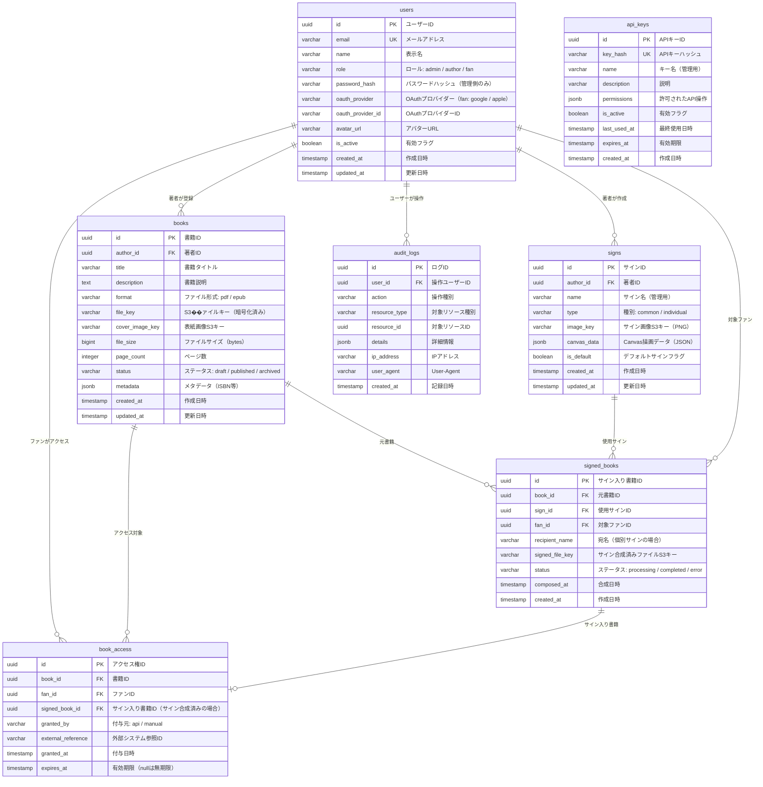

# ER図

## データベース: PostgreSQL

## テーブル補足

### users テーブル
- `role` は `admin` / `author` / `fan` の3値
- 管理側（admin / author）は `password_hash` を使用（メール+パスワード認証）
- ファン（fan）は `oauth_provider` + `oauth_provider_id` を使用（ソーシャルログイン）

### signed_books テーブル
- サイン合成結果を管理。合成処理は非同期で実行される可能性があるため `status` を持つ
- `recipient_name` は個別サイン（宛名付き）の場合のみ使用

### book_access テーブル
- 外部システムからのAPI経由と、著者の手動付与の両方に対応
- `signed_book_id` はサイン合成完了後に紐づけ

### api_keys テーブル
- 外部システム連携APIの認証に使用
- システム管理者がAPI Keyを発行・管理
