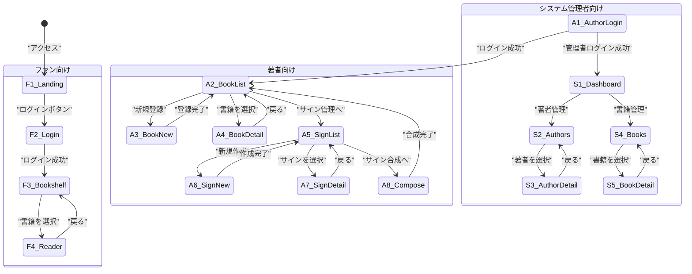
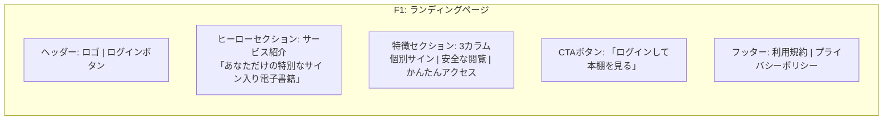
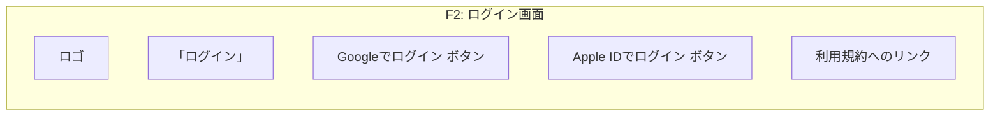
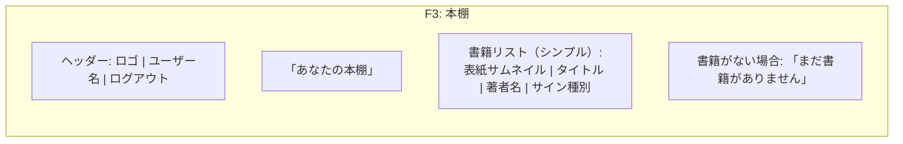
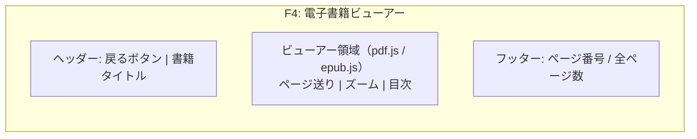
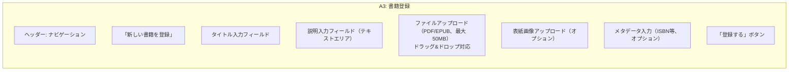
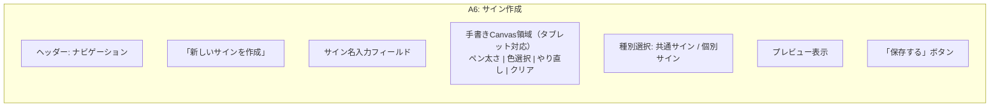
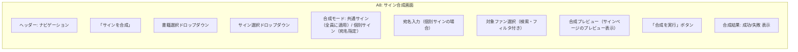

# 画面一覧・遷移図

## 画面一覧

### ファン向け画面

| # | 画面名 | URL | 説明 |
|---|--------|-----|------|
| F1 | ランディングページ | / | サービス紹介・ログインボタン |
| F2 | ログイン画面 | /login | ソーシャルログイン（Google / Apple） |
| F3 | 本棚 | /bookshelf | サイン入り書籍のシンプルなリスト表示 |
| F4 | 電子書籍ビューアー | /reader/:bookId | PDF/EPUB閲覧（DRM保護付き） |

### 著者向け画面

| # | 画面名 | URL | 説明 |
|---|--------|-----|------|
| A1 | 著者ログイン画面 | /admin/login | メール+パスワード認証 |
| A2 | 書籍一覧 | /author/books | 自分の登録書籍一覧 |
| A3 | 書籍登録 | /author/books/new | PDF/EPUBアップロード・メタデータ入力 |
| A4 | 書籍詳細・編集 | /author/books/:bookId | 書籍情報の表示・編集・削除 |
| A5 | サイン一覧 | /author/signs | 作成済みサインの一覧 |
| A6 | サイン作成 | /author/signs/new | タブレット手書きCanvasでサイン作成 |
| A7 | サイン詳細・編集 | /author/signs/:signId | サイン表示・再作成 |
| A8 | サイン合成画面 | /author/compose | 書籍・サイン・ファン選択 → 合成実行 |

### システム管理者向け画面

| # | 画面名 | URL | 説明 |
|---|--------|-----|------|
| S1 | 管理ダッシュボード | /admin/dashboard | 統計情報・最近の操作 |
| S2 | 著者管理 | /admin/authors | 著者アカウント一覧・作成・編集 |
| S3 | 著者詳細 | /admin/authors/:authorId | 著者情報詳細・書籍一覧 |
| S4 | 書籍管理 | /admin/books | 全書籍一覧・検索 |
| S5 | 書籍詳細 | /admin/books/:bookId | 書籍情報詳細 |

## 画面遷移図

## 画面ワイヤーフレーム

### F1: ランディングページ

### F2: ログイン画面

### F3: 本棚

### F4: 電子書籍ビューアー

### A3: 書籍登録

### A6: サイン作成

### A8: サイン合成画面

