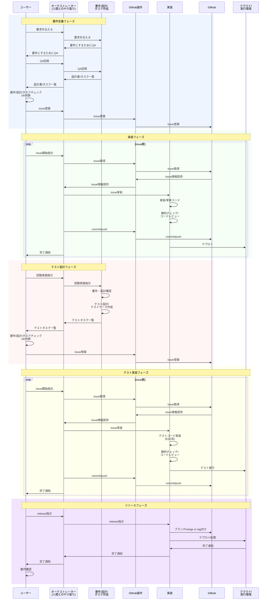

# 運用の流れ

## GAiDoコンポーネントとの対応

以下のシーケンス図は抽象的な参加者名を使用している（ターゲットリポジトリにもコピーされるため）。
GAiDoシステムにおける各参加者の実体は以下の通り:

| ワークフロー参加者 | GAiDoコンポーネント | 補足 |
|---|---|---|
| ユーザー | Pockode UI（ブラウザ/webview） | メッセージ送信、レビュー、承認/却下 |
| オーケストレーター | Pockode ChatClient + Claude Code | 会話フロー管理、タスク分解 |
| 要件/設計/タスク作成 | Claude Code + MCP tools + Project system | 設計書・Issue・タスク作成 |
| Github操作 | Claude Code（gh CLI）+ Pockode gitネームスペース | commit, push, PR |
| 実装 | Claude Code（workerエージェント） | コーディング、テスト、デプロイ |
| クラウド/実行環境 | Dockerコンテナ（DooD）+ Output Systemコンテナ | ターゲットシステムのビルド・実行 |

ランタイムアーキテクチャの詳細は [runtime_architecture.md](../../docs/concept/runtime_architecture.md) を参照。

## ワークフロー

