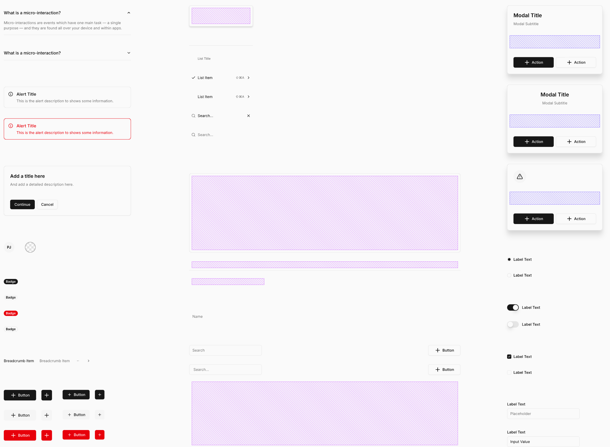
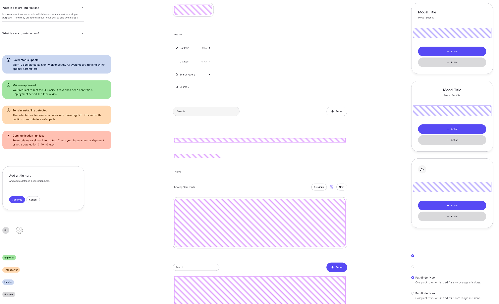
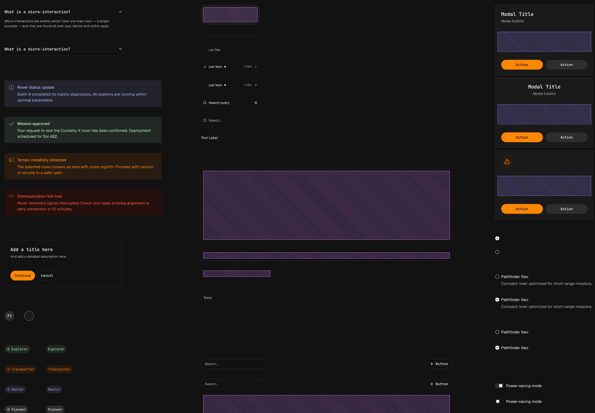
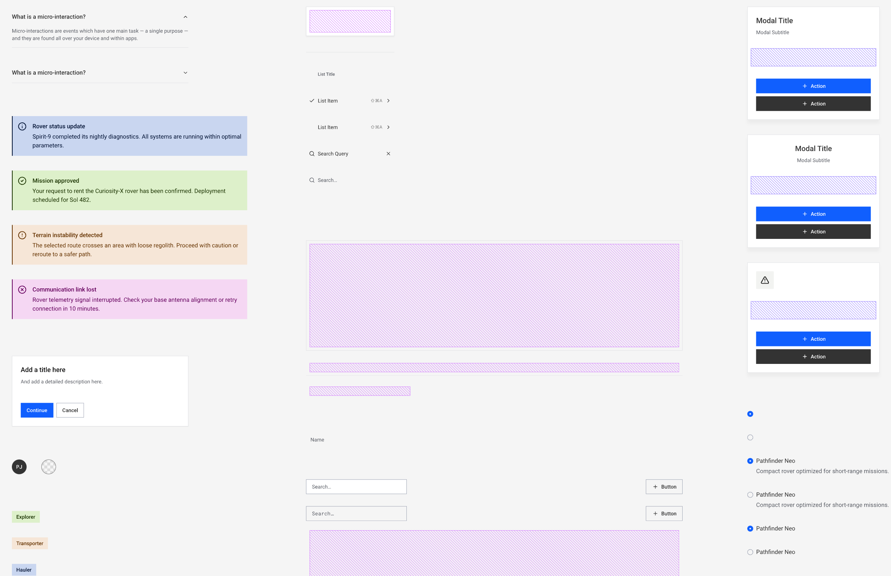

# UIキット デザインカタログ

画面デザインに使用するUIキットを選んでください。各キットのサンプルダッシュボード画面を以下に示します。

---

## Shadcn UI

- コンポーネント数: 87
- ReactコンポーネントライブラリベースのUI kit

---

## Halo

- コンポーネント数: 95
- モダンデザインシステム

---

## Lunaris

- コンポーネント数: 100
- デザインシステム（最もコンポーネント数が多い）

---

## Nitro

- コンポーネント数: 97
- デザインシステム
